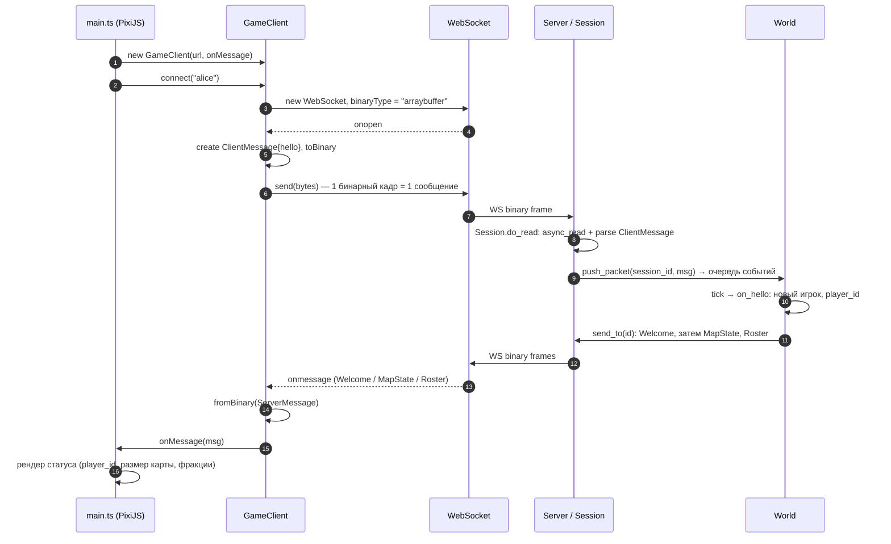
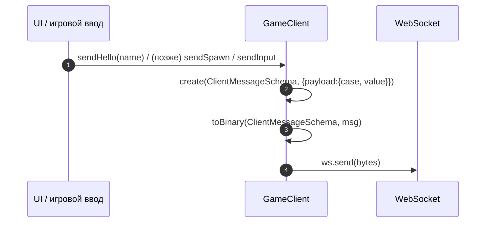

# Клиент — диаграммы последовательности

Клиент на **TypeScript + PixiJS + protobuf-es**. Транспорт — WebSocket, один
бинарный кадр = одно protobuf-сообщение (`ClientMessage` ↔ `ServerMessage`).
Схема протокола генерируется из `../../protocol/game/v1/protocol.proto`
(`npm run generate`, buf + protoc-gen-es) в `src/gen/`.

## Подключение и приветствие (Hello → Welcome)

## Отправка сообщения (обобщённо)

> Статус: реализовано подключение + `Hello` и декодирование ответа
> (`Welcome`/`MapState`/`Roster`). Спавн, ввод и рендер карты/игроков — дальше
> (серверные M2–M4).
