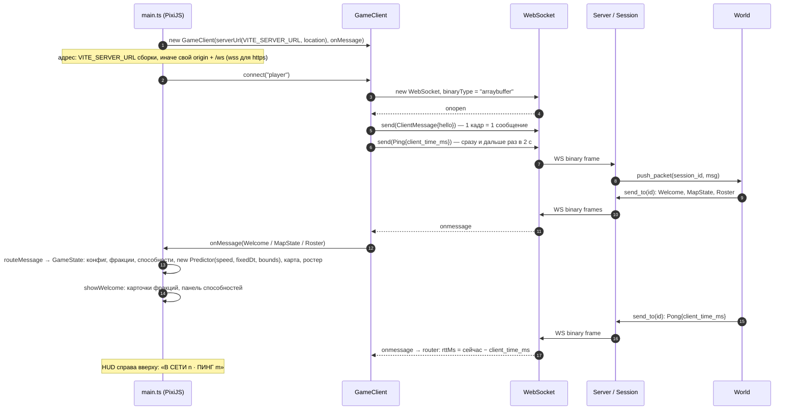
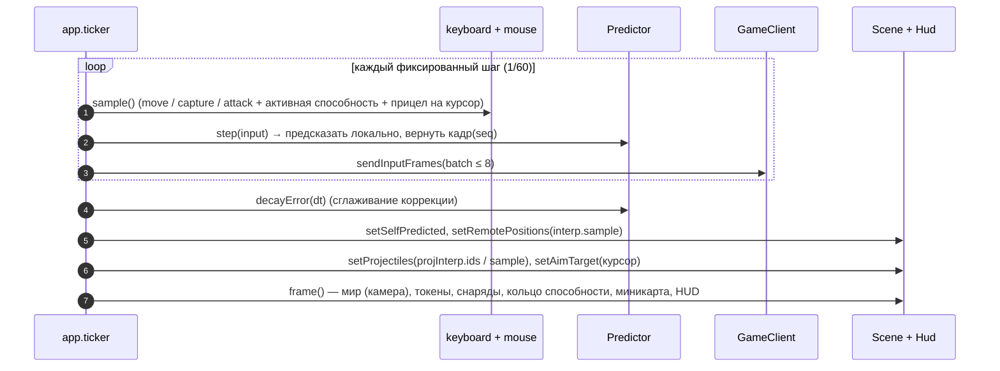

# Клиент — диаграммы последовательности

Клиент на **TypeScript + PixiJS + protobuf-es**. Транспорт — WebSocket, один
бинарный кадр = одно protobuf-сообщение (`ClientMessage` ↔ `ServerMessage`).
Схема протокола генерируется из `../../protocol/game/v1/protocol.proto`
(`npm run generate`, buf + protoc-gen-es) в `src/gen/`.

Клиент **предсказывает** своего игрока и **интерполирует** остальных: рендер идёт
каждый кадр из предсказанной (свой) и интерполированной (чужие) позиций, а
снапшоты сервера только корректируют.

## Подключение и приветствие (Hello → Welcome)

```mermaid
sequenceDiagram
    autonumber
    participant main as main.ts (PixiJS)
    participant net as GameClient
    participant ws as WebSocket
    participant srv as Server / Session
    participant world as World

    main->>net: new GameClient(serverUrl(VITE_SERVER_URL, location), onMessage)
    Note over main: адрес: VITE_SERVER_URL сборки, иначе свой origin + /ws (wss для https)
    main->>net: connect("player")
    net->>ws: new WebSocket, binaryType = "arraybuffer"
    ws-->>net: onopen
    net->>ws: send(ClientMessage{hello}) — 1 кадр = 1 сообщение
    net->>ws: send(Ping{client_time_ms}) — сразу и дальше раз в 2 с
    ws->>srv: WS binary frame
    srv->>world: push_packet(session_id, msg)
    world->>srv: send_to(id): Welcome, MapState, Roster
    srv->>ws: WS binary frames
    ws-->>net: onmessage
    net->>main: onMessage(Welcome / MapState / Roster)
    main->>main: routeMessage → GameState: конфиг, фракции, способности, new Predictor(speed, fixedDt, bounds), карта, ростер
    main->>main: showWelcome: карточки фракций, панель способностей
    world->>srv: send_to(id): Pong{client_time_ms}
    srv->>ws: WS binary frame
    ws-->>net: onmessage → router: rttMs = сейчас − client_time_ms
    Note over main: HUD справа вверху: «В СЕТИ n · ПИНГ m»
```

## Игровой цикл (тикер PixiJS, фиксированный шаг)

```mermaid
sequenceDiagram
    autonumber
    participant tick as app.ticker
    participant kb as keyboard + mouse
    participant pred as Predictor
    participant net as GameClient
    participant scene as Scene + Hud

    loop каждый фиксированный шаг (1/60)
        tick->>kb: sample()  (move / capture / attack + активная способность + прицел на курсор)
        tick->>pred: step(input) → предсказать локально, вернуть кадр(seq)
        tick->>net: sendInputFrames(batch ≤ 8)
    end
    tick->>pred: decayError(dt)  (сглаживание коррекции)
    tick->>scene: setSelfPredicted, setRemotePositions(interp.sample)
    tick->>scene: setProjectiles(projInterp.ids / sample), setAimTarget(курсор)
    tick->>scene: frame() — мир (камера), токены, снаряды, кольцо способности, миникарта, HUD
```

## Снапшот → коррекция

```mermaid
sequenceDiagram
    autonumber
    participant ws as WebSocket
    participant router as router (net/router.ts)
    participant state as GameState
    participant pred as Predictor
    participant scene as Scene + Hud (render/)

    ws-->>router: Snapshot{you, players, cells, events, projectiles, revealed, hidden}
    router->>state: you: жизнь, hp, возрождение, кулдауны атаки и блока, тик сервера
    router->>pred: reconcile(you.pos, you.last_input_seq)
    Note over pred: выкинуть подтверждённые кадры, снап к авторитету, реплей остатка
    router->>state: игроки снапшота; interp.push(позиции чужих), shots.push(позиции снарядов)
    router->>state: fog.apply(revealed, hidden, resync) — туман войны; territory.applyCellUpdates
    Note over state: resync (сервер потерял кадр к нам): видимые → исследованные, затем revealed
    router->>state: эффекты (effectsFromEvents: удар, блок, блок сработал); ревизия мира++ при смене клеток или видимости
    state-->>scene: showStatus: HUD (фракция, клетки/%, В СЕТИ, HP, текущая клетка), панель, выбор фракции
    state-->>scene: каждый кадр: Scene читает GameState; мир перерисовывается, только если сменилась ревизия
```

Роутер пишет только в `GameState` (данные, без PixiJS); виды в `src/render/`
читают его. Текстовый UI поверх канваса — DOM-оверлей `src/ui/` (модальное окно,
тосты); его первыми используют переподключение и экран ника (GAME-009).

> Статус: реализован весь цикл MVP — выбор фракции (карточки внизу), спавн по
> клику, движение (**WASD**), захват клетки (удержание **E**), бой (удержание
> **ЛКМ**): способность из панели **1–5** — удар по площади или выстрел снарядом
> в сторону курсора (общий кулдаун), блок (свой кулдаун) — удары и блоки других
> видны всем, кто их видит — и смерть/респавн, с клиентским
> предсказанием/интерполяцией, под туманом войны (видимое — как есть,
> исследованное — затемнено, неизведанное — закрыто; на карте и миникарте). Рендер по концепту: сетка территорий с
> координатами, токены со свечением/тенью/именем/hp, кольцо дальности активной
> способности с дугой кулдауна (и линией прицела для выстрела), снаряды со следом,
> панель способностей, follow-камера (обзор всей карты — **M**), угловой HUD и
> локальная миникарта.
