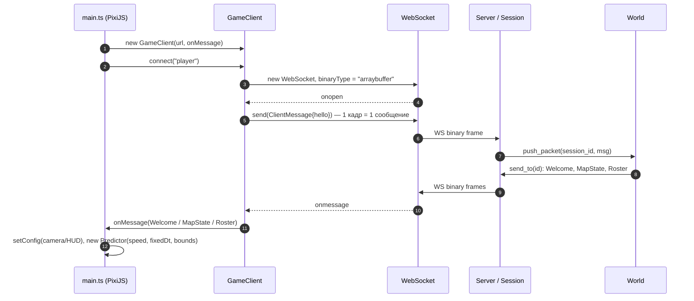
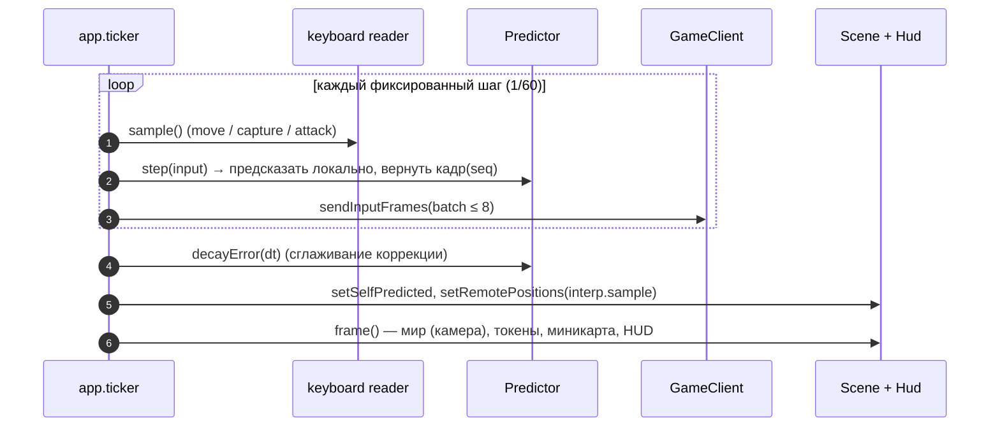
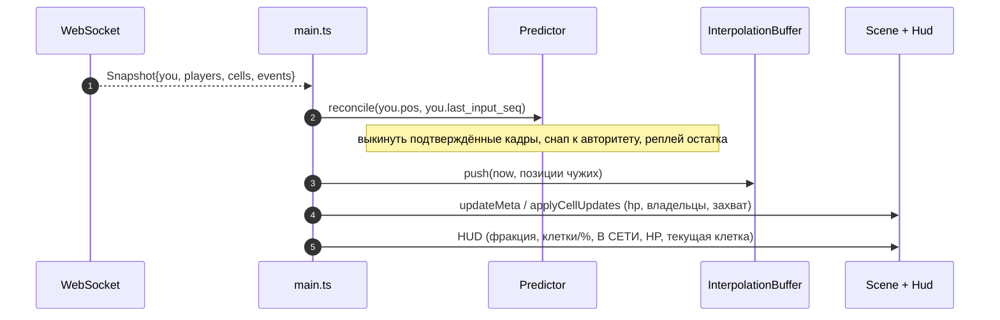

# Клиент — диаграммы последовательности

Клиент на **TypeScript + PixiJS + protobuf-es**. Транспорт — WebSocket, один
бинарный кадр = одно protobuf-сообщение (`ClientMessage` ↔ `ServerMessage`).
Схема протокола генерируется из `../../protocol/game/v1/protocol.proto`
(`npm run generate`, buf + protoc-gen-es) в `src/gen/`.

Клиент **предсказывает** своего игрока и **интерполирует** остальных: рендер идёт
каждый кадр из предсказанной (свой) и интерполированной (чужие) позиций, а
снапшоты сервера только корректируют.

## Подключение и приветствие (Hello → Welcome)

```mermaid
sequenceDiagram
    autonumber
    participant main as main.ts (PixiJS)
    participant net as GameClient
    participant ws as WebSocket
    participant srv as Server / Session
    participant world as World

    main->>net: new GameClient(url, onMessage)
    main->>net: connect("player")
    net->>ws: new WebSocket, binaryType = "arraybuffer"
    ws-->>net: onopen
    net->>ws: send(ClientMessage{hello}) — 1 кадр = 1 сообщение
    ws->>srv: WS binary frame
    srv->>world: push_packet(session_id, msg)
    world->>srv: send_to(id): Welcome, MapState, Roster
    srv->>ws: WS binary frames
    ws-->>net: onmessage
    net->>main: onMessage(Welcome / MapState / Roster)
    main->>main: setConfig(camera/HUD), new Predictor(speed, fixedDt, bounds)
```

## Игровой цикл (тикер PixiJS, фиксированный шаг)

```mermaid
sequenceDiagram
    autonumber
    participant tick as app.ticker
    participant kb as keyboard reader
    participant pred as Predictor
    participant net as GameClient
    participant scene as Scene + Hud

    loop каждый фиксированный шаг (1/60)
        tick->>kb: sample()  (move / capture / attack)
        tick->>pred: step(input) → предсказать локально, вернуть кадр(seq)
        tick->>net: sendInputFrames(batch ≤ 8)
    end
    tick->>pred: decayError(dt)  (сглаживание коррекции)
    tick->>scene: setSelfPredicted, setRemotePositions(interp.sample)
    tick->>scene: frame() — мир (камера), токены, миникарта, HUD
```

## Снапшот → коррекция

```mermaid
sequenceDiagram
    autonumber
    participant ws as WebSocket
    participant main as main.ts
    participant pred as Predictor
    participant interp as InterpolationBuffer
    participant scene as Scene + Hud

    ws-->>main: Snapshot{you, players, cells, events}
    main->>pred: reconcile(you.pos, you.last_input_seq)
    Note over pred: выкинуть подтверждённые кадры, снап к авторитету, реплей остатка
    main->>interp: push(now, позиции чужих)
    main->>scene: updateMeta / applyCellUpdates (hp, владельцы, захват)
    main->>scene: HUD (фракция, клетки/%, В СЕТИ, HP, текущая клетка)
```

> Статус: реализован весь цикл MVP — спавн по клику, движение (**WASD**), захват
> клетки (удержание **E**), атака по площади (удержание **ЛКМ**), смерть/респавн —
> с клиентским предсказанием/интерполяцией. Рендер по концепту: сетка территорий
> с координатами, токены со свечением/тенью/именем/hp, кольцо радиуса атаки с
> дугой кулдауна, follow-камера (обзор всей карты — **M**), угловой HUD и
> локальная миникарта.
