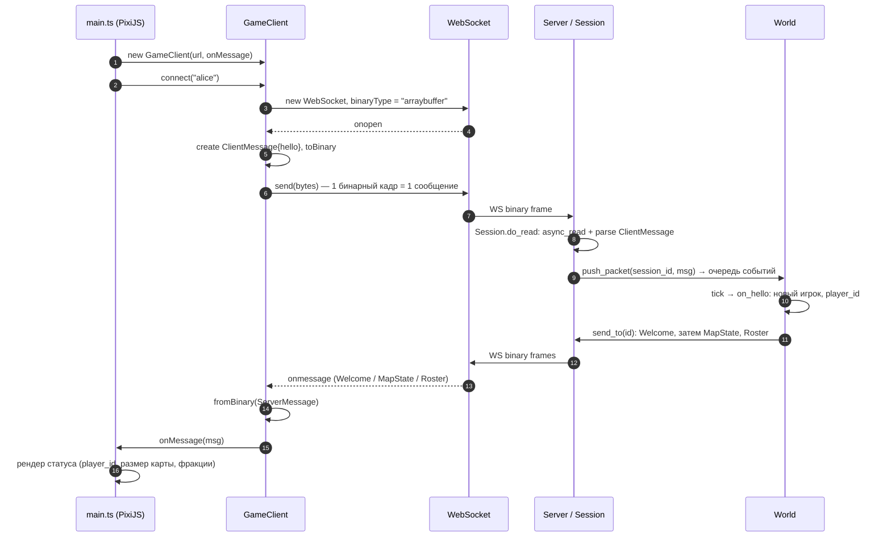
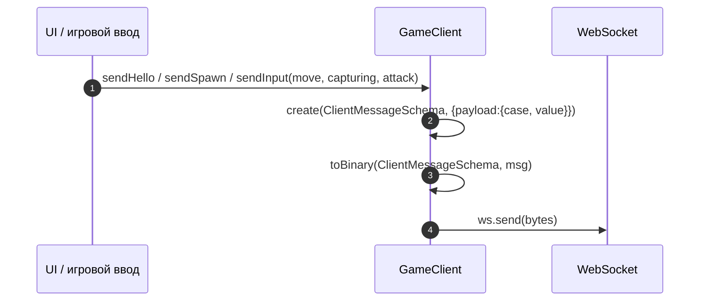

# Клиент — диаграммы последовательности

Клиент на **TypeScript + PixiJS + protobuf-es**. Транспорт — WebSocket, один
бинарный кадр = одно protobuf-сообщение (`ClientMessage` ↔ `ServerMessage`).
Схема протокола генерируется из `../../protocol/game/v1/protocol.proto`
(`npm run generate`, buf + protoc-gen-es) в `src/gen/`.

## Подключение и приветствие (Hello → Welcome)

```mermaid
sequenceDiagram
    autonumber
    participant main as main.ts (PixiJS)
    participant net as GameClient
    participant ws as WebSocket
    participant srv as Server / Session
    participant world as World

    main->>net: new GameClient(url, onMessage)
    main->>net: connect("alice")
    net->>ws: new WebSocket, binaryType = "arraybuffer"

    ws-->>net: onopen
    net->>net: create ClientMessage{hello}, toBinary
    net->>ws: send(bytes) — 1 бинарный кадр = 1 сообщение
    ws->>srv: WS binary frame

    srv->>srv: Session.do_read: async_read + parse ClientMessage
    srv->>world: push_packet(session_id, msg) → очередь событий
    world->>world: tick → on_hello: новый игрок, player_id
    world->>srv: send_to(id): Welcome, затем MapState, Roster
    srv->>ws: WS binary frames

    ws-->>net: onmessage (Welcome / MapState / Roster)
    net->>net: fromBinary(ServerMessage)
    net->>main: onMessage(msg)
    main->>main: рендер статуса (player_id, размер карты, фракции)
```

## Отправка сообщения (обобщённо)

```mermaid
sequenceDiagram
    autonumber
    participant app as UI / игровой ввод
    participant net as GameClient
    participant ws as WebSocket

    app->>net: sendHello / sendSpawn / sendInput(move, capturing, attack)
    net->>net: create(ClientMessageSchema, {payload:{case, value}})
    net->>net: toBinary(ClientMessageSchema, msg)
    net->>ws: ws.send(bytes)
```

> Статус: реализован весь цикл MVP — спавн по клику, движение (**WASD**), захват
> клетки (удержание **E**), атака по площади (удержание **ЛКМ**), смерть/респавн.
> Клиент рендерит сетку территорий, игроков (с HP-баром над головой), радиус
> атаки и шкалу кулдауна вокруг своего игрока; `Snapshot` обновляет позиции, hp,
> клетки и события боя (`HitEvent` / `DeathEvent`).
