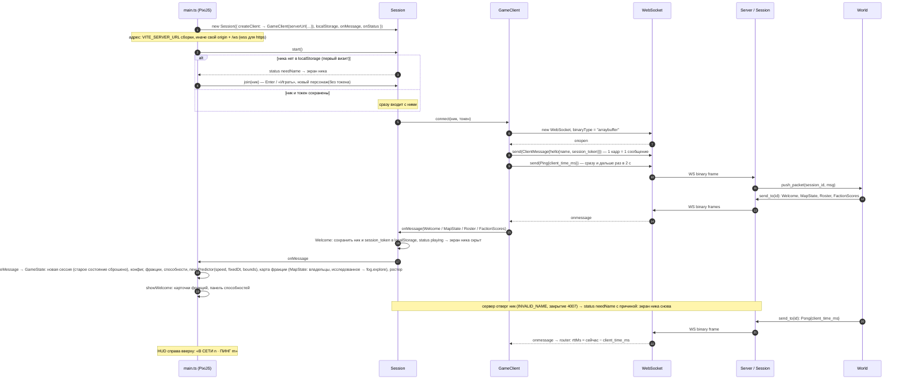
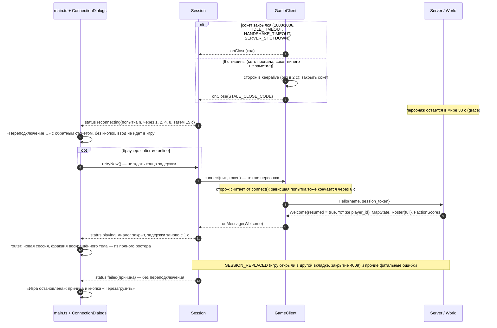
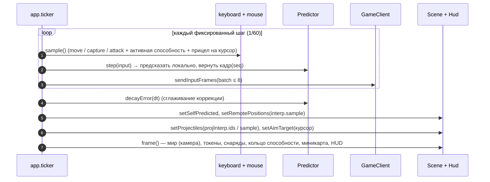
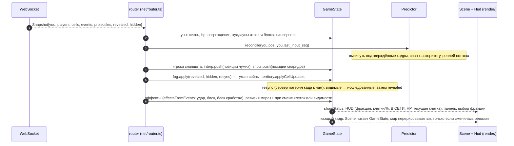

# Клиент — диаграммы последовательности

Клиент на **TypeScript + PixiJS + protobuf-es**. Транспорт — WebSocket, один
бинарный кадр = одно protobuf-сообщение (`ClientMessage` ↔ `ServerMessage`).
Схема протокола генерируется из `../../protocol/game/v1/protocol.proto`
(`npm run generate`, buf + protoc-gen-es) в `src/gen/`.

Клиент **предсказывает** своего игрока и **интерполирует** остальных: рендер идёт
каждый кадр из предсказанной (свой) и интерполированной (чужие) позиций, а
снапшоты сервера только корректируют.

## Подключение и приветствие (Hello → Welcome)

```mermaid
sequenceDiagram
    autonumber
    participant main as main.ts (PixiJS)
    participant ses as Session
    participant net as GameClient
    participant ws as WebSocket
    participant srv as Server / Session
    participant world as World

    main->>ses: new Session({ createClient: → GameClient(serverUrl(…)), localStorage, onMessage, onStatus })
    Note over main: адрес: VITE_SERVER_URL сборки, иначе свой origin + /ws (wss для https)
    main->>ses: start()
    alt ника нет в localStorage (первый визит)
        ses-->>main: status needName → экран ника
        main->>ses: join(ник) — Enter / «Играть», новый персонаж(без токена)
    else ник и токен сохранены
        Note over ses: сразу входит с ними
    end
    ses->>net: connect(ник, токен)
    net->>ws: new WebSocket, binaryType = "arraybuffer"
    ws-->>net: onopen
    net->>ws: send(ClientMessage{hello{name, session_token}}) — 1 кадр = 1 сообщение
    net->>ws: send(Ping{client_time_ms}) — сразу и дальше раз в 2 с
    ws->>srv: WS binary frame
    srv->>world: push_packet(session_id, msg)
    world->>srv: send_to(id): Welcome, MapState, Roster, FactionScores
    srv->>ws: WS binary frames
    ws-->>net: onmessage
    net->>ses: onMessage(Welcome / MapState / Roster / FactionScores)
    ses->>ses: Welcome: сохранить ник и session_token в localStorage, status playing → экран ника скрыт
    ses->>main: onMessage
    main->>main: routeMessage → GameState: новая сессия (старое состояние сброшено), конфиг, фракции, способности, new Predictor(speed, fixedDt, bounds), карта фракции (MapState: владельцы, исследованное → fog.explore), ростер
    main->>main: showWelcome: карточки фракций, панель способностей
    Note over ses,srv: сервер отверг ник (INVALID_NAME, закрытие 4007) → status needName с причиной: экран ника снова
    world->>srv: send_to(id): Pong{client_time_ms}
    srv->>ws: WS binary frame
    ws-->>net: onmessage → router: rttMs = сейчас − client_time_ms
    Note over main: HUD справа вверху: «В СЕТИ n · ПИНГ m»
```

## Потеря связи и переподключение

```mermaid
sequenceDiagram
    autonumber
    participant main as main.ts + ConnectionDialogs
    participant ses as Session
    participant net as GameClient
    participant srv as Server / World

    alt сокет закрылся (1000/1006, IDLE_TIMEOUT, HANDSHAKE_TIMEOUT, SERVER_SHUTDOWN)
        net-->>ses: onClose(код)
    else 6 с тишины (сеть пропала, сокет ничего не заметил)
        net->>net: сторож в keepalive (раз в 2 с): закрыть сокет
        net-->>ses: onClose(STALE_CLOSE_CODE)
    end
    Note over srv: персонаж остаётся в мире 30 с (grace)
    ses-->>main: status reconnecting{попытка n, через 1, 2, 4, 8, затем 15 с}
    main->>main: «Переподключение…» с обратным отсчётом, без кнопок, ввод не идёт в игру
    opt браузер: событие online
        main->>ses: retryNow() — не ждать конца задержки
    end
    ses->>net: connect(ник, токен) — тот же персонаж
    Note over net: сторож считает от connect(): зависшая попытка тоже кончается через 6 с
    net->>srv: Hello{name, session_token}
    srv-->>net: Welcome{resumed = true, тот же player_id}, MapState, Roster{full}, FactionScores
    net-->>ses: onMessage(Welcome)
    ses-->>main: status playing: диалог закрыт, задержки заново с 1 с
    main->>main: router: новая сессия, фракция воскрешённого тела — из полного ростера

    Note over ses,srv: SESSION_REPLACED (игру открыли в другой вкладке, закрытие 4009) и прочие фатальные ошибки
    ses-->>main: status failed{причина} — без переподключения
    main->>main: «Игра остановлена»: причина и кнопка «Перезагрузить»
```

## Игровой цикл (тикер PixiJS, фиксированный шаг)

```mermaid
sequenceDiagram
    autonumber
    participant tick as app.ticker
    participant kb as keyboard + mouse
    participant pred as Predictor
    participant net as GameClient
    participant scene as Scene + Hud

    loop каждый фиксированный шаг (1/60)
        tick->>kb: sample()  (move / capture / attack + активная способность + прицел на курсор)
        tick->>pred: step(input) → предсказать локально, вернуть кадр(seq)
        tick->>net: sendInputFrames(batch ≤ 8)
    end
    tick->>pred: decayError(dt)  (сглаживание коррекции)
    tick->>scene: setSelfPredicted, setRemotePositions(interp.sample)
    tick->>scene: setProjectiles(projInterp.ids / sample), setAimTarget(курсор)
    tick->>scene: frame() — мир (камера), токены, снаряды, кольцо способности, миникарта, HUD
```

## Снапшот → коррекция

```mermaid
sequenceDiagram
    autonumber
    participant ws as WebSocket
    participant router as router (net/router.ts)
    participant state as GameState
    participant pred as Predictor
    participant scene as Scene + Hud (render/)

    ws-->>router: Snapshot{you, players, cells, events, projectiles, revealed, hidden}
    router->>state: you: жизнь, hp, возрождение, кулдауны атаки и блока, тик сервера
    router->>pred: reconcile(you.pos, you.last_input_seq)
    Note over pred: выкинуть подтверждённые кадры, снап к авторитету, реплей остатка
    router->>state: игроки снапшота, interp.push(позиции чужих), shots.push(позиции снарядов)
    router->>state: fog.apply(revealed, hidden, resync) — туман войны, territory.applyCellUpdates
    Note over state: resync (сервер потерял кадр к нам): видимые → исследованные, затем revealed
    router->>state: эффекты (effectsFromEvents: удар, блок, блок сработал), ревизия мира++ при смене клеток или видимости
    state-->>scene: showStatus: HUD (фракция, клетки/%, В СЕТИ, HP, текущая клетка), панель, выбор фракции
    state-->>scene: каждый кадр: Scene читает GameState, мир перерисовывается, только если сменилась ревизия
```

Роутер пишет только в `GameState` (данные, без PixiJS); виды в `src/render/`
читают его. Текстовый UI поверх канваса — DOM-оверлей `src/ui/`: модальное окно,
тосты, экран ника и диалоги соединения (переподключение, остановка игры).

> Статус: реализован весь цикл MVP — вход по нику (он и токен сессии хранятся в
> браузере; при потере связи клиент сам возвращается тем же персонажем), выбор
> фракции (карточки внизу), спавн по клику, движение (**WASD**), захват клетки (удержание **E**), бой (удержание
> **ЛКМ**): способность из панели **1–5** — удар по площади или выстрел снарядом
> в сторону курсора (общий кулдаун), блок (свой кулдаун) — удары и блоки других
> видны всем, кто их видит — и смерть/респавн, с клиентским
> предсказанием/интерполяцией, под туманом войны (видимое — как есть,
> исследованное — затемнено, неизведанное — закрыто; на карте и миникарте). Рендер по концепту: сетка территорий с
> координатами, токены со свечением/тенью/именем/hp, кольцо дальности активной
> способности с дугой кулдауна (и линией прицела для выстрела), снаряды со следом,
> панель способностей, follow-камера (обзор всей карты — **M**), угловой HUD и
> локальная миникарта.
