# Territory — Game Design Document & Development Roadmap

> **Рабочее название:** «Territory» (из `client/index.html`; исторически проект назывался EndlessPeak, пространство имён `lit`).
> **Основа документа:** анализ репозитория `litcxx/Game` (ветка `main`, коммит `db8df5c`, 28.09.2026; вся история — 227 коммитов) и черновик ГДД автора.
> **Статус:** живой документ, версия 1.1.1. Главный документ проекта до первой публичной Alpha.
> **Изменения в 1.1:** в Alpha добавлены **поднятие союзника** (7.5.1, итерация 3, Step 10) и **стражи рудников** — простые монстры с ИИ (7.13.1, итерация 4, Step 12). Добавлены архитектурные требования `Unit` (R1a) и единого пространства id (R7a). Совместный захват и пауза захвата от урона стали MUST. Шаги перенумерованы (1–19), добавлены задачи GAME-051…055 и вопросы 16.18–16.21.
> **Правки 1.1.1 (сверка с кодом `db8df5c`):** число кодов `ErrorCode` — 18, а не 25; на оспариваемой клетке прогресс захвата сбрасывается, а не стоит (1.5, 7.3).
>
> **Условные обозначения**
> ✅ работает · 🟡 частично · 🧱 архитектурно подготовлено · 📝 только идея · ❌ отсутствует · ♻️ требует переработки
> **[ВРЕМЕННОЕ РЕШЕНИЕ]** — принято, чтобы не блокировать roadmap; вопрос вынесен в раздел 16 и может быть пересмотрен без переделки плана.
> Приоритеты: **MUST** (P0) · **SHOULD** (P1) · **POST-ALPHA** · **FUTURE**. Размер задач: **S** ≈ до 1 дня, **M** ≈ 2–4 дня, **L** ≈ 1–2 недели (ориентир для соло-разработки в текущем темпе).

---

## Содержание

0. [TL;DR — что делать дальше](#0-tldr--что-делать-дальше)
1. [Current State — текущее состояние](#1-current-state--текущее-состояние)
2. [Game Vision](#2-game-vision)
3. [Core Gameplay Loop](#3-core-gameplay-loop)
4. [Player Experience](#4-player-experience)
5. [Alpha Definition](#5-alpha-definition)
6. [Alpha Scope](#6-alpha-scope)
7. [Game Systems](#7-game-systems)
8. [System Dependencies](#8-system-dependencies)
9. [Development Iterations и правильный порядок](#9-development-iterations-и-правильный-порядок)
10. [Vertical Slices](#10-vertical-slices)
11. [Technical Roadmap](#11-technical-roadmap)
12. [MMO Architecture](#12-mmo-architecture)
13. [Technical Risks](#13-technical-risks)
14. [Cut List](#14-cut-list)
15. [Post-Alpha Roadmap](#15-post-alpha-roadmap)
16. [Open Questions](#16-open-questions)
17. [Linear / GitHub Issues](#17-linear--github-issues)
- [Приложение A. Текущие параметры конфига](#приложение-a-текущие-параметры-конфига)
- [Приложение B. Карта кода](#приложение-b-карта-кода)
- [Приложение C. Проверка документа (Phase 6)](#приложение-c-проверка-документа-phase-6)

---

## 0. TL;DR — что делать дальше

**Где мы сейчас.** У проекта технически сильный MVP. Авторитетный сервер на C++23 с фиксированным шагом 60 Гц, WebSocket + Protobuf. Клиент с предсказанием и интерполяцией. Три боевые способности, захват клеток и серверный туман войны. Всё собирается, 116 из 116 unit-тестов зелёные. Но пока это **арена, а не игра**:
- у территории нет последствий;
- у игрока нет идентичности: игрок равен WebSocket-сессии;
- ничего не сохраняется;
- фракцию можно менять при каждом респавне, появиться можно в любой клетке карты;
- сервер доступен только на `localhost`.

**Главный вывод.** До Alpha не хватает не «контента», а трёх фундаментов и одного смыслового ядра:

1. **Идентичность персонажа, отделённая от соединения.** Это reconnect, закреплённая фракция и вклад игрока.
2. **Модель сущностей мира помимо игроков.** Крепости, рудники, монстры-стражи. Сюда же входит общее «боевое тело» (Unit) для игроков и монстров, чтобы монстры пользовались тем же боем.
3. **Сохранение мира.**
4. **Смысловое ядро: территория → ресурс → крепость → спавн и зрение ближе к фронту → конфликт → новая территория.**

**Ближайшие шаги (в этом порядке):**

| # | Шаг | Зачем сейчас |
|---|-----|--------------|
| 1 | **Гигиена (S–M).** Рассинхрон дельт при переполнении очереди отправки, валидация `Hello` и `ServerError`, лимиты ввода, CI, дрейф радиуса зрения в тестах и доках | Дёшево. Без этого нельзя пускать внешних игроков, и каждая следующая фича строится на шатком основании |
| 2 | **Онлайн (M–L).** Персонаж ≠ сессия, reconnect по токену, экран ника, деплой с `wss://` | Самый быстрый путь к первым живым игрокам уже на текущем MVP |
| 3 | **Фронт (M–L).** Фракция закреплена, столицы и спавн только у своих, захват только смежных клеток, сохранение мира | Территория превращается из «раскраски» в фронт; мир переживает рестарт |
| 4 | **Крепость (L).** Модель сущностей, урон по постройкам, крепость как спавн, зрение и якорь территории, разрушение; **поднятие союзника** | Первая стратегическая цель для совместных действий; смерть получает цену и контригру |
| 5 | **Экономика и строительство (L).** Рудники под охраной **монстров-стражей** → казна фракции → ранги → постройка крепостей | Замыкает Core Loop; рудник нельзя взять в одиночку |
| 6 | **Alpha (L).** Чат, сезон, онбординг, админ-инструменты, нагрузочный тест, аналитика | Готовность к незнакомым игрокам |

**Alpha** — это постоянный мир со следующим циклом:
- игрок выбирает фракцию на сезон и появляется в крепостях своей фракции;
- павшего союзника можно поднять, пока идёт его таймер возрождения;
- игрок расширяет фронт и вместе со своими зачищает от стражей и захватывает рудники;
- фракция копит ресурс, офицеры строят новые крепости, противники их разрушают;
- мир переживает рестарт;
- есть чат фракции, вклад, ранги и сезон с победителем.

**Сознательно после Alpha:** стены, мёртвые клетки и бродячие или ночные монстры (в Alpha — только стражи рудников), ночь, логистика, инвентарь, предметы, технологии, дипломатия, налоги, личные владения, регионы, распределённый сервер.

---

## 1. Current State — текущее состояние

### 1.1 Итоговая оценка

| Аспект | Оценка |
|--------|--------|
| Техническое ядро (сеть, тик, симуляция, тесты) | **Сильное.** Чистая архитектура «системы над данными», единая точка урона, тесты на каждую фичу |
| Игровой цикл | **Только ближний цикл**: двигаться → драться → красить клетки. Среднего (сессия) и дальнего (дни) циклов нет |
| Готовность к реальным игрокам | **Нет.** Только localhost, у всех имя `"player"`, нет reconnect и сохранения, при обрыве связи игра молча замирает |
| Готовность к крепостям и постройкам | **Частичная.** Нет модели сущностей, урон наносится только игрокам, протокол знает только игроков и снаряды |
| Готовность к MMO-масштабу | **Для Alpha — да** (оценка по коду: порядка 300 CCU на карте 100×100 без оптимизаций; нужен замер). Дальше нужны инкрементальное зрение и чанки |

### 1.2 Что проверено при анализе

| Проверка | Результат |
|----------|-----------|
| Сборка сервера: GCC 13.3, C++23, Debug, ASan+UBSan, `-Werror` | ✅ собирается без предупреждений (понадобились обходы вне репозитория, см. TD-3, TD-4) |
| Unit-тесты сервера (GoogleTest) | ✅ **116/116**, 20 наборов |
| Клиент `tsc --noEmit` | ✅ |
| Клиентские pure-проверки (7 скриптов) | ✅ все `VERDICT: PASS` |
| E2E smoke против живого сервера (10 скриптов) | 🟡 **9/10**. `fog_smoke` падает |
| CI | ❌ отсутствует (нет `.github/`) |

**Почему падает `fog_smoke`.** Тест жёстко ожидает радиус зрения 4 клетки. Коммит `557e091` («config: change vision radius») поменял `vision_radius` с 400 на 300. С копией конфига на 400 тест проходит. Значит, это дрейф теста и документации, а не баг кода: `README.md`, `server/README.md` и шапка `protocol.proto` всё ещё говорят «4 клетки».

**Сборка.** Системный protobuf 3.21 (Ubuntu 24.04) не поставляет CMake-пакет, а `server/proto/CMakeLists.txt` требует `find_package(Protobuf CONFIG REQUIRED)`, то есть protobuf ≥ 22 с abseil. Кроме того, `src/db` подключается в сборку всегда и требует `libmariadb`, хотя модуль «запаркован». Для CI и новых разработчиков это надо решить.

### 1.3 Что игрок может сделать в игре сегодня

- Открыть клиент. Адрес зашит: `ws://localhost:27998/`; имя у всех — `"player"`.
- Выбрать одну из 4 фракций (Red, Green, Blue, Gold) и кликнуть **любую** клетку карты 100×100, чтобы появиться.
- Двигаться на WASD со скоростью 3 клетки/с. Движение плавное: предсказание плюс сверка с сервером.
- Удерживать **E** и захватить клетку под собой за 1 с. Подходит **любая** клетка в любой точке карты.
- Сражаться. Нет урона по своим, туман не мешает атаке. Способности:
  - **1** — удар по площади: 20 урона, радиус 1,2 клетки, перезарядка 0,75 с;
  - **2** — снаряд: 30 урона, 5 клеток, 8 кл/с, перезарядка 1,5 с, от него можно увернуться;
  - **3** — блок: 0,15 с, своя перезарядка 0,75 с.
- Умереть (100 HP). Через 5 с можно снова выбрать **любую** фракцию и **любую** клетку.
- Видеть мир под туманом:
  - видимое — 3 клетки вокруг каждого союзника и вокруг каждой своей клетки;
  - исследованное — затемнено;
  - неизвестное — закрыто.

  Есть миникарта, HUD и эффекты ударов и блоков других игроков.
- Всё исчезает при рестарте сервера. При обрыве связи клиент только пишет в консоль.

### 1.4 Какой игровой цикл существует

```
спавн (где угодно, любая фракция) → движение → захват / бой → смерть → спавн (где угодно, любая фракция)
```

У цикла нет «зачем»:
- **Территория** не даёт ничего, кроме зрения. У неё нет цены и последствий. 20 игроков перекрашивают всю карту 100×100 примерно за 8 минут (20 × 60 клеток/мин).
- **Смерть** почти бесплатна: 5 с ожидания и спавн в любой точке. Это обесценивает позицию, дистанцию и фронт.
- **Смена фракции при каждом респавне** обнуляет фракционную идентичность. Через неё можно шпионить: сменил цвет — получил зрение чужой фракции.
- **Нет накопления.** Ни у игрока, ни у фракции ничего не растёт и не может быть потеряно.

### 1.5 Классификация найденного

#### 1) ✅ Уже работает

| Система | Где в коде | Комментарий |
|---------|-----------|-------------|
| WebSocket-транспорт, 1 кадр = 1 protobuf-сообщение | `server/src/net/session`, `server/src/net/server` | Корутины Asio, супервизор сессии (`do_read ‖ do_send`), безопасный teardown, graceful shutdown |
| Протокол v1 | `protocol/game/v1/protocol.proto` | Единый источник правды, генерация для C++ (CMake) и TS (buf) |
| Фиксированный шаг 60 Гц, снапшоты 20 Гц | `game/world/world.cpp`, `fixed_step.hpp` | Аккумулятор с защитой от spiral of death |
| Ввод: одна команда за тик, seq/ack | `systems/input_system` | Детерминированный replay — основа клиентского предсказания |
| Движение + предсказание | `systems/movement_system`, `client/src/net/prediction.ts` | Формула продублирована на клиенте и совпадает побайтно по смыслу |
| Интерполяция чужих игроков и снарядов | `client/src/net/interpolation.ts` | Задержка 100 мс |
| Presence и roster | `World::on_hello` / `on_disconnect` | |
| Спавн и респавн с задержкой | `systems/spawn_system` | |
| Бой: удар по площади, снаряд со swept-проверкой, блок | `systems/combat_system`, `projectile_system`, `damage` | Способности задаются конфигом и приходят в `Welcome.abilities` |
| Единая точка урона `apply_damage()` | `systems/damage.cpp` | Попадания, блок, смерть, таймер респавна, события |
| Захват клетки | `systems/capture_system` | На оспариваемой клетке прогресс сбрасывается в 0; отпустил клавишу — тоже сброс |
| Туман войны на сервере | `systems/vision_system`, `sync/snapshot_builder` | Фильтр доставки, дельты `revealed`/`hidden`, общее зрение фракции |
| Туман войны на клиенте | `client/src/fog.ts`, `render/fog.ts` | Три состояния, память исследованного, миникарта под туманом |
| Рендер | `client/src/render/*` | Камера (15 клеток по ширине, обзор всей карты на M), HUD, миникарта, панель 1–5, выбор фракции, эффекты |
| Тесты | `server/test/unit` (116), `client/scripts` (7 pure + 10 e2e) | Процесс автора: план → протокол → сервер → клиент → smoke → доки |

#### 2) 🟡 Частично реализовано

| Что | Есть сейчас | Чего нет |
|-----|-------------|----------|
| Reconnect | В протоколе: `Hello.session_token`, `Welcome.session_token/resumed`, `GameConfig.reconnect_grace_ms` | Сервер токен не выдаёт. При разрыве игрок удаляется сразу (`on_disconnect`). Клиент не переподключается |
| Ошибки протокола | 18 кодов `ErrorCode` (1–12 и 20–25) и `ServerError` описаны в proto | Сервер **не отправляет ни одной ошибки**. Невалидные запросы молча игнорируются, остаётся только лог |
| Валидация `Hello` | По proto: версия протокола, имя 1–16 символов, повторный `Hello` — ошибка | Не проверяется ничего. Повторный `Hello` создаёт нового игрока с новым id, старый id остаётся «призраком» в roster у всех остальных |
| Таймауты и лимиты | Коды `HANDSHAKE_TIMEOUT`, `IDLE_TIMEOUT`, `RATE_LIMITED` | Нет. Очередь ввода игрока (`Player::inputs`) не ограничена |
| Фракции | 4 цвета в конфиге, нет урона по своим, общее зрение | Нет членства: фракция выбирается при каждом спавне. Нет лидера, казны и статистики |
| Территория | Сетка владельцев, захват, дельты под туманом | Нет правил (смежности) и ценности, нет защищённых зон. HUD считает долю карты только по клеткам, известным клиенту |
| Авторизация | Legacy `LoginDataBase` (MariaDB) + SHA-256 | Не подключено к серверу, тесты выключены. При этом конфигурация сборки требует `libmariadb` |
| TLS | Шапка proto описывает `wss://`, в репо лежит `certs/server.crt` | Сервер слушает обычный `ws` |
| Память исследованного | Клиент хранит explored-клетки | Теряется при перезагрузке вкладки и при каждом новом `Welcome` (`FogOfWar.reset` в `Scene.setConfig`) |
| Пинг | `Ping`/`Pong` в протоколе, сервер отвечает | Клиент не шлёт `Ping`, хотя в концепте в HUD нарисован «ПИНГ 38» |
| Совместный захват | Комментарий proto: «1 захватчик ≈ capture_ticks» | Скорость не зависит от числа захватчиков |

#### 3) 🧱 Архитектурно подготовлено

- **Способности задаются данными** (конфиг → `Welcome.abilities`). Новые виды способностей не требуют переделки панели и протокола.
- **`apply_damage()` — единая точка урона.** Естественное место для урона по постройкам и монстрам, щитов и модификаторов.
- **`compute_vision()` с источниками «игроки + свои клетки».** Крепости и здания как источники — ещё один цикл по источникам.
- **Снапшот собирается на каждого получателя.** Это готовая точка для interest management.
- **Шов `IClientGateway` + мок.** Весь `World` тестируется без сети.
- **`SpatialIndex`.** Broad phase для любых точечных сущностей (монстры, повозки).
- **Намерение игрока — простые поля** (`move_x/move_y`, `attack`, `ability`, `aim_x/aim_y`), которые `consume_inputs` заполняет из ввода. ИИ монстра может заполнять те же поля, и тогда движение, удар, снаряд и блок работают для монстров без нового кода боя.
- **Тело погибшего остаётся на месте до респавна** (`PlayerState.hp = 0`, таймер `respawn_tick`). Это готовая основа для поднятия союзника.
- **`CellUpdate` идемпотентен** (полное состояние клетки). Безопасен при повторах и раскрытии клетки.
- **Правила задаются конфигом** (карта, темп, фракции, способности). Их дёшево подстраивать под численность Alpha.
- **Дисциплина протокола.** `reserved`-поля, `id = 0` означает «нет», `enum 0 = UNSPECIFIED`, заложен `PROTOCOL_VERSION`.

#### 4) 📝 Есть только как идея (черновик ГДД и `client/docs/concept.png`)

- **Постройки:** крепость, стены, фракционные и личные постройки.
- **Экономика:** ресурсы, экономика, кошелёк фракции и личный кошелёк, налоги.
- **Логистика и транспорт:** телега, тропы.
- **PvE:** мёртвые клетки, монстры, ночь.
- **Прочее:** погода, технологии, инвентарь, оружие и предметы, дипломатия, форма правления, еженедельные войны, прокачка, ветки развития, личные владения клеток, регионы и бонус за регион, трава-невидимость, бой в духе Magicka.

Концепт-арт дополнительно показывает то, чего нет в коде: **«КРЕПОСТЬ»** и **«РУДНИК»** (ресурсная точка) на карте, ленту боя («TAG ранил SKAL −18»), статистику «ВИДНО / РАЗВЕДАНО / НЕИЗВЕСТНО», пинг и нейтральных (серых) игроков.

#### 5) ❌ Отсутствует (фундаментальное, в черновике ГДД не упомянуто)

- **Идентичность персонажа.** Сейчас игрок — это WebSocket-сессия (`WorldState::players` по `session_id`).
- **Сохранение чего-либо.** Мир живёт только в памяти процесса; `next_player_id` сбрасывается при рестарте.
- **Модель не-игровых сущностей.** В `WorldState` есть только `players` и `projectiles`.
- **Статические данные карты.** Рельеф, препятствия, точки интереса. Карта — однородная сетка.
- **Коллизии.** Игроки проходят сквозь друг друга, препятствий нет. Без коллизий невозможны стены.
- **Деплой.** Публичный адрес, TLS, раздача клиента, адрес сервера в конфиге клиента.
- **Ввод имени и UI потери соединения.**
- **Цель игры:** победа, сезон, счёт фракций.
- **Социальные функции:** чат, метки на карте.
- **Админ-инструменты:** кик, сброс мира, выдача прав.
- **Метрики и аналитика.** Только текстовый spdlog с уровнем `debug`, зашитым в `main.cpp`.
- **CI.**

#### 6) ♻️ Требует переработки

| Что | Проблема | Когда |
|-----|----------|-------|
| Игрок = сессия: `players` по `session_id`, удаление при разрыве | Блокирует reconnect, сохранение, закрепление фракции и вклад | Итерация 1 |
| Молчаливый drop кадров при переполнении очереди отправки (10 кадров), хотя протокол дельтовый | `World::send_snapshots` обновляет `Player::vision`, даже если снапшот выброшен (`Server::send_to` игнорирует результат `try_send`). Клиент теряет `revealed`-клетки и изменения территории, пока клетка снова не выйдет из зоны и не войдёт в неё. Потеря `Roster` оставляет игроков без имён | Итерация 1 (это баг) |
| Выбор фракции при каждом спавне | Нет фракционной идентичности; шпионаж через смену фракции | Итерация 2 |
| Спавн в любой клетке | Обесценивает фронт, позицию и будущие крепости | Итерация 2 |
| Захват любой клетки за 1 с | Нет фронтов, только «раскраска» | Итерация 2 |
| Статистика территории в HUD по клеткам, известным клиенту | Под туманом показывает не реальную долю карты | Итерация 2 |
| Порядок разрешения боя зависит от порядка обхода `unordered_map` | При ударе друг по другу в одном тике выживает тот, кто раньше в хеш-таблице | Итерация 3 (вместе с уроном по постройкам) |
| `client/src/main.ts` — одно замыкание со всем состоянием | Чат, меню спавна, режим строительства и лидерборд быстро превратят его в клубок | Итерации 1–2 |
| Радиус зрения в документации и `fog_smoke` | Там 4 клетки, в конфиге 3 | Итерация 1 |
| `src/db`, `src/cryptography` в сборке; README упоминает давно удалённый legacy-код (старый бинарный протокол, физику платформера) | Лишняя системная зависимость и устаревшая документация | Итерация 1 |

### 1.6 Готовность архитектуры к следующему этапу

**Хороший фундамент, который нужно сохранить:**

- **Разделение сети и игры.** Потокобезопасная очередь входящих, `IClientGateway` на выход, однопоточная симуляция без блокировок. Это правильная модель для одного шарда MMO.
- **«Системы над данными».** `WorldState` — простая структура, правила — свободные функции. Новые системы (`fortress_system`, `economy_system`) добавляются рядом. Данные отделены от логики, поэтому их легко сохранять.
- **Туман как фильтр доставки.** Защищает от wallhack by design; это зачаток interest management.
- **Детерминированный ввод и предсказание.** Хорошее ощущение управления уже сейчас.
- **Культура тестов и процесс вертикальных фич.** План → протокол → сервер → клиент → smoke → доки. Roadmap ниже построен под этот ритм.

**Что станет проблемой, если не решить заранее:**

1. **Нет понятия «сущность мира».** Если сделать крепость «особой клеткой» (флаг в `Territory` и `CellUpdate`), то рудники, здания и монстры потом потребуют переделки протокола и тумана. → Решить до крепости (раздел 13, R2).
2. **Нет разделения Character и Session.** Любая сохраняемая механика будет привязана к сессии. → Решить первым (R1).
3. **Дельтовый протокол без гарантии доставки.** → Исправить сразу (R3).
4. **Сложность снапшота.** O(клеток × получателей), зрение O(своих клеток × r²). Для Alpha нормально; становится проблемой прежде всего при **росте карты**, а не числа игроков (R14).
5. **У клиента нет слоя состояния и UI.** Текстовый UI (чат, меню, лидерборд) на PixiJS дорог. → DOM-оверлей (R10).

### 1.7 Технический долг

| ID | Долг | Серьёзность | Задача |
|----|------|-------------|--------|
| TD-1 | Рассинхрон дельт при переполнении очереди отправки | **Высокая** | GAME-002 |
| TD-2 | Нет валидации `Hello`, не отправляется `ServerError`, повторный `Hello` оставляет «призрака» | **Высокая** (публичный доступ) | GAME-003 |
| TD-3 | Сборка требует `libmariadb` из-за запаркованного `src/db` | Средняя | GAME-006 |
| TD-4 | Нужен protobuf ≥ 22 с CMake-пакетом; дистрибутивный 3.21 не подходит | Средняя (CI) | GAME-005 |
| TD-5 | Неограниченная очередь ввода, нет rate limit и таймаутов | **Высокая** (публичный доступ) | GAME-004 |
| TD-6 | Дрейф радиуса зрения: доки и тест 4 клетки, конфиг 3 | Низкая | GAME-001 |
| TD-7 | Порядок разрешения боя зависит от хеш-таблицы | Низкая | GAME-028 |
| TD-8 | Адрес сервера и имя зашиты в клиенте, нет reconnect и ping | **Высокая** (публичный доступ) | GAME-009, GAME-010 |
| TD-9 | README описывает удалённый legacy-код; `player_tests` в CMake-комментарии не существует | Низкая | GAME-006 |
| TD-10 | Нет CI | Средняя | GAME-005 |
| TD-11 | Уровень логов `debug` зашит в `main.cpp` | Низкая | GAME-012 |
| TD-12 | Статистика территории в HUD по известным клеткам | Низкая | GAME-018 |
| TD-13 | Копия `Vision` на каждого получателя и полный проход по всем клеткам на каждый снапшот | Низкая сейчас | Post-Alpha, P7 |

### 1.8 Вывод

Проект **готов к следующему этапу**: наращивать геймплей поверх ядра можно без переписывания. Но прежде чем строить крепости и экономику, нужно сделать короткий фундаментный блок: идентичность, надёжная доставка, модель сущностей, сохранение. Он занимает итерации 1–3 и чередуется с геймплейными срезами, так что реальные игроки появятся уже после итерации 1.

---

## 2. Game Vision

### 2.1 Одной фразой

**Браузерная MMO-война за территорию.** Сотни игроков в цветах своих фракций управляют одним персонажем в реальном времени. Они отвоёвывают клетки постоянной карты, разведывают её сквозь туман войны и превращают захваченную землю в ресурсы и крепости, которые держат фронт.

Ориентиры для настроения (не для копирования):
- минимализм и читаемость «раскраски территории»;
- постоянная война фракций, где игрок — солдат, как в Foxhole;
- владение пространством через постройки и возникающая сама собой политика, как в EVE Online.

### 2.2 Столпы дизайна (решения проверяются на соответствие им)

1. **Территория — это всё.** Она и счёт, и доход, и зрение, и право строить.
2. **Информация — оружие.** Туман войны делает разведку, засаду и наблюдение самостоятельными действиями.
3. **Фракция сильнее одиночки.** Общие зрение, казна, крепости и точки спавна. Вклад каждого виден.
4. **Мир помнит.** Карта постоянна, последствия переживают сессию и рестарт.
5. **Простая форма, глубина из взаимодействия.** Минималистичная графика и простые правила; сложность рождают люди, а не таблицы.

### 2.3 Элементы видения

| Элемент | Роль в игре |
|---------|-------------|
| **Жанр** | Top-down браузерная MMO: контроль территории + action-PvP + лёгкая стратегия фракций. Real-time, прямое управление одним персонажем |
| **Основной игровой опыт** | «Я часть фронта». Вместе со своими двигаю границу, нахожу в тумане врага и его крепости, защищаю наше и вижу, как мои действия меняют карту |
| **Роль игрока** | Солдат, разведчик и строитель фракции. Игрок сам выбирает, чем полезен: держать фронт, разведывать, захватывать рудники, осаждать крепости. С рангом — строить |
| **Роль территории** | Счёт фракции, сеть зрения (свои клетки видят вокруг), доступ к ресурсам (рудники), право строить (только на своих клетках), граница, от которой идёт захват (смежность) |
| **Роль фракций** | Главная социальная единица: общее зрение, казна, крепости, спавн, чат. Игрок принадлежит фракции на весь сезон |
| **Роль PvP** | Способ разрешения территориальных споров, а не самоцель. Бой нужен, чтобы остановить захват, прорвать фронт, защитить или разрушить крепость |
| **Роль PvE** | В Alpha — только **стражи рудников**: барьер, который не пускает одиночку к рудникам и превращает их захват в групповую задачу. PvE не заменяет PvP и исчезает у рудника после первой зачистки |
| **Роль исследования** | Добыча информации: где враг, где его крепости, кто держит рудники. Туман делает исследованное знание устаревающим, поэтому разведка нужна постоянно |
| **Роль экономики** | Мост между территорией и строительством. В Alpha один ресурс и казна фракции. Сложная экономика — только когда появится, на что тратить |
| **Роль строительства** | Превращает ресурсы в позицию и информацию. Крепость — это спавн, зрение и якорь территории у фронта |
| **Долгосрочная цель** | Фракции — доминировать на карте к концу сезона. Игроку — вклад, ранг и репутация внутри фракции. Игре — сезоны с меняющимися картами и правилами |

### 2.4 Чем игра НЕ является (в горизонте до Alpha)

- Не MOBA и не арена: бой обслуживает территорию.
- Не survival-крафт с гриндом ресурсов руками.
- Не политический симулятор: никаких выборов, дипломатии и налогов до Alpha.
- Не RPG с уровнями: сила персонажа не растёт вертикально. Новичок должен быть полезен в PvP с первой минуты.

---

## 3. Core Gameplay Loop

### 3.1 Три вложенных цикла

| Цикл | Масштаб | Содержание | Статус |
|------|---------|------------|--------|
| **Micro** | секунды | движение → обнаружение сквозь туман → решение (бой, уклонение, захват) → результат (урон, клетка) | ✅ есть |
| **Session** | 10–60 мин | спавн в своей крепости → путь к фронту → расширение границы или захват рудника → защита или набег → смерть → респавн в ближайшей крепости → … Вклад растёт | ❌ нет (нет крепостей, фронта, вклада) |
| **Macro** | дни, сезон | рудники → казна → новые крепости → фронт сдвигается → враг разрушает → потери и трофеи → сезонный итог | ❌ нет |

### 3.2 Core Gameplay Loop игры

```
        ┌──────────────► Разведка (туман войны) ──────────────┐
        │                                                     ▼
 Изменение территории                                   Захват клеток и рудников
 (граница сдвигается,                                   (только смежно своей земле)
  крепости стоят или падают)                                  │
        ▲                                                     ▼
        │                                              Доход в казну фракции
 Конфликт (PvP у границы,                                     │
  осада и защита крепостей)                                   ▼
        ▲                                             Строительство крепости
        │                                                     │
        └──── Проекция силы: спавн и зрение ближе к фронту ◄──┘
```

Два усилителя петли в Alpha:
- **Стражи рудников** делают первый захват рудника групповой задачей: без союзников доход не получить.
- **Поднятие союзника** делает бой у фронта командным: смерть стоит дорого (путь от крепости), но союзник может её отменить, если враг даст ему 4 секунды.

**Почему именно так, а не по примеру из задания.** В примере «развитие» и «разведка» стоят отдельными шагами. Здесь осью петли сделана **крепость**, потому что она превращает экономику в две «валюты», которые уже производят существующие механики:

- **Позиция (спавн).** Движение стоит времени (3 клетки/с, карта 100 клеток), поэтому точка спавна у фронта — реальное преимущество.
- **Информация (зрение).** Туман делает зрение ценным, а крепость — его стационарный источник.

Каждый элемент придаёт смысл предыдущему:
- без смежности у территории нет фронта;
- без ресурсов крепости бесплатны и их можно спамить;
- без крепостей ресурсам не на что тратиться;
- без разрушения крепостей нет конфликта с последствиями.

### 3.3 Место существующих механик в петле

| Механика | Место в петле | Что нужно добавить |
|----------|---------------|---------------------|
| Туман войны ✅ | Разведка: цена информации | Постройки как источники зрения; статичные точки интереса всегда известны |
| Захват ✅ | Захват | Смежность, защищённые зоны, разная скорость для нейтральных и вражеских клеток |
| Бой ✅ | Конфликт | Урон по постройкам, защита при спавне |
| Спавн ✅ | Проекция силы | Только в своих точках: столица, крепости |
| Смерть и тело ✅ | Конфликт: цена ошибки | **Поднятие союзника** в окне таймера респавна |
| Фракции 🟡 | Всё | Закрепление, казна, статистика |
| Стражи рудников ❌ (новое) | Захват рудников: PvE-барьер для одиночки | Боевое тело (Unit) общее с игроком, простой ИИ, жизненный цикл у рудника |

---

## 4. Player Experience

> Ниже описан опыт **целевой Alpha**. Для контраста: сегодня игрок открывает localhost, выбирает цвет, кликает любую клетку и красит карту или дерётся. Через 10 минут он понимает, что это ни на что не влияет.

### First 5 minutes — «Я в армии»

1. Открывает ссылку и вводит ник. Токен сохраняется в браузере — это и есть «аккаунт».
2. Видит карточки фракций: онлайн, доля карты, рекомендованная (самая малочисленная) фракция. Выбирает фракцию **на сезон**.
3. Появляется в **столице** своей фракции. Подсказка: «WASD — движение, удерживай E на клетке рядом с вашей землёй — захват».
4. Выходит к границе и захватывает первые клетки. Видит, как растёт территория фракции и копится вклад (+1 за клетку).
5. Встречает врага на границе: тот появляется из тумана. Первый бой: ЛКМ, клавиши 1/2/3. Побеждает или погибает. Если рядом союзник, тот подбегает к телу, удерживает F, и через 4 секунды игрок снова в бою. Если нет — по окончании таймера возрождается в ближайшей крепости.

**Цель первых 5 минут:** понять «моя земля — граница — враг» и сделать действие, которое заметно на карте.

### First 30 minutes — «Я понимаю фронт»

- Читает миникарту и панель фракции: доля карты, казна, крепости, лидер.
- Находит в тумане **рудник** (значок на карте виден всегда, владелец — только под зрением). Пытается взять его в одиночку, но стражи — два бойца с ударом и блоком и стрелок — отбрасывают его. Он возвращается с двумя союзниками: один выманивает стражей, двое бьют, павшего поднимают, рудник захвачен. Стражи этого рудника больше не появятся, казна фракции начинает расти.
- Координируется: метка на карте, чат фракции. Вместе с другими идёт к вражеской крепости.
- Получает ранг «Боец», видит себя в лидерборде фракции.
- Замечает цену смерти: после гибели нужно идти от крепости до фронта. Ближняя крепость — это ценность.

### First hour — «Я влияю на карту»

- Участвует в осаде или обороне крепости: HP-бар, оповещение «Крепость атакована». Узнаёт главную тактику: убить того, кто поднимает союзника, — и тогда таймер павшего снова пойдёт.
- Видит последствия разрушения: 3 клетки вокруг стали нейтральными, фронт провалился, фракция-победитель получила трофей.
- Приближается к рангу «Офицер» и получает право строить. Выбирает место для новой крепости на своей земле у фронта и тратит казну фракции.
- Видит, что его крепость появилась в меню респавна у всей фракции.

### Long-term loop — почему игрок возвращается

1. **Карта изменилась, пока его не было.** Постоянный мир: «что там с нашим рудником?»
2. **Фракция в гонке сезона.** Счёт, таймер, победитель, новый сезон.
3. **Личный статус.** Вклад, ранг, место в лидерборде, право строить.
4. **Социальные обязательства.** «Вечером штурмуем их северную крепость».
5. **(Post-Alpha)** Новые слои: стены и рельеф, мёртвые земли с ночными монстрами (ИИ уже есть у стражей рудников), логистика, личные владения.

---

## 5. Alpha Definition

### 5.1 Определение

> **Первая публичная Alpha готова**, когда незнакомый человек по ссылке может за 5 минут войти в **постоянный мир**, стать частью **фракции** и внести **вклад**, который:
> (а) виден ему и фракции,
> (б) меняет карту,
> (в) сохраняется, когда он вернётся завтра.
> И при этом у фракций есть **цель**, ради которой стоит объединяться.

### 5.2 Что должно существовать

| Измерение | Минимум для Alpha |
|-----------|-------------------|
| **Gameplay loop** | Полный Core Loop (3.2): разведка → захват (смежный) → зачистка стражей и захват рудников → казна → строительство крепости → спавн и зрение у фронта → осада и разрушение → изменение территории |
| **Действия игрока** | Войти с ником, выбрать фракцию на сезон, возродиться в своей столице или крепости, двигаться, захватывать смежные клетки и рудники, сражаться (удар, снаряд, блок) с игроками и стражами, **поднимать павших союзников**, атаковать постройки, писать в чат фракции. С рангом «Офицер» — строить крепость. SHOULD: ставить метку на карте |
| **Взаимодействия игроков** | PvP; **поднятие союзника** и охота на того, кто поднимает; совместный захват (быстрее вдвоём-втроём); совместная зачистка стражей рудника; совместная осада и оборона; общее зрение фракции; чат фракции. SHOULD: метки, оповещения о крепостях |
| **PvE** | Стражи рудников: появляются при инициализации карты, охраняют рудник, не возвращаются после первого захвата и полной зачистки |
| **Сохраняемое состояние** | Владельцы клеток; постройки (вид, клетка, фракция, HP, состояние); рудники (захватывался ли, сколько стражей живо); казна фракций; персонажи (id, ник, хеш токена, фракция, вклад, ранг, статистика, исследованная карта); состояние сезона; счётчики id |
| **Progression** | Игрок: вклад → ранг → право строить + лидерборд. Фракция: доля карты, рудники, крепости, казна, место в сезоне |
| **Социальное** | Членство во фракции на сезон, лидер и офицеры по вкладу, чат фракции, метки, лента событий, лидерборд |

### 5.3 Критерии запуска Alpha (Definition of Done)

- [ ] Публичный адрес с `wss://`; клиент раздаётся как статический сайт; сервер работает как сервис с автоперезапуском.
- [ ] Незнакомый игрок проходит путь «ссылка → ник → фракция → спавн → первая захваченная клетка» меньше чем за 2 минуты без внешних объяснений.
- [ ] Полный цикл проверен на плейтесте: фракция зачистила стражей и захватила рудник, накопила ресурс, построила крепость у фронта, крепость атакована и разрушена или удержана.
- [ ] Стражи выполняют свою роль: на плейтесте одиночка не удерживает захват охраняемого рудника, а группа из 3 игроков зачищает его за 1–3 минуты. Поднятие союзника используется в боях (метрика: число поднятий на смерть).
- [ ] Мир переживает рестарт: сохранение каждые 60 с и при остановке, восстановление при старте, проверена процедура восстановления из резервной копии.
- [ ] Reconnect в течение 30 с возвращает тот же персонаж в то же состояние.
- [ ] Нагрузочный тест: 200 ботов в течение 30 минут, время тика p99 < 8 мс (бюджет 16,6 мс), нет роста памяти.
- [ ] Метрики: CCU, время тика, байты на клиента, drops, reconnects. Журнал игровых событий для расчёта D1/D7 и длины сессии.
- [ ] Админ-инструменты: кик, mute, сброс мира и сезона, выдача ранга, разместить или удалить постройку.
- [ ] CI зелёный: сборка, unit-тесты, клиентские проверки, e2e smoke на каждую систему.
- [ ] Есть канал обратной связи (ссылка в клиенте) и список известных проблем.

### 5.4 Чем Alpha НЕ является

Не контент-полная игра. Нет стен, бродячих и ночных монстров (только стражи рудников), логистики, предметов и личного прогресса-«прокачки». Не рассчитана на тысячи игроков: цель — десятки одновременно, запас прочности до ~200. Не требует пароля и аккаунта: хватает гостевого токена.

---

## 6. Alpha Scope

Приоритеты выставлены по пяти критериям: вклад в Core Loop, зависимости, стоимость, влияние на удержание, возможность тестировать на живых игроках.

### 6.1 MUST HAVE — без этого Alpha не имеет смысла

| Система / фича | Почему MUST |
|----------------|-------------|
| Деплой: публичный URL, `wss`, раздача клиента | Без этого нет живых игроков |
| Экран ника + гостевой токен | Идентичность в минимальной форме |
| Character ≠ Session, reconnect с грейс-периодом | От идентичности зависят все сохраняемые системы. Обрывы связи в браузере — норма |
| Проверка версии протокола, `ServerError`, валидация `Hello` | Публичный доступ, кэшированные старые клиенты |
| Надёжная доставка дельт (resync при переполнении) | Иначе туман и территория рассинхронизируются у реальных игроков с плохой сетью |
| Лимиты ввода, rate limit, таймауты | Публичный доступ |
| Закрепление фракции на сезон | Фракционная идентичность; убирает шпионаж |
| Столицы + спавн только в своих точках | Даёт смысл позиции, фронту и крепостям |
| Захват v2: смежность, защищённая зона столицы | Создаёт фронт. Дёшево: одна система |
| Прерывание захвата уроном + совместный захват | Без паузы от урона одиночка «пересидит» стражей на клетке рудника, а без ускорения группой групповая игра не вознаграждается. Дёшево |
| Серверная статистика фракций | Честный счёт; нужна для сезона и выбора фракции |
| Сохранение мира v1 + резервные копии | «Мир помнит» — столп дизайна |
| Модель сущностей + синхронизация с учётом тумана | От неё зависят крепость, рудники и всё будущее |
| Урон по постройкам | Без него крепость нельзя разрушить |
| Крепость v1: спавн, зрение, HP, разрушение с нейтрализацией радиуса 3 | Ось Core Loop |
| Защита при спавне (3 с) | Иначе спавн в крепости — ловушка для кемперов |
| **Поднятие союзника** (окно = таймер респавна, канал 4 с, таймер павшего на паузе) | Делает бой командным и даёт смерти контригру. Дёшево: тело и таймер уже есть. Решение автора |
| **Боевое тело (Unit), общее для игроков и монстров** | Архитектурное условие для стражей: монстры используют тот же код движения, удара, снаряда, блока и урона |
| **Стражи рудников** (ближний бой + блок, стрелок; привязка к руднику; короткое агро; не возвращаются после первого захвата и зачистки) | Одиночка не должен брать рудник. Появляется PvE-задача для группы. Решение автора |
| Рудники + казна фракции + доход | Единственный источник ресурса |
| Вклад и ранги | Определяют право строить; личный прогресс в минимальной форме |
| Строительство крепости: стоимость, права, правила размещения, фаза строительства (60 с, уязвима) | Замыкает петлю «ресурс → позиция». Фаза строительства дешёвая и не даёт поставить мгновенный форпост посреди боя |
| Чат фракции | Незнакомые игроки не пойдут в Discord. Без координации фракция — просто толпа одного цвета |
| Сезон (минимум): таймер, счёт «территория-часы», объявление победителя, сброс | Единственная долгосрочная цель; без неё Alpha — песочница без причины возвращаться |
| Минимальные админ-инструменты и модерация (kick, mute, ban, сброс) | Плейтесты без сброса и модерации невозможны; с чатом нужен mute |
| Метрики + журнал событий | Без них плейтест не отвечает на вопросы |
| CI | Защищает темп разработки |
| Онбординг-подсказки первой сессии | Незнакомый игрок должен понять правила сам |
| Нагрузочный тест ботами | Нельзя звать людей, не зная потолка |

### 6.2 SHOULD HAVE — желательно, но можно выпустить без этого

| Фича | Почему SHOULD, а не MUST |
|------|--------------------------|
| Метки на карте, лента событий и убийств | Дёшево, заметно улучшает координацию и ощущение «живого мира»; чат уже закрывает минимум |
| Оповещения «крепость атакована / разрушена» | Оборона без них возможна: крепость — источник зрения |
| История прошлых сезонов в клиенте, вариации правил сезонов | Минимального сезона (MUST: таймер, счёт, победитель, сброс, архив сохранения) достаточно |
| Захват крепости (вместо разрушения) | Разрушение уже даёт конфликт с последствиями; захват — усложнение |
| Награда ресурсом в казну за убитого стража | Вклад за стража (MUST) уже вознаграждает; ресурс — ручка баланса экономики |
| Несколько поднимающих одновременно (ускорение канала) | Одного поднимающего достаточно для проверки механики |
| Регенерация HP вне боя | Меньше смертей «от усталости»; дёшево |
| Индикатор «попадание из тумана» для жертвы | Понятность боя |
| Баланс выбора фракции (онлайн, рекомендация) | Иначе все уйдут в сильнейшую фракцию |
| Серверная память исследованного | Черновик ГДД требует «не забывать карту»; без этого после reconnect карта снова тёмная |
| Показ пинга | Диагностика проблем у игроков (дёшево, делается вместе с GAME-010) |
| Урон столицы по врагам в её защищённой зоне | Против кемпинга спавна, если защиты при спавне не хватит |
| Базовые звуки | Ощущение боя; не влияет на петлю |

### 6.3 POST-ALPHA

Стены и коллизии, рельеф и препятствия, трава-невидимость, тропы, бродячие и ночные монстры, новые виды монстров, мёртвые клетки, день и ночь, логистика (перенос, телега, доставка на стройку), инвентарь, предметы и оружие, личный кошелёк и валюта, личные постройки, личные владения клеток, налоги, технологии фракции, аккаунты с паролем или OAuth и база данных, бой v2 (стихии в духе Magicka), регионы и бонус за регион, еженедельные войны, дипломатия, форма правления.

### 6.4 FUTURE

Погода как геймплей, сложная графика, бесшовные регионы на нескольких серверах, 10 000+ CCU, рынок и торговля между игроками, NPC-экономика, создаваемые игроками фракции и гильдии.

### 6.5 Куда попали идеи из черновика

| # | Идея | Решение |
|---|------|---------|
| 1 | Бой в духе Magicka | POST-ALPHA, фаза P4 (бой v2). Способности, заданные данными, делают это возможным |
| 2 | Идеи EVE Online | Частично в Alpha: владение пространством через постройки и возникающая политика фракций. Остальное — P5–P6 |
| 3, 16 | Монстры в тумане и на мёртвых клетках | **Частично в Alpha:** стражи рудников (7.13.1) — они же скрыты туманом как подвижные сущности. Монстры мёртвых клеток — POST-ALPHA, P2, на готовом ИИ стражей |
| 4 | Погода | FUTURE (P7): сначала косметика |
| 5 | Ночью монстры сильнее | POST-ALPHA, P2 |
| 6 | Открытие технологий | POST-ALPHA, P5 |
| 7 | Трава-невидимость | POST-ALPHA, P1 (нужен рельеф) |
| 8 | Фракции | **Alpha** (минимум) |
| 9, 10 | Экономика, деньги и ресурсы | **Alpha:** один ресурс и казна фракции. Деньги — P4, сложная экономика — P3–P5 |
| 11, 12 | Инвентарь, оружие, предметы | POST-ALPHA, P4 |
| 13, 26, 27 | Транспорт, логистика, доставка для стройки | POST-ALPHA, P3 |
| 14 | Дипломатия | POST-ALPHA, P6 |
| 15 | Форма правления | P5–P6, простая |
| 17 | Туман войны | ✅ сделано |
| 18 | Еженедельные войны | POST-ALPHA, P6 |
| 19, 21 | Прокачка, ветки как в WoW/Аллодах | **Alpha:** вклад и ранги. Горизонтальный прогресс — P4. Большие деревья — FUTURE или никогда (конфликт с PvP-балансом) |
| 20 | Сложная графика | FUTURE |
| 22, 23, 24 | Клетки во владение, личное строительство, налоги | POST-ALPHA, P5 |
| 25 | Ветка развития фракции | POST-ALPHA, P5 |
| 28 | Регионы с бесшовным переходом | Регионы как геймплей — P6. Как серверная технология — P7, только при необходимости |
| 29 | Бонус за контроль региона | POST-ALPHA, P6 |
| — | Итерация 1 черновика: «Туман, Крепость, …, Мёртвые клетки» | Туман ✅. Крепость — итерация 3. Плейсхолдеры «1» заполнены фундаментом (онлайн, идентичность, фронт, сохранение), без которого крепость не имеет смысла. Мёртвые клетки перенесены в P2: они не входят в Core Loop. Монстры как таковые вошли в Alpha в роли стражей рудников (см. 7.13) |
| — | *Добавлено позже автором:* поднятие союзника | **Alpha**, итерация 3 (7.5.1) |
| — | *Добавлено позже автором:* простые монстры у рудников | **Alpha**, итерация 4 (7.13.1) |

---

## 7. Game Systems

Для каждой системы: назначение → текущее состояние → Alpha-реализация → чего не делаем → будущее. Все числа — стартовые значения для конфига, их меняют без изменения кода. Сводка параметров — в 7.15.

### 7.1 Идентичность и сессия

**Назначение.** Персонаж — это постоянная сущность мира. Соединение — временный канал к ней.

**Сейчас.** ❌ Игрок = сессия. `WorldState::players` хранится по `session_id`, `on_disconnect` удаляет игрока.

**Alpha:**
- `Character { id (= player_id на проводе, не переиспользуется), name, token_hash, faction_id, season_contribution, rank, stats, explored (битсет клеток), created_at, last_seen }`.
- `Session { session_id → character_id }`. Рантайм-поля (позиция, HP, кулдауны, очередь ввода) принадлежат **персонажу в мире**, а не сессии.
- **Боевое тело `Unit`** выделяется при этом же разделении: позиция, HP, жизнь, фракция, кулдауны атаки и блока, текущее намерение (движение, атака, способность, прицел). Источник намерения — ввод игрока (`consume_inputs`) или ИИ монстра (итерация 4). Системы движения, боя, снарядов и `apply_damage` работают над `Unit`, а не над `Player`. Это почти бесплатно сейчас и избавляет от второго, «монстрового» кода боя потом.
- **Гостевой токен.** Сервер генерирует 128-битный случайный токен и отдаёт его в `Welcome.session_token`. Клиент хранит его в `localStorage` и шлёт в `Hello.session_token`. Сервер хранит только хеш токена. Можно переиспользовать `src/cryptography` (SHA-256).
- **Грейс-период** `reconnect_grace_ms` (30 с). При разрыве персонаж **остаётся в мире** — видим и уязвим. Это защита от выхода из боя закрытием вкладки. Затем тело исчезает из мира, запись о персонаже сохраняется.
- **Reconnect в грейс-период:** `Welcome.resumed = true`, то же состояние, принудительная пересылка видимости (сброс `Player::vision`).
- **Вход после грейс-периода:** тот же персонаж и фракция, состояние `NOT_SPAWNED`.
- **Тот же токен из другой вкладки:** старая сессия получает `SESSION_REPLACED` (код уже есть в proto).
- **Имя:** 1–16 символов, обрезка пробелов, печатные символы. Уникальность без учёта регистра **[ВРЕМЕННОЕ РЕШЕНИЕ]**: занятое имя — ошибка `INVALID_NAME`.

**Не делаем в Alpha.** Пароли, почта, OAuth, несколько персонажей на аккаунт.

**Будущее.** Аккаунты и привязка гостевого персонажа к аккаунту (P1), база данных.

### 7.2 Фракции — минимальная реализация

| Аспект | Alpha | Позже |
|--------|-------|-------|
| **Принадлежность игрока** | `Character.faction_id` фиксируется при первом спавне в сезоне. Сменить может только админ или сброс сезона **[ВРЕМЕННОЕ РЕШЕНИЕ]** | Смена с кулдауном и штрафом (P5) |
| **Принадлежность клеток** | `Territory.owners` (есть) | Личные владения внутри фракции (P5) |
| **Совместное зрение** | Есть: живые игроки + свои клетки. В Alpha добавляются постройки | Разведывательные постройки, трава (P1) |
| **Совместные действия** | Захват (быстрее вдвоём-втроём), **поднятие павших**, зачистка стражей рудника, осада, общие точки спавна, метки, чат | Совместная логистика (P3) |
| **Фракционные постройки** | Столица (заранее размещена, неразрушима), крепость | Стены, башни (P1), здания (P5) |
| **Фракционные ресурсы** | Казна: один ресурс «Материалы» | Несколько ресурсов, деньги (P3–P4) |
| **Фракционный progression** | Доля карты, рудники, крепости, казна, место в сезоне | Технологии фракции (P5) |
| **Роли** | **Лидер** — наибольший вклад в сезоне (пересчёт раз в минуту). **Офицеры** — ранг ≥ «Офицер». Оба могут строить **[ВРЕМЕННОЕ РЕШЕНИЕ]** | Форма правления, выборы (P5–P6) |
| **Баланс численности** | Пикер показывает онлайн и долю карты, рекомендует самую малочисленную фракцию (SHOULD). Мягкий лимит: нельзя вступить, если онлайн фракции > минимум + 30 % (SHOULD) | Бонусы отстающим |
| **Число фракций** | Задаётся конфигом. На Alpha при ожидаемых < 60 CCU — **3**, иначе 4 **[ВРЕМЕННОЕ РЕШЕНИЕ]** | |

**Не делаем в Alpha.** Дипломатию, форму правления, выборы, создание фракций игроками, внутрифракционную иерархию сложнее «лидер / офицер / боец».

### 7.3 Территория и захват v2

**Сейчас.** ✅ Удержание E захватывает клетку под центром игрока за `capture_ticks` = 60 (1 с). Разные фракции на одной клетке — прогресс сбрасывается в 0. Отпустил — тоже сброс. Пауза от урона (п. 5 ниже) потребует отдельного состояния «пауза», а не сброса. **Любая клетка в любом месте.**

**Alpha:**
1. **Смежность.** Захватывать можно только клетку, соседнюю по стороне с клеткой своей фракции (4-соседство) **[ВРЕМЕННОЕ РЕШЕНИЕ]**. Точки роста — зоны столиц и крепостей.
2. **Столица.** При старте сезона клетки в радиусе 4 от столицы принадлежат фракции и **защищены**: враг не может их захватить.
3. **Время захвата.** Нейтральная клетка — `capture_ticks` (рекомендуется 90 = 1,5 с). Вражеская — × 2.
4. **Совместный захват (MUST).** Каждый дополнительный захватчик своей фракции на той же клетке даёт +50 % скорости, не более трёх. Это реализует задуманное в комментарии proto «1 захватчик ≈ capture_ticks».
5. **Прерывание (MUST).** Получил урон от игрока или стража — прогресс захвата на этой клетке ставится на паузу на 1 с. Благодаря этому стражи не дают одиночке «пересидеть» захват рудника под ударами.
6. **Клетка рудника** захватывается по тем же правилам, в том числе пока стражи живы. Стражи не запрещают захват, а мешают ему уроном (п. 5). Жёсткий запрет «пока жив хоть один страж» — альтернатива, см. 16.19.
7. **Нет распада** неохраняемой территории в Alpha **[ВРЕМЕННОЕ РЕШЕНИЕ]** — проверяем на плейтестах.
8. **Счёт фракций.** Сервер ведёт счётчики клеток по фракциям (инкрементально при смене владельца) и раз в секунду рассылает `FactionScores`. HUD показывает реальную долю, а не известную клиенту.
9. **Изолированная территория** (отрезанная от сети) в Alpha ничем не наказывается. «Снабжение» — связь с логистикой (P3).

**Реализация.** Только `capture_system` (проверка соседей O(1), маска защищённых клеток, множитель) плюс конфиг столиц.

### 7.4 Туман войны

#### 7.4.1 Как устроен сейчас

- **Сервер.** `compute_vision(state, faction)` раз на фракцию на каждый снапшот отмечает клетки, чей центр находится в радиусе `vision_radius` (300 ед. = 3 клетки) от источника. Источники: живые игроки фракции и каждая её клетка.
- `build_snapshot()` отдаёт получателю:
  - игроков и снаряды на видимых клетках (себя — всегда);
  - события, все названные в которых игроки видимы;
  - изменившиеся видимые клетки;
  - все клетки, раскрытые с прошлого раза, с **актуальным** состоянием;
  - дельты `revealed`/`hidden` относительно `Player::vision`.
- Симуляция туман **не учитывает**: атака из тумана наносит урон.
- **Клиент.** `FogOfWar` хранит для каждой клетки состояние unexplored/explored/visible по дельтам. Explored показывается затемнённым с последним известным владельцем, unexplored закрыт плотным туманом. Миникарта тоже под туманом.

#### 7.4.2 Сравнение с описанием из черновика ГДД

| Требование черновика | Реализация | Статус |
|----------------------|-----------|--------|
| Visible: полностью видно, игроки видны, состояние актуально | revealed + cells + players на видимых клетках | ✅ |
| Explored: территория видна, состояние не обновляется, игроки исчезают | hidden → клиент хранит последнее известное; игроки не отправляются | ✅ |
| Unexplored: полностью скрыто | Клиентское состояние по умолчанию; `MapState` новичку ничего не раскрывает | ✅ |
| Радиус ≈ 4 клетки, круг, без блокировок | Круг по центрам клеток, без линии видимости. **Радиус в конфиге 3** (коммит `557e091`), доки и `fog_smoke` — 4 | 🟡 дрейф |
| Источники: игроки фракции | Живые игроки фракции | ✅ |
| Источники: захваченные клетки | Каждая своя клетка с тем же радиусом, что и у игрока | ✅ (радиус не настраивается отдельно) |
| Источники: крепости, здания | Нет построек | ❌ (шаблон готов) |
| Динамическое обновление с игроком, союзниками, захватом | Пересчёт на каждый снапшот | ✅ |
| Противник в зоне: модель, положение, направление, цвет, информация | Позиция, HP; фракция — через roster; направление — только по интерполяции (нет скорости и направления взгляда в `PlayerState`) | 🟡 |
| Противник вышел из зоны — исчезает | Не отправляется, клиент удаляет спрайт | ✅ |
| Изменение территории в тумане неизвестно до возврата зрения | `dirty` уходит только видимым; раскрытая клетка приходит с текущим состоянием | ✅ |
| Неизменяемая информация видна всегда: граница, размер | Размер — в `Welcome`, граница рисуется всегда | ✅ |
| Неизменяемая информация: препятствия, заранее известные точки интереса | Нет статических данных карты | ❌ |
| Отображение: нормальная / затемнённая / закрытая | Три слоя в `FogView` | ✅ |
| Атака из тумана наносит урон | Симуляция игнорирует зрение | ✅ |
| Смерть — перестаёт давать зрение | Тело даёт зрение только в снапшоте, сообщающем о смерти | ✅ |
| Respawn: новая точка, зрение, разведка заново, карта не забывается | Новая точка и зрение — да; исследованное хранит **только клиент в пределах вкладки** — теряется при перезагрузке и новом `Welcome` | 🟡 |
| Совместное зрение фракции | Да | ✅ |
| Скрытие игроков | Сервер не отправляет скрытых вообще — анти-wallhack | ✅ |
| *(не в черновике)* Постройки в исследованных клетках | — | ❌ нужно правило «последнее известное состояние» (7.4.3) |
| *(не в черновике)* Надёжность дельт | Drop кадра ломает видимость навсегда (TD-1) | ❌ |

#### 7.4.3 Доработки тумана к Alpha

| ID | Доработка | Итерация |
|----|-----------|----------|
| F-1 | Синхронизировать радиус: оставить 3 клетки как последнее решение автора **[ВРЕМЕННОЕ РЕШЕНИЕ]**; обновить README, proto и `fog_smoke` (радиус из переменной окружения) | 1 |
| F-2 | Надёжность: при неудачном `try_send` сбросить `Player::vision` получателя и повторно отправить `MapState`/roster (resync), либо закрыть сессию (клиент переподключится) | 1 |
| F-3 | Explored на сервере: `Character.explored \|= vision` на каждом снапшоте (битсет 1,25 КБ на 100×100). Отдаётся в `Welcome`, сохраняется. Выполняет требование «карта не забывается» | 2 |
| F-4 | Статическое знание: `MapDefinition` в `Welcome` (столицы, рудники, позже рельеф). Позиции видны всегда, **актуальный владелец** — только под зрением | 2 / 4 |
| F-5 | Два класса видимых объектов. **Подвижные** (игроки, снаряды, монстры-стражи с итерации 4, позже телеги) в тумане исчезают. **Стационарные** (постройки, рудники, в том числе статус «охраняется / зачищен») в explored показываются в последнем известном состоянии, как территория | 3 |
| F-6 | Обобщённые источники зрения: `VisionSource{x, y, radius}` — игроки (3), клетки (`cell_vision_radius`, отдельный параметр), постройки (крепость 5) | 3 |
| F-7 | Жертва атаки из тумана получает `HitEvent` с `attacker_id = 0` («удар из тумана»). Урон виден, позиция атакующего не раскрывается (SHOULD) **[ВРЕМЕННОЕ РЕШЕНИЕ]** | 5 |

Смерть и respawn уже соответствуют черновику и не требуют изменений, кроме F-3 (explored не теряется между сессиями). Поднятие союзника (7.5.1) правил тумана не меняет: тело не даёт зрения ни во время канала, ни после; поднятый игрок снова становится источником зрения с момента оживления. Прогресс поднятия виден всем, кто видит клетку тела, в том числе врагам — это их шанс помешать.

#### 7.4.4 Можно ли использовать туман как основу MMO interest management?

**Да — как слой «право знать».** Нынешний туман уже решает главную задачу interest management: определяет **на сервере**, что получатель может получить, и **не отправляет остальное**. Это правильная точка расширения: «видимость = подписка». Фильтр ставит один и тот же вопрос для любых сущностей («видна ли клетка под объектом?»). Значит, крепости, монстры и телеги попадут под туман автоматически, если пойдут через тот же `build_snapshot`.

**Ограничения, мешающие масштабу:**

| # | Ограничение | Почему проблема | Путь развития |
|---|-------------|-----------------|---------------|
| 1 | Полный проход по всем клеткам на каждого получателя на каждый снапшот (diff revealed/hidden) | O(клеток × получателей × 20 Гц). Растёт с **размером карты** | Чанки 16×16 с битсетами и diff только по «грязным» чанкам. Общий diff для получателей фракции с одинаковым прошлым состоянием |
| 2 | `compute_vision` каждый снапшот заново проходит по всем своим клеткам | O(своих клеток × r²). Территория меняется редко, а пересчитывается 20 раз в секунду | Инкрементальная сетка счётчиков видимости (reference counting): источник появился, ушёл или сдвинулся на клетку → ±1 в диске. Зрение клеток кэшируется |
| 3 | Фильтр игроков и событий перебирает всех | O(игроков²), O(событий × получателей) | Выборка через `SpatialIndex` и чанки только видимой области |
| 4 | Зрение общее на **всю** фракцию | Фракции из 500 человек по всей карте потребуется получать всех, кого видит любой союзник. Трафик растёт квадратично | **Второй слой — «нужно знать» (relevance AOI).** Полная детализация только в радиусе камеры и интереса игрока. Дальнее фракционное зрение — упрощённо и реже (точки на миникарте 2 Гц) |
| 5 | Копия `Vision` (10 КБ) на каждого получателя | Память и memcpy: O(получателей × клеток) | Хранить у получателя версию или хеш чанков, а не копию |
| 6 | Нет приоритизации и бюджета трафика | При перегрузке кадры выбрасываются молча (TD-1) | Бюджет байт на снапшот, приоритеты (близкие игроки > дальние), resync |

**Эволюция:**
- **v1 (сейчас, Alpha).** Полный пересчёт, фильтр по клетке. Хватает примерно до 300 CCU на 100×100 (оценка по коду, замер — задача GAME-045).
- **v2.** Инкрементальное зрение + чанки. **Триггер:** карта больше 150×150 или CCU > 300, время снапшота > 4 мс.
- **v3.** Слой relevance AOI + LOD для дальнего фракционного зрения. **Триггер:** фракции > 150 онлайн или средний снапшот > 3 КБ.
- **v4.** Зоны и серверы регионов (раздел 12). **Триггер:** один процесс не держит тик.

**Итог:** выбрасывать существующую систему не нужно. Модель «право знать = фракционное зрение» остаётся, под ней меняются структуры данных, а над ней появляется слой «нужно знать».

### 7.5 Боевая система

**Принцип (сохраняется).** Туман не блокирует атаку. Сервер решает, попал ли удар или снаряд. Жертва может не видеть атакующего.

**Alpha combat = текущий набор + постройки + честность:**

| Элемент | Alpha |
|---------|-------|
| **Базовые атаки** | Как сейчас: удар по площади (1), снаряд (2), блок (3), общая перезарядка атак, отдельная — у блока. Слоты 4–5 пустые |
| **Урон** | Фиксированный на способность. По постройкам — тот же урон с множителем способности **[ВРЕМЕННОЕ РЕШЕНИЕ]**: удар × 1, снаряд × 0,5 (ближний бой у стены опаснее) |
| **Смерть** | `DEAD`, тело лежит, нет зрения. Захват прерывается (уже так). Пока идёт таймер респавна (5 с), тело можно **поднять** (7.5.1) |
| **Поднятие союзника** | Союзник у тела удерживает F 4 с; таймер павшего на это время стоит. Успех → павший оживает на месте тела с 40 % HP. Прервали или убили поднимающего → таймер идёт дальше. Таймер истёк → только спавн в крепости |
| **Respawn** | Только в своей точке спавна (столица или крепость) по выбору из меню, после окончания таймера. **Защита при спавне** 3 с: нет урона, снимается при первой атаке. Поднятый союзником защиты не получает |
| **PvP** | Все чужие фракции враждебны, урона по своим нет. Выход из игры не спасает — персонаж остаётся в мире на грейс-период |
| **PvE** | Стражи рудников (7.13.1) пользуются тем же набором способностей и тем же `apply_damage`. Враждебны всем фракциям, между собой не дерутся |
| **Связь с территорией** | Бой останавливает захват: урон (от игрока или стража) ставит захват на паузу на 1 с (MUST). Смерть сама по себе не меняет территорию. Убийства, поднятия и урон по постройкам дают вклад (итерация 4) |
| **Честность** | Двухфазное разрешение: сначала собираются все удары и запуски снарядов тика, затем урон применяется разом. Возможна взаимная смерть, порядок в хеш-таблице ни на что не влияет |
| **Регенерация (SHOULD)** | 5 HP/с после 5 с без полученного урона |
| **Индикатор «удар из тумана» (SHOULD)** | См. F-7 |

**Не делаем в Alpha.** Предметы, оружие, характеристики, криты, стихии, контроль (оглушение, замедление), лечение (кроме поднятия павшего), компенсацию лага для снарядов (сознательно, как сейчас), сложный ИИ (у стражей — простой конечный автомат).

**Будущее (бой v2, P4):**
- Комбинации стихий в духе Magicka. Способности уже заданы данными: нужен новый `AbilityKind` «комбо» и конфиг элементов.
- Оружие определяет набор способностей в слотах 4–5.
- Лечение и поддержка.
- Невидимость в траве (P1).

#### 7.5.1 Поднятие союзника (Alpha, итерация 3)

**Назначение.** Смерть у фронта дорогая: путь от крепости. Поднятие даёт команде способ её отменить, а врагу — ясную цель: убить того, кто поднимает. Бой становится командным, появляется роль «медика» без отдельного класса.

| Аспект | Правило |
|--------|---------|
| **Окно** | Пока павший в `DEAD` и его таймер респавна не истёк (`respawn_delay_ticks` = 300, 5 с) |
| **Кто может** | Живой игрок той же фракции. Не может: враг, монстр, сам павший |
| **Как начать** | Подойти к телу на ≤ 1 клетку (`revive_range` = 100 ед.) — появляется подсказка «F — поднять ‹ник›». **Удерживать F**. Если рядом несколько тел, сервер выбирает ближайшее тело союзника с открытым окном |
| **Длительность** | 4 с (`revive_ticks` = 240) непрерывного удержания |
| **Таймер павшего** | Пока идёт канал, таймер **замирает**: на каждом тике канала `respawn_tick += 1`. Пример: прошло 3 с из 5 → союзник начал поднимать → таймер стоит на «2 с» → поднимающего убили → таймер снова идёт от 2 с |
| **Прерывание** | Отпустил F; отошёл дальше `revive_range`; применил любую способность (удар, выстрел, блок); поднимающий погиб. Полученный урон сам по себе **не прерывает** (как задумано автором) — поднимающего нужно убить. После прерывания таймер павшего идёт дальше, прогресс канала обнуляется **[ВРЕМЕННОЕ РЕШЕНИЕ]** |
| **Повторная попытка** | Можно, пока окно открыто; прогресс с нуля. Тот же или другой союзник |
| **Один поднимающий** | На одно тело — один канал. Второй союзник не может начать, пока идёт первый |
| **Успех** | Павший оживает на месте тела: `ALIVE`, HP = 40 % от `max_hp` **[ВРЕМЕННОЕ РЕШЕНИЕ]**, кулдауны сброшены, без защиты при спавне. Поднимающему +5 вклада (итерация 4) |
| **Окно закрылось** | Тело больше нельзя поднять («угасло»). Павший выбирает точку спавна (столица или крепость) — как сейчас после `respawn_tick` |
| **Движение поднимающего** | Разрешено в пределах радиуса, поэтому клиентское предсказание не меняется. Захват (E) во время канала не работает |
| **Грейс-период** | Отключившегося павшего можно поднять, пока он в мире. После ухода из мира канал отменяется |
| **Видимость** | Прогресс виден всем, кто видит клетку тела (`PlayerState.revive_progress`), — и союзникам, и врагам. `ReviveEvent` (начато, прервано, завершено) — для эффектов и ленты. Правила тумана не меняются |

**Небольшие корректировки к исходной идее и почему:**
- **Удержание, а не однократное нажатие.** Единообразно с захватом (E). «Прервать» — это естественно «отпустить». Не нужно блокировать движение в предсказании.
- **40 % HP, а не полное.** Поднятие — второй шанс, а не бесплатная замена возрождения в крепости.
- **Любая способность прерывает канал.** Честный выбор «поднимать или сражаться»; блок тоже считается.
- **Урон не прерывает** (как у автора). Если плейтест покажет, что поднимать слишком безопасно, включается ручка конфига `revive_interrupt_on_damage`.
- **Окно равно таймеру респавна, 5 с.** Поднимать можно только «горячо», рядом в бою. Если окажется слишком тесно, таймер увеличивается до 8 с (вопрос 16.18). После перехода спавна в столицу и крепости более длинный таймер наказывает не так сильно.

**Зависит от:** закреплённой фракции (кто союзник), меню возрождения (что после окна), двухфазного боя (кто погиб в этом тике), `Unit`.
**Не делаем в Alpha:** лечение живых, поднятие после окна, самоподнятие, ускорение несколькими поднимающими, предметы воскрешения.

### 7.6 Крепость v1 — roadmap

#### 7.6.1 Поэтапная реализация

| Этап | Что появляется | Итерация | Зависит от |
|------|----------------|----------|------------|
| **F0. Сущности** | `Structure` с id, видом, клеткой, фракцией, HP, состоянием; протокол `EntityUpdate`; клиентский слой построек; столица становится постройкой вида `CAPITAL` | 3 | Персонаж ≠ сессия, сохранение v1 |
| **F1. Функции крепости** (крепости ставит админ) | Спавн, зрение (радиус 5), HP 3000, урон от врагов, разрушение → радиус 3 нейтрален, оповещения, сохранение | 3 | F0, урон по постройкам, правила спавна |
| **F2. Строительство** | Строит лидер или офицер за 300 «Материалов» на своей клетке; фаза строительства 60 с; при завершении нейтральные клетки в радиусе 3 переходят фракции; трофей 50 % при разрушении | 4 | F1, казна, ранги |
| **F3. Захват** (SHOULD) | Альтернатива разрушению: владелец меняется, радиус 3 перекрашивается | 5 | F2 |
| **F4. Развитие** | Уровни крепости, ремонт за ресурсы, стены вокруг | P1 / P5 | Коллизии, технологии |

#### 7.6.2 Правила Fortress v1

| Аспект | Правило |
|--------|---------|
| **Создание** | Итерация 3 — админ-командой или из конфига (для плейтестов). Итерация 4 — `BuildRequest` от лидера или офицера фракции |
| **Размещение** | Только на своей клетке. Не ближе 10 клеток к любой другой постройке (своей или чужой) и столице. Максимум 5 крепостей на фракцию. Не в защищённой зоне чужой столицы (следует из смежности и дистанции) |
| **Владелец** | **Фракция.** Персонаж-строитель записывается в `builder_id` для вклада и истории, но прав не получает **[ВРЕМЕННОЕ РЕШЕНИЕ]**. Так личное владение (P5) ляжет поверх фракционного без переделки |
| **Фракция** | Цвет, общий спавн и зрение для всей фракции |
| **Спавн** | Появляется в меню возрождения у всех членов фракции. Точка появления — свободная клетка в радиусе 1 от крепости. Защита при спавне 3 с. Во время строительства спавна нет |
| **Зрение** | Источник зрения радиусом 5 клеток (больше игрока). Во время строительства — 2 |
| **HP** | 3000. Урон — только от атак врагов. Регенерация (SHOULD) — 1 % за 10 с, если в радиусе 5 нет врагов. Строящаяся крепость имеет 20 % HP |
| **Уничтожение** | При HP = 0 крепость удаляется. Клетки в радиусе 3 становятся **нейтральными**, захваты там сбрасываются. Защищённые зоны столиц не затрагиваются: по правилу дистанции они и не пересекаются (10 > 3 + 4). Событие `StructureDestroyed` уходит всем, кто видит клетку; владельцу — всегда |
| **Захват** (F3, SHOULD) | Если при HP ≤ 25 % атакующая фракция удерживает захват на клетке крепости 10 с, владелец меняется, HP становится 25 %, клетки в радиусе 3 переходят новому владельцу. Иначе при HP = 0 — разрушение **[ВРЕМЕННОЕ РЕШЕНИЕ]** |
| **Влияние на клетки** | При завершении строительства нейтральные клетки в радиусе 3 становятся своими (вражеские — нет). При разрушении — радиус 3 нейтрален. При захвате — радиус 3 переходит захватчику |
| **Столица** | Особый вид: заранее размещена у края карты, неразрушима в Alpha, защищённая зона радиуса 4, всегда точка спавна. SHOULD — урон врагам внутри зоны против кемпинга |

#### 7.6.3 Зависимости крепости

| От чего | Зачем крепости | Минимум, достаточный для F1 |
|---------|----------------|-----------------------------|
| **Фракции** | Владелец, общий спавн и зрение, враги | Закреплённая фракция (итерация 2) |
| **Строительство** | Появление крепости игроками | Не нужно для F1 (админ ставит). Нужно для F2 |
| **Экономика** | Цена, трофей | Не нужна для F1. Нужна для F2 |
| **Ресурсы** | То, что тратится на крепость | Не нужны для F1. Нужны для F2 |
| **Бой** | Разрушение | Урон по постройкам (итерация 3) |
| **Туман** | Зрение, память о крепости в explored | Обобщённые источники зрения, правило «последнее известное» |
| **Спавн** | Главная функция | Точки спавна вместо «любой клетки» (итерация 2) |
| **Сохранение** | Крепость переживает рестарт | Сохранение v1 (итерация 2) |

**Ключевой вывод:** F1 делается **до экономики**. Ценность крепости (спавн, зрение, осада) проверяется на плейтесте раньше, чем появятся ресурсы. Если крепость не создаёт интересного конфликта, экономику под неё строить рано.

#### 7.6.4 Минимальная игровая ценность уничтожения крепости

1. **Стратегическая.** У врага пропадает точка спавна у фронта. Его подкрепления идут от дальней крепости или столицы — фронт проседает.
2. **Территориальная.** 3 клетки вокруг становятся нейтральными: дыра в границе, которую атакующие могут занять по смежности.
3. **Информационная.** У врага пропадает источник зрения радиусом 5 — он слепнет на участке.
4. **Экономическая** (с итерации 4). 50 % стоимости крепости (150 «Материалов») уходит в казну атакующей фракции. Владелец теряет вложение.
5. **Социальная.** Объявление в ленте событий; вклад участникам пропорционально нанесённому урону (итерация 4). Это история, которую пересказывают.

Штраф владельцу отдельно вводить не нужно: потеря спавна, зрения, клеток и вложенных ресурсов уже достаточна.

### 7.7 Строительство

**Минимальная система для Alpha:** один вид постройки игроков — **крепость**. Столица размещается сервером.

**Цепочка зависимостей:** ресурсы (рудники → казна) → территория (строим на своей клетке) → право (ранг) → постройка (крепость) → progression (новая точка спавна у фронта, рост фракции).

**Правила `BuildRequest{kind, cell}`** (все проверки на сервере):
- клетка своя;
- правило дистанции (10 клеток) и лимит (5 на фракцию);
- в казне ≥ стоимости;
- строитель — лидер или ранг ≥ «Офицер»;
- строитель жив и находится не дальше 5 клеток от места стройки **[ВРЕМЕННОЕ РЕШЕНИЕ]** — строить можно только там, куда дошёл.

Ошибки: `BUILD_NO_RIGHTS`, `BUILD_NOT_ENOUGH_RESOURCES`, `BUILD_INVALID_CELL`, `BUILD_TOO_CLOSE`, `BUILD_LIMIT`.

**Виды построек задаются данными**, как способности: `structure_kinds[] { kind, max_hp, cost, vision_radius, influence_radius, spawn_point, build_ticks, destructible }`. Новые постройки (башня, лагерь) потом добавляются конфигом и системой-обработчиком.

**Клиент.** Режим строительства (клавиша B): призрак крепости на клетке под курсором, подсветка допустимости по известным данным (сервер всё равно проверяет), подтверждение кликом, показ ошибки.

| Категория | Постройка | Решение |
|-----------|-----------|---------|
| Фракционные | **Крепость** | **Alpha** |
| Фракционные | **Стены** | **POST-ALPHA (P1).** Зависимости: коллизии на сервере → **повторение коллизий в клиентском предсказании** (иначе сервер постоянно дёргает игрока назад) → статический слой карты → блокировка снарядов (и, возможно, зрения). Это отдельный крупный пласт, не нужный Core Loop |
| Фракционные | Будущие здания (башня зрения, лагерь-спавн, улучшение рудника, склад) | P1–P5, по данным |
| Личные | Личные здания | **POST-ALPHA (P5).** Требуют личного кошелька и личного владения клетками |
| Личные | Личный progression через постройки | P5 |

### 7.8 Экономика

**Минимальный economic loop Alpha:**

```
Рудник (точка на карте) ──владение клеткой рудника──► доход раз в минуту
      ──► казна фракции (с лимитом) ──► строительство крепости
      ──► разрушение чужой крепости ──► трофей в казну
```

| Элемент | Alpha | Когда вернуть в расширенном виде |
|---------|-------|----------------------------------|
| **Ресурсы** | Один ресурс «Материалы» | Несколько ресурсов — когда появятся разные постройки и технологии (P3–P5) |
| **Получение** | 12 рудников (`MapDefinition`): по 2 ближе к каждой столице, остальные в центре и богаче. Доход 10/мин с рудника (центральные — 20). **Каждый рудник изначально охраняется стражами** (7.13.1): первый захват — групповая задача. SHOULD: слабый доход с клеток (`cell_income` = 0 по умолчанию) | Добыча руками и перенос — P3 |
| **Хранение** | Казна фракции, лимит 1000 **[ВРЕМЕННОЕ РЕШЕНИЕ]** — против ночного накопления | Склады, физическое хранение — P3 |
| **Расход** | Крепость — 300 | Ремонт, улучшения, технологии, стены — P1, P5 |
| **Деньги** | Нет | P4: валюта для личного уровня |
| **Кошелёк фракции** | = казна | Разделение ресурсов и денег — P4 |
| **Личный кошелёк** | **Нет.** Тратить лично нечего без предметов и личных построек, а это новые UI и баланс | P4–P5 |
| **Налоги** | **Нет.** Нужны личное владение и личный доход | P5 |
| **Будущая экономика** | — | Логистика, рынок, производственные цепочки — P3+ |

**Проверка баланса.** Фракция с 2 своими рудниками получает 20/мин → крепость каждые 15 минут. С центральным рудником — 40/мин → каждые 7–8 минут. Лимит в 5 крепостей и дистанция 10 клеток не дают «застроить всё». Трофей 150 делает набег выгодным. Все числа — конфиг.

**Почему рудники, а не доход с каждой клетки.** Рудник — **конкретная цель** на карте, которую находят в тумане, захватывают и защищают, и которая стягивает конфликт. Доход с клеток поощряет бесцельную раскраску и снежный ком. Поэтому по умолчанию он выключен и оставлен как ручка настройки.

**Роль стражей в экономике.** В начале сезона каждый рудник — «лагерь»: доход открывается фракции, которая первой соберёт группу. После первого захвата и зачистки рудник переходит из рук в руки уже только в PvP. Центральные рудники богаче и охраняются сильнее (больше стражей), поэтому стягивают туда первые групповые походы.

### 7.9 Progression

#### Player progression (Alpha)

```
Игрок → действие (захват, убийство, поднятие союзника, зачистка стражей, осада, рудник) → вклад → ранг → новые возможности (право строить) + статус (лидерборд, титул)
```

| Действие | Вклад **[ВРЕМЕННОЕ РЕШЕНИЕ]** |
|----------|-------------------------------|
| Захват нейтральной клетки | +1 |
| Захват вражеской клетки | +2 |
| Захват клетки рудника | +20 |
| Убийство врага | +5 |
| Поднятие союзника | +5 |
| Убийство стража рудника | +3 |
| Урон по вражеской постройке | +1 за каждые 100 HP |
| Разрушение крепости | +50, делится по нанесённому урону |
| Постройка крепости (после завершения) | +10 |

| Ранг | Порог (сезон) | Возможность |
|------|---------------|-------------|
| Рекрут | 0 | — |
| Боец | 50 | Титул |
| Ветеран | 250 | Титул |
| Офицер | 1000 | **Право строить** |
| Командир | 3000 | Титул. Лидер фракции — максимальный вклад |

- Вклад и ранг сезонные. Статистика за всё время (убийства, захваты) сохраняется у персонажа.
- **Почему нет уровней, XP и деревьев умений.** В PvP вертикальный рост ломает честность боя «новичок vs ветеран». Задача Alpha — проверить территориальную петлю, а рост силы маскирует проблемы баланса. Горизонтальный прогресс (выбор способностей в слоты 4–5, косметика) — P4.

#### Faction progression (Alpha)

```
Фракция → территория (смежный захват) → рудники → казна → строительство крепостей
        → спавн и зрение у фронта → война (осады) → место в сезоне
```

Видимые показатели: доля карты, рудники, крепости (x/5), казна и доход, лидер, место в сезоне.
**Нет в Alpha:** технологии фракции, уровни фракции, бонусы за регион (P5–P6).

### 7.10 Социальное

| Фича | Alpha | Примечание |
|------|-------|------------|
| Чат фракции | MUST | До 200 символов, rate limit, только своя фракция, не сохраняется. Если плейтесты #1–2 покажут острую нужду, поднимается раньше итерации 5: зависит только от GAME-013 и GAME-014 |
| Глобальный чат | Нет **[ВРЕМЕННОЕ РЕШЕНИЕ]** | Цена модерации; фракциям достаточно своего |
| Метка на карте (Alt+клик) | SHOULD | Видна фракции 5 с, на карте и миникарте |
| Лента событий и убийств | SHOULD | Строится из `GameEvent` (уже есть); в концепте она нарисована |
| Объявления (крепость построена / разрушена, рудник захвачен, конец сезона) | SHOULD | |
| Лидерборд фракции | MUST (часть 7.9) | |
| Модерация | MUST (минимум) | Фильтр имён, mute, kick, ban по токену |
| Ссылка на Discord / обратную связь | MUST | |

### 7.11 Сезон и мета

- **Сезон** — 14 дней **[ВРЕМЕННОЕ РЕШЕНИЕ]**. Счёт — сумма долей карты во времени («территория-часы»), чтобы ночной захват пустой карты не решал всё.
- **Конец сезона:** объявление победителя, архив сохранения. Сброс территории, построек, казны, вклада и фракционной принадлежности; у всех рудников снова появляются лагеря стражей. У персонажей остаются ник, токен, статистика за всё время и титулы сезона.
- **До реализации сезонов** (итерации 2–4) сезон — это `season_id` в сохранении, а сброс делает админ-команда.
- **Еженедельные войны** — P6 (окна осад с бонусами), когда будет база игроков и данные об активности по времени.

### 7.12 Логистика — анализ

**Идея:** ресурсы → транспорт → доставка → территория → строительство.

| Элемент | Что требует | Стоимость |
|---------|-------------|-----------|
| **Телега с лошадью** | Подвижная сущность (модель сущностей F0 + движение и путь), физический ресурс как груз, управление игроком или сопровождение ИИ, протокол транспорта, предсказание движения транспорта, уязвимость (урон по сущности) | L–XL |
| **Тропы** | Счётчик трафика на клетку с распадом → модификатор скорости. Модификатор должен быть **известен клиентскому предсказанию**; под туманом клиент знает только последнее известное, и расхождение исправит сверка. Сохранение состояния троп | M |
| **Скорость передвижения** | Модификаторы скорости по клеткам в `integrate()` на сервере и клиенте одновременно | S–M |
| **Логистические маршруты** | Возникают сами из расположения рудников и строек; нужны точки доставки (стройка требует N доставленных ресурсов) | M |
| **Связь с мёртвыми клетками** | Мёртвые клетки — опасные или непроходимые для телег зоны. Выбор между коротким опасным путём и длинным безопасным | Зависит от P2 |

**Вердикт: логистика — не Alpha, а фаза P3.**
- Она удваивает число систем (грузы, транспорт, пути, стройплощадки) и сценариев тестирования.
- Её ценность проявляется, только когда экономика и строительство уже проверены на игроках.
- В Alpha ресурс «телепортируется» в казну.

**Поэтапный ввод:**
1. **L1** — тропы (дёшево, растут сами по себе).
2. **L2** — игрок сам несёт связку ресурса от рудника к крепости (перенос медленнее обычного движения, ресурс выпадает при смерти). Простая ручная логистика и PvP вокруг носильщиков.
3. **L3** — телега-сущность.
4. **L4** — стройка требует доставленных материалов.

### 7.13 Монстры: стражи рудников (Alpha) и мёртвые клетки (Post-Alpha)

#### 7.13.1 Стражи рудников — монстры v1 (Alpha, итерация 4)

**Назначение.** Одиночка не должен взять рудник сам, поэтому первый захват каждого рудника — групповая задача. Стражи — первый PvE в игре и фундамент ИИ для фазы P2.

**Виды стражей.** Задаются данными (`monster_kinds[]` в конфиге → `Welcome`), как способности. Способности — **те же записи**, что у игрока.

| Вид | Способности | HP | Скорость | Поведение в бою |
|-----|-------------|----|----------|-----------------|
| **Страж-воин** | Удар (1) + Блок (3) | 150 | 250 ед./с (игрок — 300, поэтому от стража можно оторваться) | Сближается и бьёт, когда цель в радиусе удара. Ставит блок в ответ на удар игрока рядом с вероятностью 50 % **[ВРЕМЕННОЕ РЕШЕНИЕ]** |
| **Страж-стрелок** | Выстрел (2) | 80 | 250 ед./с | Держит дистанцию 3–4 клетки, стреляет в текущую позицию цели без упреждения, поэтому выстрел можно обойти. Отходит, если цель ближе 2 клеток |

**Состав лагеря** **[ВРЕМЕННОЕ РЕШЕНИЕ]** (конфиг `mines[].guards`): у бокового рудника — 2 воина и 1 стрелок; у центрального, более богатого — 3 воина и 2 стрелка.

**Поведение — простой конечный автомат:**

```
                  игрок в 3 клетках
                  или страж получил урон
     ОБХОД ──────────────────────────────────► АГРО / АТАКА
  (бродит в 2 клетках                          (способности по виду,
   от рудника)                                  поднимает весь лагерь)
        ▲                                             │
        │ дошёл до рудника:                           │ 5 с без контакта (ни удара, ни попадания)
        │ HP восстановлено                            │ или цель дальше 6 клеток от рудника
        │                                             │ или целей не осталось
        └─────────────── ВОЗВРАТ ◄────────────────────┘
                   (не атакует, не агрится)
```

- **Обход:** бродит к случайным точкам в `wander_radius` = 2 клетки от рудника.
- **Агро:**
  - ближайший игрок любой фракции в `aggro_radius` = 3 клетки;
  - или тот, кто нанёс стражу урон, если он в пределах привязи — нельзя безнаказанно расстреливать стражей из-за радиуса агро;
  - начавший бой страж поднимает весь свой лагерь («стая») **[ВРЕМЕННОЕ РЕШЕНИЕ]** — так выманить стражей по одному сложнее.
- **Короткое агро** (как задумано автором): стражи возвращаются, если 5 с (`aggro_ticks` = 300) не было контакта (ни нанесённого, ни полученного урона) или цель ушла дальше `leash_radius` = 6 клеток от рудника. Пока бой идёт у рудника, контакт продлевает агро. Если убежать — стражи немного погонятся и вернутся.
- **Возврат:** бегут к руднику, не атакуют и не агрятся. Урон по ним проходит. У рудника восстанавливают HP полностью **[ВРЕМЕННОЕ РЕШЕНИЕ]** — защита от тактики «откусить и убежать».
- **Чего стражи не делают:** не захватывают клетки, не дают никому зрения, не атакуют постройки, их нельзя поднять.
- **Фракция:** служебная, id 255 «Дикие». Враждебна всем игрокам, внутри неё урона нет.

**Жизненный цикл (у каждого рудника свой):**

| Состояние рудника | Условие | Стражи |
|-------------------|---------|--------|
| **Охраняется** | Рудник ни разу не захватывался | Появляются при инициализации карты (старт сезона). Убитый страж возрождается у рудника через 90 с (`guard_respawn_ticks` = 5400) **[ВРЕМЕННОЕ РЕШЕНИЕ]** |
| **Захвачен, стражи остались** | Первый захват уже был, живые стражи есть | Больше не возрождаются. Оставшиеся продолжают охранять и атакуют всех, включая новых владельцев |
| **Зачищен** | Рудник захватывался хотя бы раз, и все стражи мертвы | Не появляются до конца сезона. Дальше рудник переходит из рук в руки только в PvP |

Сброс сезона возвращает все рудники в состояние «Охраняется».

> **Как понято исходное правило.** Автор написал: «когда рудник был захвачен первый раз и все монстры убиты, они больше не появляются». Отсюда вывод: **до** первого захвата убитые стражи возрождаются. Иначе одиночка мог бы выбивать их по одному за долгое время. После зачистки у группы есть окно ~90 с на захват. Если задумано, что стражи не возрождаются никогда, достаточно поставить `guard_respawn_ticks = 0` (вопрос 16.19).

**Туман.** Стражи — подвижные сущности: видны только на видимых клетках, в explored исчезают. Позиция рудника известна всегда (`MapDefinition`). Статус «охраняется / зачищен» — стационарная информация в последнем известном состоянии.

**Награды.** +3 вклада за стража тому, кто нанёс последний удар. Первый захват клетки рудника даёт +20, как и раньше. SHOULD: ресурс в казну за стража.

**Реализация (кратко):**
- Страж — это `Unit` с контроллером «ИИ».
- `ai_system` на каждом тике **до движения** пишет в `Unit` намерение (движение, атака, способность, прицел). Дальше работают те же `integrate_movement`, `activate_blocks`, `resolve_attacks`, `update_projectiles`, `apply_damage`.
- Стражи попадают в `SpatialIndex` вместе с игроками.
- `guardian_system` отвечает за жизненный цикл по руднику.
- События `HitEvent` / `DeathEvent` / `AbilityEvent` не меняются: id стражей — из общего пространства id (раздел 13, R7a).
- В снапшоте — `Snapshot.monsters`, фильтр тумана такой же, как у игроков.
- Около 50 стражей на карте — для тика это ничтожно.
- Поиск пути не нужен: на карте нет препятствий, достаточно прямого движения. С рельефом (P1) понадобится.

**Зависит от:** `Unit` (итерация 1); модели сущностей и общего пространства id (итерация 3); двухфазного боя (итерация 3); рудников (итерация 4); прерывания захвата уроном (итерация 2).

**Не делаем в Alpha:** поиск пути, бродячих монстров вне рудников, ночь, особые способности монстров, добычу с монстров, боссов.

**Что проверить на плейтесте:**
- одиночка без помощи не удерживает захват охраняемого рудника;
- группа из 3 игроков зачищает боковой лагерь за 1–3 минуты;
- стражей не удаётся «разобрать» выманиванием по одному.

#### 7.13.2 Мёртвые клетки и ночные монстры — анализ (Post-Alpha)

**Идея:** мёртвые клетки → монстры → ночь → усиление монстров → исследование → логистика.

| Вопрос | Ответ |
|--------|-------|
| **Часть Core Loop?** | **Нет.** Core Loop Alpha — PvP за территорию. Монстры мёртвых земель — слой PvE-давления: делают исследование опасным, дают контент без других игроков и позже угрожают логистике |
| **Нужна Alpha?** | **Нет.** Стражи рудников уже закрывают задачу Alpha (PvE-барьер у ресурса). Мёртвые клетки требуют статического слоя карты и цикла дня и ночи — это не усиливает проверку Core Loop |
| **Когда вводить?** | **P2**, после стабилизации Alpha. **Исключение:** если на Alpha пиковый CCU < 30 и игроки жалуются на «пустой мир», P2 идёт **раньше** P1 — монстры дают занятие без других игроков |
| **Какие системы нужны** | Уже есть после Alpha: `Unit`, ИИ (обход, агро, возврат), урон по монстрам и от них, туман для подвижных сущностей. Нужно добавить: 1) патрули и стаи вне рудников, спавн с лимитами по зонам; 2) статический слой карты — мёртвые клетки как вид рельефа; 3) глобальные часы дня и ночи (в `Welcome` и снапшоте), ночные множители силы; 4) поиск пути, если к этому времени появится рельеф; 5) награды: вклад, ресурс. Сами монстры не сохраняются, раскладка мёртвых клеток статична |

**Определение мёртвых клеток** **[ВРЕМЕННОЕ РЕШЕНИЕ]**: статические зоны карты, которые нельзя захватить. Ночью в них появляются монстры, возможно, с редким ресурсом. Альтернатива «клетка умирает от запустения» интереснее, но требует распада территории (открытый вопрос 16.6).

### 7.14 Admin и Live-Ops (минимум для плейтестов)

- Команды: kick, mute, ban (по токену), сброс мира, сброс сезона, выдать или снять ранг, разместить или удалить постройку, изменить казну, возродить или убрать стражей рудника, объявление всем.
- Канал: отдельный локальный HTTP-порт (только localhost / VPN) или `ClientMessage` с админ-токеном из конфига **[ВРЕМЕННОЕ РЕШЕНИЕ]**: первое проще.
- Все админ-действия пишутся в журнал.

### 7.15 Сводка стартовых параметров (новые ключи конфига)

| Параметр | Значение | Система |
|----------|----------|---------|
| `vision_radius` (игрок) | 300 (3 клетки), как сейчас | Туман |
| `cell_vision_radius` | 300 (как сейчас; рассмотреть 200) | Туман |
| `capture_ticks` | 90 (1,5 с) | Захват |
| `capture_enemy_multiplier` | 2.0 | Захват |
| `capture_helper_bonus` / `max_helpers` | 0.5 / 3 | Захват |
| `capitals[]` | `{faction_id, cell, protected_radius: 4}` | Фракции |
| `spawn_protection_ticks` | 180 (3 с) | Бой |
| `respawn_delay_ticks` | 300 (5 с), как сейчас; это же окно поднятия | Бой |
| `revive_ticks` / `revive_range` / `revive_hp_percent` | 240 (4 с) / 100 (1 клетка) / 40 | Поднятие |
| `revive_interrupt_on_damage` | false | Поднятие |
| `monster_kinds.guard_warrior` | HP 150, способности [1, 3], скорость 250 | Стражи |
| `monster_kinds.guard_archer` | HP 80, способности [2], скорость 250, дистанция 300–400 | Стражи |
| `mines[].guards` | Боковой рудник: 2 воина + 1 стрелок; центральный: 3 + 2 | Стражи |
| `guard_wander_radius` / `guard_aggro_radius` / `guard_leash_radius` | 200 / 300 / 600 | Стражи |
| `guard_aggro_ticks` / `guard_respawn_ticks` | 300 (5 с без контакта) / 5400 (90 с, только пока рудник ни разу не захвачен) | Стражи |
| `structure_kinds.fortress` | `max_hp` 3000, `cost` 300, `vision` 500, `influence` 3, `build_ticks` 3600, `spawn` true | Крепость |
| `structure_min_distance` | 10 клеток | Строительство |
| `fortress_max_per_faction` | 5 | Строительство |
| `destroy_loot_share` | 0.5 | Экономика |
| `mines[]` | `{cell, income_per_min}` — 10 / 20 | Экономика |
| `stockpile_cap` | 1000 | Экономика |
| `rank_thresholds` | [0, 50, 250, 1000, 3000] | Progression |
| `build_min_rank` | 3 («Офицер») | Строительство |
| `season_length_days` | 14 | Мета |
| `reconnect_grace_ms` | 30000 (есть, начнёт использоваться) | Сессия |
| `max_input_queue` / `max_messages_per_sec` | 32 / 120 | Защита |

---

## 8. System Dependencies

### 8.1 Граф зависимостей

Стрелка `A --> B` означает «B требует A». Зелёным отмечено то, что уже есть.

```mermaid
flowchart TD
  classDef done fill:#1f6f3f,color:#fff,stroke:#0d3;
  classDef alpha fill:#24476b,color:#fff,stroke:#48f;
  classDef post fill:#555,color:#fff,stroke:#999;

  NET[Транспорт и протокол]:::done
  SIM[Тик и симуляция]:::done
  VIS[Туман войны]:::done
  CMB[Бой: удар, снаряд, блок]:::done
  CAP0[Захват v1]:::done

  REL[Надёжная доставка дельт]:::alpha
  ID[Персонаж ≠ сессия]:::alpha
  UNIT[Боевое тело Unit]:::alpha
  REC[Reconnect]:::alpha
  DEP[Деплой wss + ник]:::alpha
  FL[Закрепление фракции]:::alpha
  MAPDEF[MapDefinition: столицы, рудники]:::alpha
  CAPITAL[Столицы]:::alpha
  SPAWN[Спавн только в своих точках]:::alpha
  ADJ[Захват v2: смежность]:::alpha
  SCORE[Счёт фракций]:::alpha
  PERS[Сохранение мира]:::alpha
  EXPL[Explored на сервере]:::alpha
  ENT[Модель сущностей]:::alpha
  VSRC[Обобщённые источники зрения]:::alpha
  SDMG[Урон по постройкам + двухфазный бой]:::alpha
  FORT[Крепость v1]:::alpha
  REV[Поднятие союзника]:::alpha
  MINE[Рудники]:::alpha
  NPC[ИИ монстров v1]:::alpha
  GUARD[Стражи рудников]:::alpha
  STOCK[Казна фракции]:::alpha
  CONTR[Вклад и ранги]:::alpha
  BUILD[Строительство крепости]:::alpha
  FCAP[Захват крепости]:::alpha
  CHAT[Чат и метки]:::alpha
  SEASON[Сезон]:::alpha

  TERR[Рельеф и препятствия]:::post
  COLL[Коллизии в сервере и предсказании]:::post
  WALL[Стены]:::post
  GRASS[Трава-невидимость]:::post
  TRAIL[Тропы]:::post
  DEAD[Мёртвые клетки]:::post
  NIGHT[День и ночь]:::post
  MON[Монстры мёртвых земель]:::post
  CARGO[Физические ресурсы]:::post
  LOG[Логистика, телега]:::post
  INV[Инвентарь и предметы]:::post
  PWAL[Личный кошелёк]:::post
  FIEF[Личные владения клеток]:::post
  PBLD[Личные постройки]:::post
  TAX[Налоги]:::post
  TECH[Технологии фракции]:::post
  DIPL[Дипломатия]:::post
  REG[Регионы и бонус]:::post
  WAR[Еженедельные войны]:::post

  NET --> REL
  NET --> ID --> REC
  ID --> UNIT
  CMB --> UNIT
  NET --> DEP
  REC --> DEP
  ID --> FL
  ID --> PERS
  ID --> CONTR
  MAPDEF --> CAPITAL
  FL --> SPAWN
  CAPITAL --> SPAWN
  CAPITAL --> ADJ
  CAP0 --> ADJ
  ADJ --> SCORE
  PERS --> EXPL
  VIS --> EXPL
  SIM --> ENT
  PERS --> ENT
  ENT --> VSRC
  VIS --> VSRC
  ENT --> SDMG
  CMB --> SDMG
  SDMG --> FORT
  VSRC --> FORT
  SPAWN --> FORT
  FL --> REV
  SPAWN --> REV
  SDMG --> REV
  MAPDEF --> MINE
  ADJ --> MINE
  MINE --> STOCK
  UNIT --> NPC
  ENT --> NPC
  SDMG --> NPC
  NPC --> GUARD
  MINE --> GUARD
  ADJ --> GUARD
  FORT --> BUILD
  STOCK --> BUILD
  CONTR --> BUILD
  BUILD --> FCAP
  FL --> CHAT
  SCORE --> SEASON
  PERS --> SEASON

  MAPDEF --> TERR --> COLL --> WALL
  BUILD --> WALL
  TERR --> GRASS
  VIS --> GRASS
  TERR --> TRAIL
  NPC --> MON
  TERR --> DEAD --> MON
  NIGHT --> MON
  STOCK --> CARGO
  ENT --> CARGO
  CARGO --> LOG
  TRAIL --> LOG
  BUILD --> LOG
  CARGO --> INV
  INV --> PWAL
  ADJ --> FIEF
  CONTR --> FIEF
  FIEF --> PBLD
  PWAL --> PBLD
  FIEF --> TAX
  PWAL --> TAX
  STOCK --> TECH
  FL --> DIPL
  CHAT --> DIPL
  MAPDEF --> REG
  SCORE --> REG
  SEASON --> WAR
  FORT --> WAR
```



**Критический путь до Alpha:**

```
Персонаж ≠ сессия → Сохранение → Модель сущностей → Урон по постройкам → Крепость v1
       → (Рудники → Казна) + (Вклад → Ранги) → Строительство крепости → Alpha
```

Параллельные ветки, не блокирующие критический путь: надёжная доставка, деплой, захват v2 и счёт фракций, чат, сезон, **поднятие союзника** (после крепости и меню возрождения), **стражи рудников** (после рудников; строительство от них не зависит, но плейтест #3 проверяет рудники уже со стражами).

**Архитектурная развилка, которую нужно учесть рано:** стражи используют тот же бой, что игроки, только если в итерации 1 при разделении Character и Session выделено боевое тело `Unit`. Если этого не сделать, в итерации 4 придётся либо переписывать системы боя, либо дублировать их для монстров.

### 8.2 Зависимости по системам

| Система | Требует до реализации | Становится возможным после | Зависят от неё | Упрощённая версия раньше |
|---------|------------------------|-----------------------------|----------------|---------------------------|
| **Надёжная доставка дельт** | Транспорт ✅ | Реальные сети, публичный доступ | Всё, что использует дельты: туман, территория, сущности | Сразу: закрыть сессию при переполнении, клиент переподключится |
| **Персонаж ≠ сессия** | — | Reconnect, закрепление фракции, вклад, сохранение персонажей | Почти всё | — (это и есть минимум) |
| **Боевое тело `Unit`** | Персонаж ≠ сессия (делается вместе) | Монстры с тем же боем, что у игроков | ИИ монстров, стражи, поднятие (оживление тела) | Сначала только игроки, но системы боя уже принимают `Unit` |
| **Reconnect** | Персонаж ≠ сессия | Игра в браузере на реальной сети | Деплой, UX | Без грейс-периода: вернуться тем же персонажем в `NOT_SPAWNED` |
| **Деплой + ник** | Reconnect желателен | Плейтесты | Все плейтесты | Сначала без TLS для друзей; `wss` — к итерации 2 |
| **Закрепление фракции** | Персонаж ≠ сессия | Честная фракционная идентичность, сезон | Спавн, крепости, чат, вклад | Закрепление до конца сессии (без сохранения) |
| **Столицы** | `MapDefinition` | Точки роста и точки спавна | Смежный захват, спавн | Зона спавна в конфиге, без сущности (итерация 2) → сущность `CAPITAL` (итерация 3) |
| **Спавн в своих точках** | Закрепление фракции, столицы | Ценность позиции и крепостей | Крепость | Только столица |
| **Захват v2 (смежность)** | Столицы как точки роста, захват v1 ✅ | Фронты | Рудники (захват по смежности), строительство | Смежность без множителей |
| **Счёт фракций** | Захват | Честный HUD, баланс выбора фракции, сезон | Сезон, пикер | Только количество клеток |
| **Сохранение мира** | Персонаж ≠ сессия | «Мир помнит», сезон | Все сохраняемые системы | Территория и персонажи в одном protobuf-файле |
| **Explored на сервере** | Сохранение, туман ✅ | Требование «карта не забывается» | — | Хранить только в памяти сервера (переживёт reconnect, не рестарт) |
| **Модель сущностей** | Сохранение (чтобы сразу сохранять) | Крепости, рудники, монстры, телеги | Крепость, рудники, стражи, логистика | Итерация 3 — стационарные постройки и общее пространство id; подвижные (стражи) — в итерации 4 |
| **Поднятие союзника** | Закрепление фракции, меню возрождения, двухфазный бой | Командный бой, контригра смерти | — | Без паузы таймера (просто канал в окне) — но пауза дешёвая, делаем сразу |
| **Обобщённые источники зрения** | Модель сущностей, туман ✅ | Крепость как глаз, башни | Крепость, трава | Один дополнительный цикл по постройкам |
| **Урон по постройкам** | Модель сущностей, бой ✅ | Разрушаемые постройки | Крепость, стены, осады | Только удар по площади; снаряды следом |
| **Крепость v1** | Урон по постройкам, источники зрения, спавн | Осада, форпосты | Строительство, захват крепости, войны | Ставит админ, без стоимости |
| **Рудники** | `MapDefinition`, захват v2 | Доход | Казна, стражи | Владелец = владелец клетки; состояние «захватывался ли» — для стражей |
| **ИИ монстров v1 + стражи рудников** | `Unit`, модель сущностей (общие id), двухфазный бой, рудники, прерывание захвата уроном | PvE-барьер у рудников; основа P2 | Монстры мёртвых земель (P2), угрозы логистике (P3) | Стражи без возрождения и без «стаи» |
| **Казна фракции** | Рудники | Стоимость постройки, трофеи | Строительство, технологии, логистика | Одно число на фракцию |
| **Вклад и ранги** | Персонаж ≠ сессия, игровые события ✅ | Права, лидерборд, лидер | Строительство, личные владения | Только счётчик вклада без рангов |
| **Строительство** | Крепость, казна, ранги | Замкнутый Core Loop | Стены, логистика, личные постройки | Без фазы строительства |
| **Чат и метки** | Закрепление фракции | Координация | Дипломатия | Discord вне игры |
| **Сезон** | Счёт фракций, сохранение | Цель и ритм | Еженедельные войны | Ручной сброс админом |
| **Рельеф и коллизии** (P1) | `MapDefinition` | Стены, трава, тропы, мёртвые клетки | P1–P3 | Непроходимые клетки без скольжения |
| **Монстры мёртвых земель** (P2) | ИИ v1 из Alpha, рельеф, день и ночь | Ночное PvE-давление | Логистика (угроза) | Стражи Alpha — это и есть упрощённая версия |
| **Логистика** (P3) | Физические ресурсы, тропы, строительство | Цепочки поставок | Налоги, рынок | L2: игрок несёт ресурс сам |
| **Инвентарь** (P4) | Физические ресурсы | Предметы, оружие | Личный кошелёк, торговля | Один слот «ноша» (из L2) |
| **Личные владения** (P5) | Смежный захват, ранги | Личные постройки, налоги | Налоги | Пометка «клетку выдал лидер» без эффекта |

---

## 9. Development Iterations и правильный порядок

### 9.1 Правильный порядок: Steps

Порядок учитывает одновременно:
- игровые и технические зависимости;
- как быстро появляется новый геймплей;
- стоимость переделок (фундамент — до контента);
- как рано можно показать игру живым людям.

Каждые 2–3 шага заканчиваются **плейтестом**.

---

**Step 1 — Гигиена и стабилизация** · S–M · итерация 1

- **Что:**
  - надёжная доставка: resync или закрытие сессии при переполнении очереди отправки;
  - валидация `Hello` (версия, имя, повторный `Hello`) и реальная отправка `ServerError`;
  - кап очереди ввода, rate limit, таймауты рукопожатия и простоя;
  - дрейф радиуса зрения (доки, proto, `fog_smoke`);
  - `src/db` и `src/cryptography` — опционально в сборке;
  - CI.
- **Почему сейчас:** это стоит дни, а не недели. Баг рассинхрона (TD-1) проявится у первого же игрока с плохой сетью. Каждая следующая фича получает защиту CI. Протокол уже обещает эти ошибки и лимиты — код догоняет спецификацию.
- **Зависимости:** нет.
- **Результат:** сервер можно открыть внешним людям; сборка воспроизводима; все 10 smoke-тестов зелёные.

**Step 2 — Персонаж ≠ сессия + reconnect** · L · итерация 1

- **Что:**
  - `Character` отдельно от `Session`;
  - гостевой токен в `Welcome.session_token`;
  - грейс-период 30 с — персонаж остаётся в мире;
  - resume с полной пересылкой видимости;
  - `SESSION_REPLACED`;
  - боевое тело `Unit` (позиция, HP, жизнь, фракция, кулдауны, намерение), над которым работают системы движения и боя.
- **Почему сейчас:** ключ, по которому живут фракция, вклад, сохранение и explored. Каждая система, сделанная до этого шага, пришлось бы потом перепривязывать от сессии к персонажу. Сейчас переделывать меньше всего: игровых систем всего 8. Раз эти системы всё равно переписываются, сразу переводим их на `Unit` — тогда стражи рудников (Step 12) получат тот же бой бесплатно.
- **Зависимости:** Step 1 (валидация `Hello`).
- **Результат:** обрыв Wi-Fi и перезагрузка вкладки не выкидывают из игры; выход из боя закрытием вкладки не работает.

**Step 3 — Онлайн: деплой, ник, клиент на реальной сети** · M · итерация 1

- **Что:**
  - адрес сервера из конфигурации сборки;
  - экран ника (DOM-оверлей), токен в `localStorage`;
  - автопереподключение и оверлей потери связи;
  - ping в HUD;
  - `wss://` через reverse proxy, раздача клиента, сервис с автоперезапуском;
  - базовые метрики;
  - разделение `main.ts` на состояние и роутер сообщений.
- **Почему сейчас:** самый быстрый путь к живым игрокам. Даже текущий MVP стоит показать на реальной сети: сразу проверяется ощущение боя, предсказание при реальном RTT и хостинг — пока их дёшево менять.
- **Зависимости:** Step 2.
- **Результат:** **Плейтест #0** — 5–15 знакомых по ссылке играют 30 минут.

---

**Step 4 — Закрепление фракции + столицы + спавн в своих точках** · M · итерация 2

- **Что:**
  - фракция фиксируется при первом спавне;
  - столицы в конфиге и `MapDefinition` в `Welcome`;
  - спавн только в столице своей фракции, без клика по произвольной клетке;
  - пикер показывает закреплённую фракцию.
- **Почему сейчас:** фракционная идентичность — основание территории, зрения, крепостей и чата. Спавн «где угодно» обесценивает всё, что будет дальше. Правила простые и почти не требуют нового кода.
- **Зависимости:** Step 2.
- **Результат:** появляется «наша сторона» и «их сторона», позиция и дистанция начинают иметь значение.

**Step 5 — Захват v2: фронт** · M · итерация 2

- **Что:**
  - захват только смежно своей земле;
  - вражеская клетка × 2 по времени;
  - защищённая зона столицы;
  - `FactionScores` с сервера, HUD и пикер на её основе;
  - совместный захват (+50 % за помощника) и пауза захвата от полученного урона — оба понадобятся стражам рудников;
  - подсветка доступных для захвата клеток.
- **Почему сейчас:** превращает раскраску во фронт. Это главное изменение ощущения игры при минимальной стоимости: одна система и один протокольный месседж.
- **Зависимости:** Step 4 (столицы как точки роста).
- **Результат:** на карте видны границы и направления наступления. У PvP появляется причина: остановить захват.

**Step 6 — Сохранение мира v1** · L · итерация 2

- **Что:**
  - `WorldSave` (protobuf, только для сервера): территория, персонажи, счётчики id, `season_id`, explored;
  - сохранение каждые 60 с и при `SIGTERM`, запись в фоне;
  - атомарная замена файла, 5 резервных копий;
  - загрузка при старте, флаг `--fresh`.
- **Почему сейчас:** модель данных ещё маленькая. Если строить крепости и экономику до сохранения, придётся отлаживать формат сохранения сразу для всего. После этого шага каждая новая система включает «сохраняется и восстанавливается» в свой Definition of Done. Protobuf делает добавление полей дешёвым.
- **Зависимости:** Step 2, Step 4.
- **Результат:** **Плейтест #1** — фронты, фракции, мир переживает рестарт посреди сессии.

---

**Step 7 — Модель сущностей + протокол + клиентский слой** · M–L · итерация 3

- **Что:**
  - `Structure` и `StructureKind` задаются данными, занятость клеток;
  - `EntityUpdate`/`entities_removed` с семантикой «последнее известное» в explored (F-5);
  - обобщённые источники зрения (F-6);
  - столица становится сущностью `CAPITAL`;
  - **общее пространство id**: игроки 1…2²⁴−1 (как сейчас), сущности мира (постройки, рудники, монстры) — от 2²⁴. Тогда `HitEvent`/`DeathEvent`/`AbilityEvent` без изменений ссылаются на кого угодно;
  - клиентский слой построек.
- **Почему сейчас:** крепость, рудники, стражи, а позже телеги требуют одного и того же. Первым потребителем делаем крепость, чтобы не проектировать в вакууме. Делать крепость «флагом клетки» — ловушка, которая потом стоит переделки протокола и тумана (R2).
- **Зависимости:** Step 6 (сущности сразу сохраняются).
- **Результат:** на карте видны столицы как объекты, в тумане они помнятся в последнем известном состоянии.

**Step 8 — Урон по постройкам + двухфазное разрешение боя** · M · итерация 3

- **Что:**
  - удар по площади и снаряды наносят урон вражеским постройкам (множители);
  - события попаданий по постройкам;
  - сбор намерений → применение урона (TD-7).
- **Почему сейчас:** без этого крепость нельзя разрушить. Бой всё равно меняется, поэтому честность разрешения исправляется сразу.
- **Зависимости:** Step 7.
- **Результат:** постройки можно атаковать; взаимная смерть в одном тике не зависит от хеш-таблицы.

**Step 9 — Крепость v1 (ставит админ)** · L · итерация 3

- **Что:**
  - спавн, зрение 5, HP 3000;
  - разрушение → радиус 3 нейтрален;
  - меню выбора точки возрождения;
  - защита при спавне;
  - оповещения фракции;
  - админ-команды размещения;
  - сохранение построек.
- **Почему сейчас:** проверяем, создаёт ли крепость интересный конфликт, **до** того как вкладываться в экономику. Если нет — меняем правила крепости, а не экономику.
- **Зависимости:** Steps 4, 7, 8.
- **Результат:** осады и обороны; разрушение крепости двигает фронт.

**Step 10 — Поднятие союзника** · M · итерация 3

- **Что (правила — 7.5.1):**
  - подсказка «F — поднять» у тела союзника в окне таймера респавна;
  - удержание F 4 с; таймер павшего на паузе;
  - прерывание: отпустил, отошёл, применил способность, погиб;
  - оживление на месте тела с 40 % HP;
  - прогресс на теле виден всем, кто видит клетку;
  - экран павшего: «Вас поднимает ‹ник›», замерший таймер, затем меню возрождения.
- **Почему сейчас:** спавн теперь только в столице и крепостях (Steps 4, 9), поэтому смерть у фронта стоит дорого — и именно сейчас у поднятия появляется ценность. Экран смерти (меню возрождения) делается в Step 9, так что поднятие проектируется вместе с ним, а не переделывает его потом. Двухфазный бой (Step 8) даёт однозначный ответ, кто погиб в тике.
- **Зависимости:** Steps 4 (кто союзник), 8, 9 (меню возрождения).
- **Результат:** **Плейтест #2** — осады и обороны с поднятием павших; появляется тактика «сначала убей поднимающего».

---

**Step 11 — Рудники + казна фракции** · M · итерация 4

- **Что:**
  - рудники в `MapDefinition` (позиции видны всегда, владелец — по зрению);
  - рудник — стационарная сущность вида `MINE` с состоянием «захватывался ли» (для стражей);
  - владение = владение клеткой;
  - доход раз в минуту в казну с лимитом;
  - `FactionState` и панель фракции.
- **Почему сейчас:** у крепости уже есть смысл. Теперь ей нужна цена, а у территории появляется конкретная ценность.
- **Зависимости:** Steps 5, 6, 7 (значки рудников — стационарные объекты).
- **Результат:** цели на карте — рудники; фракции видят свою казну.

**Step 12 — Стражи рудников (монстры v1)** · L · итерация 4

- **Что (правила — 7.13.1):**
  - монстры как `Unit` с контроллером «ИИ»;
  - `ai_system` (обход → агро → возврат) пишет намерение до движения;
  - виды «воин» (удар + блок) и «стрелок» (выстрел) — те же способности, что у игрока;
  - `guardian_system`: появление при инициализации карты, возрождение, пока рудник ни разу не захвачен, зачистка навсегда после первого захвата и гибели всех;
  - `Snapshot.monsters` под туманом;
  - клиентский рендер монстров и статус рудника;
  - сохранение состояния рудников.
- **Почему сейчас:** рудники только что появились. Если выпустить их без стражей хотя бы на один плейтест, игроки привыкнут брать их в одиночку, а баланс дохода будет подобран без учёта стоимости первой зачистки. Благодаря `Unit` (Step 2) и общему пространству id (Step 7) стражи используют готовый бой — новое здесь только ИИ и жизненный цикл.
- **Зависимости:** Steps 2 (`Unit`), 5 (пауза захвата от урона), 7, 8, 11.
- **Результат:** рудник нельзя взять в одиночку; первые групповые PvE-походы.

**Step 13 — Вклад и ранги** · M · итерация 4

- **Что:**
  - начисление вклада за события (в том числе поднятие союзника и убийство стража);
  - пороги рангов, лидер фракции, лидерборд;
  - всплывающие «+очки»;
  - сохранение.
- **Почему сейчас:** определяет, **кто** тратит казну. Даёт личный прогресс до строительства — это сразу поддерживает удержание.
- **Зависимости:** Step 2, Step 6, события боя и захвата ✅.
- **Результат:** игрок видит свой рост и знает, как получить право строить.

**Step 14 — Строительство крепости игроками** · L · итерация 4

- **Что:**
  - `BuildRequest` и правила размещения;
  - стоимость и права;
  - фаза строительства;
  - влияние на клетки при завершении;
  - трофей при разрушении;
  - режим строительства на клиенте.
- **Почему сейчас:** замыкает Core Loop. Все зависимости готовы.
- **Зависимости:** Steps 9, 11, 13.
- **Результат:** **Плейтест #3** — первый полный цикл «зачистка стражей → рудник → казна → форпост → осада».

---

**Step 15 — Социальный слой** · M · итерация 5

- **Что:** чат фракции, метки на карте, лента событий и убийств, объявления.
- **Почему сейчас:** на закрытых плейтестах с участниками из одного сообщества хватает Discord; для незнакомцев на публичной Alpha встроенный чат фракции обязателен (MUST). Раньше по умолчанию не делаем: чат не проверяет петлю, а только облегчает её. Но зависимостей у него мало, поэтому при острой нужде его можно поднять в итерацию 2–3.
- **Зависимости:** Step 4, клиентский DOM-оверлей (Step 3).
- **Результат:** фракция координируется внутри игры.

**Step 16 — Сезон и админ-инструменты** · M · итерация 5

- **Что:**
  - таймер сезона, счёт «территория-часы», победитель, сброс и архив (включая возврат стражей ко всем рудникам);
  - полный набор админ-команд и модерации.
- **Почему сейчас:** даёт цель и ритм, нужные для публичного теста длиной в недели.
- **Зависимости:** Steps 5, 6.
- **Результат:** у фракций появляется цель, у операторов — контроль.

**Step 17 — Онбординг и UX** · S–M · итерация 5

- **Что:**
  - подсказки первой сессии, экран правил (включая «F — поднять союзника» и «рудник охраняют — позовите своих»);
  - пикер с балансом фракций;
  - значки на миникарте;
  - SHOULD: базовые звуки, регенерация HP, индикатор «удар из тумана».
- **Почему сейчас:** правила стабилизировались — теперь их можно объяснять.
- **Зависимости:** Steps 4–14.
- **Результат:** незнакомый игрок сам понимает, что делать.

**Step 18 — Захват крепости** (SHOULD) · M · итерация 5

- **Что:** альтернатива разрушению (F3).
- **Почему сейчас:** только если плейтест #3 покажет, что разрушение слишком «обнуляющее». Иначе переносится в P0.
- **Зависимости:** Step 14.
- **Результат:** осада может закончиться сменой владельца.

**Step 19 — Hardening и запуск Alpha** · M · итерация 5

- **Что:**
  - нагрузочный тест 200 ботами (со всеми стражами на карте) и оптимизации по результатам;
  - журнал событий для аналитики удержания;
  - учения по восстановлению из бэкапа;
  - список известных проблем, канал обратной связи.
- **Почему сейчас:** последний шаг перед незнакомыми людьми.
- **Зависимости:** всё выше.
- **Результат:** **Публичная Alpha.**

### 9.2 Итерации

> Техническая раскладка каждой итерации (Server / Client / Network / Persistence / Tests / Observability / DoD) — в разделе 11 под тем же номером.

| Итерация | Шаги | Суть | Результат и плейтест | Размер |
|----------|------|------|----------------------|--------|
| **0 — MVP** | — | ✅ Сделано: сеть, тик, движение с предсказанием, бой (3 способности), захват, туман, HUD и миникарта | Техническое демо | — |
| **1 — Онлайн** | 1–3 | Гигиена, персонаж и reconnect, боевое тело `Unit`, деплой | **Плейтест #0** (знакомые) | ~2 нед |
| **2 — Фронт** | 4–6 | Фракция на сезон, столицы, смежный и совместный захват, счёт, сохранение | **Плейтест #1** | ~2 нед |
| **3 — Крепость** | 7–10 | Сущности и общие id, урон по постройкам, крепость v1, поднятие союзника | **Плейтест #2** | ~3 нед |
| **4 — Экономика и строительство** | 11–14 | Рудники, стражи рудников (ИИ v1), казна, вклад и ранги, строительство | **Плейтест #3** (полный цикл) | ~3–4 нед |
| **5 — Alpha** | 15–19 | Социальное, сезон, онбординг, hardening | **Публичная Alpha** | ~2–3 нед |
| **Post-Alpha** | P0–P7 | См. раздел 15 | Live-ops + новые слои | — |

Размеры — грубый ориентир для текущего темпа: туман войны целиком (протокол + сервер + клиент + тесты + доки) был сделан примерно за день. Реальные сроки задаёт автор.

**Итерация 0 из черновика ГДД** закрыта. **Итерация 1 из черновика** («Туман, Крепость, 1, 1, 1, 1, Мёртвые клетки») перераспределена:
- туман ✅;
- крепость → итерация 3;
- четыре плейсхолдера «1» — это фундамент итераций 1–2, без которого крепость бессмысленна;
- мёртвые клетки → P2 (обоснование в 7.13.2); при этом монстры в виде стражей рудников — итерация 4.

Добавленные автором позже **поднятие союзника** (итерация 3) и **стражи рудников** (итерация 4) — часть Alpha. Итерации 3 и 4 из-за них выросли примерно на неделю каждая.

#### Геймплей по итерациям

| Итерация | Что появляется у игрока | Definition of Done (игровой) |
|----------|--------------------------|------------------------------|
| 1 | Вход с ником по ссылке, reconnect, пинг | 10 внешних игроков 30 мин без ручной помощи; разрыв связи < 30 с сохраняет персонажа |
| 2 | Своя сторона, столица, фронт, реальный счёт, мир помнит | За час плейтеста возникают устойчивые границы; рестарт сервера не теряет ни территорию, ни персонажей |
| 3 | Крепости: спавн у фронта, осада, разрушение; поднятие павших | Минимум 3 разрушения крепостей за плейтест; после разрушения граница сдвигается; поднятия случаются в каждом крупном бою |
| 4 | Рудники под охраной стражей, казна, ранги, строительство | Одиночка не берёт охраняемый рудник; группа из 3 зачищает лагерь за 1–3 мин; хотя бы одна фракция проходит «зачистка → захват рудника → постройка крепости» без админа |
| 5 | Чат, метки, сезон, онбординг | Критерии 5.3 |

---

## 10. Vertical Slices

Каждый срез — законченная маленькая игра, которую можно дать людям, проверить конкретной гипотезой и измерить.

| # | Срез | История игрока | Системы | E2E-сценарий (smoke) | Гипотеза плейтеста | Метрика |
|---|------|----------------|---------|----------------------|--------------------|---------|
| VS1 | **«Сыграть с друзьями онлайн»** | Открыл ссылку, ввёл ник, подрался, пропал Wi-Fi, вернулся тем же героем | Деплой, ник, персонаж, reconnect, ошибки | `reconnect_smoke`: разорвать сокет → переподключиться с токеном → тот же `player_id`, `resumed=true` | Бой и управление ощущаются хорошо на реальной сети | Средний RTT, число коррекций предсказания, длина сессии |
| VS2 | **«Фронт»** | Выбрал фракцию на сезон, появился в столице, расширяю границу от своей земли, враг мешает | Закрепление фракции, столицы, спавн, захват v2, счёт, сохранение | `front_smoke`: захват несмежной клетки не идёт, смежной — идёт; `persistence_smoke`: рестарт → территория и персонаж на месте | Смежность рождает фронты и PvP у границы | Доля боёв в 3 клетках от границы, длина фронта во времени |
| VS3 | **«Осада и не бросаем своих»** | Наша крепость у фронта — спавн рядом. Меня убили у стены, союзник поднял, пока враг перезаряжался. Мы разрушили их крепость, и граница провалилась | Сущности, урон по постройкам, крепость v1, меню спавна, оповещения, поднятие союзника | `siege_smoke`: 3 бота разрушают крепость → клетки в радиусе 3 нейтральны → спавн там недоступен. `revive_smoke`: бот убит → союзник держит F 4 с → жив с 40 % HP; вариант с убитым поднимающим → таймер продолжился с того же значения | Крепость — желанная цель; поднятие делает бой командным | Время жизни крепости, число участников осады, поднятий на смерть, доля прерванных поднятий |
| VS4 | **«Добыча»** | Нашли в тумане рудник, в одиночку стражи отбросили. Вернулись втроём, зачистили, захватили, казна растёт, стражи там больше не появляются | `MapDefinition`, рудники, стражи (ИИ v1), казна, `FactionState` | `guardian_smoke`: бот приближается → стражи агрятся → бот уходит за привязь → стражи возвращаются и восстанавливают HP; 3 бота зачищают и захватывают → стражи не возрождаются. `economy_smoke`: захват клетки рудника → казна растёт (ускоренный конфиг) | Стражи превращают первый захват рудника в групповую задачу; рудники стягивают конфликт | Время зачистки, смерти от стражей, неудачные одиночные попытки, смены владельца рудников в час |
| VS5 | **«Строитель»** | Дорос до офицера, поставил крепость у фронта, фракция спавнится там | Вклад, ранги, строительство, трофеи | `build_smoke`: офицер строит → стройка → активна → появилась в точках спавна | Ранг → право строить мотивирует | Время до ранга «Офицер», число построенных крепостей |
| VS6 | **«Сезон»** | Мы боремся за победу сезона, координируемся в чате | Чат, метки, лента, сезон, лидерборд | `chat_smoke`: сообщение доходит своей фракции и не доходит чужой; `season_smoke`: конец → сброс | Цель сезона и чат повышают возвраты | D1, D7, доля вернувшихся на следующий день |
| VS7 (P1) | «Стены и земля» | Строим стену на перевале | Рельеф, коллизии, стены | `wall_smoke` | Рельеф делает карту местом | — |
| VS8 (P2) | «Ночь в мёртвых землях» | Ночью из мёртвых клеток выходят монстры | ИИ монстров из Alpha, мёртвые клетки, день и ночь | `monster_smoke` | PvE наполняет пустые часы | CCU в непиковые часы |
| VS9 (P3) | «Караван» | Везём материалы на стройку, враг устраивает засаду | Груз, телега, тропы | `cart_smoke` | Логистика создаёт PvP вне фронта | Число засад |

Правило: срез не считается готовым без e2e smoke и хотя бы одного плейтеста с ответом на гипотезу.

---

## 11. Technical Roadmap

### 11.1 Итерация 1 — «Онлайн» (Steps 1–3)

| Слой | Содержание |
|------|------------|
| **Game Design** | Новых правил нет. Появляются ник, reconnect с грейс-периодом (персонаж остаётся в мире 30 с) и сообщения об ошибках |
| **Server** | • `Hello`: проверка `protocol_version`, имя 1–16 символов с обрезкой, печатные символы, повторный `Hello` → `UNEXPECTED_MESSAGE` (fatal). Отправка `ServerError`, закрытие WebSocket с кодом 4000 + code<br>• Разделение `Character` / `Session`: `WorldState.characters` по `character_id`, `sessions: session_id → character_id`. Системы обходят персонажей в мире<br>• Боевое тело `Unit` (позиция, HP, жизнь, фракция, кулдауны, намерение, контроллер «игрок / ИИ»): `integrate_movement`, `activate_blocks`, `resolve_attacks`, `update_projectiles`, `apply_damage`, `SpatialIndex` работают над `Unit`. В этой итерации контроллер только «игрок»<br>• Токен: 128 бит из `RAND_bytes` (OpenSSL уже подключён), в памяти хранится хеш<br>• Грейс-период: при `Disconnected` → `connected=false`, `disconnect_tick`; по истечении — уход из мира (`Roster.removed`). Resume → `Welcome{resumed}`, `MapState`, полный roster, сброс `vision` для полной пересылки<br>• Доставка: проверять результат `try_send`. При неудаче помечать сессию: следующий снапшот — полный resync (сброс `vision`, `MapState`, roster); повторная неудача за 5 с → закрыть сессию. Ёмкость канала — поднять до 64<br>• Лимиты: ≤ 8 кадров в `Input`, очередь ≤ 32 (лишнее отбрасывать), ≤ 120 сообщений/с → `RATE_LIMITED`; таймаут рукопожатия 5 с, простоя 20 с<br>• Уровень логов из конфига |
| **Client** | • Адрес сервера: `VITE_SERVER_URL` или тот же origin `/ws`<br>• DOM-оверлей: экран ника (в `localStorage`), оверлей «соединение потеряно, переподключаюсь…», показ fatal-ошибок<br>• Токен в `localStorage`, `Hello.session_token`<br>• Автопереподключение с экспоненциальной задержкой<br>• `Ping` раз в 2 с, RTT в HUD<br>• Рефакторинг `main.ts`: `GameState` + роутер сообщений + модули UI |
| **Network** | Новых сообщений нет: используются существующие `Hello.session_token`, `Welcome.session_token/resumed`, `ServerError`, `Ping`/`Pong`. Правило совместимости: только добавление полей (раздел 13, R7) |
| **Persistence** | Нет: токены в памяти, рестарт = новые персонажи. Это допустимо для плейтеста #0 |
| **Ops** | • Reverse proxy (Caddy или nginx) с TLS → `ws://127.0.0.1:27998`<br>• Статическая раздача `client/dist`<br>• Сервис systemd с автоперезапуском<br>• CI (GitHub Actions): образ с protobuf ≥ 22 + abseil (или vcpkg); сборка + unit-тесты под ASan; клиент: генерация, typecheck, 7 pure-проверок; e2e job — поднять сервер и прогнать smoke<br>• `src/db`, `src/cryptography` за опцией CMake |
| **Tests** | Unit: все 116 существующих тестов проходят после перевода систем на `Unit`; валидация `Hello` (версия, имя, повтор), resume в грейс-период, истечение грейс-периода, `SESSION_REPLACED`, кап очереди ввода, rate limit, resync после неудачного `send` (мок gateway, который отклоняет отправку).<br>E2E: `reconnect_smoke`, `bad_hello_smoke`, `fog_smoke` с радиусом из переменной окружения |
| **Observability** | Раз в минуту строка метрик: CCU, среднее и максимальное время тика, средние байты снапшота, число resync и drops, reconnect, ошибки по кодам. JSON-журнал сессий: connect, resume, disconnect, длительность |
| **Definition of Done** | Все 10 существующих и 3 новых smoke зелёные в CI. Плейтест #0 на публичном `wss://`: 10+ человек 30 мин. Обрыв < 30 с возвращает того же персонажа. Нет «призраков» в roster. Fatal-ошибки видны пользователю |

### 11.2 Итерация 2 — «Фронт» (Steps 4–6)

| Слой | Содержание |
|------|------------|
| **Game Design** | Фракция закреплена на сезон, столицы в углах или у краёв, спавн только в столице, смежный захват, вражеская клетка × 2, защищённая зона столицы, счёт фракций, мир переживает рестарт |
| **Server** | • Конфиг: `capitals[]`, `capture_enemy_multiplier`, `season_id`<br>• Закрепление: `Character.faction_id` фиксируется при первом успешном спавне. `SpawnRequest.faction_id` ≠ закреплённой → `INVALID_FACTION`. Позиция — свободная клетка в радиусе 1–2 от столицы<br>• `capture_system`: `capturable(index, faction)` — сосед по стороне своей фракции и не защищённая чужая клетка; множитель времени; +50 % за каждого помощника своей фракции (≤ 3); пауза 1 с после полученного урона<br>• Счётчики клеток по фракциям обновляются при смене владельца; `FactionScores` раз в секунду<br>• `WorldSave` (отдельный server-only proto, например `server/proto/save.proto`): `version`, `season_id`, `next_player_id`, `owners` (bytes), `characters[]` (id, name, token_hash, faction_id, stats, explored bytes). Снимок на игровом потоке (≈ 20–50 КБ), запись в фоновом потоке: `tmp` → `fsync` → `rename`, ротация 5 копий. Загрузка при старте; при ошибке разбора — отказ стартовать без `--fresh`<br>• Explored: `Character.explored \|= vision` на каждом снапшоте |
| **Client** | • Пикер: закреплённая фракция (остальные недоступны), онлайн и доля карты по каждой фракции (`FactionScores`), рекомендация<br>• Спавн: кнопка «Возродиться» вместо клика по клетке<br>• Подсветка клеток, доступных для захвата (по известным владельцам; решает сервер)<br>• Маркеры столиц из `MapDefinition`<br>• HUD территории — по `FactionScores`<br>• Восстановление explored из `Welcome` |
| **Network** | • `Welcome`: `CharacterInfo you` (закреплённая фракция, `season_id`), `MapDefinition map` (размеры, `capitals[{faction_id, cell, protected_radius}]`, позже `mines[]`), `bytes explored`<br>• `ServerMessage.faction_scores = FactionScores{repeated FactionScore{faction_id, cells, online}}`<br>• `SpawnRequest.cell` больше не используется для выбора места (оставить поле, помеченное устаревшим, для совместимости); выбор точки — итерация 3<br>• Поля добавляются аддитивно. Когда изменение требует нового клиента (здесь — правила спавна), `PROTOCOL_VERSION` увеличивается: вкладка со старым клиентом получает `PROTOCOL_VERSION` (fatal) и предложение перезагрузить страницу (GAME-003, GAME-009) |
| **Persistence** | Персонажи (включая токен-хеш, фракцию, explored), владельцы клеток, `next_player_id`, `season_id` |
| **Tests** | Unit: смежный захват разрешён и запрещён, множитель, совместный захват, пауза от урона, защищённая зона, закрепление фракции (попытка сменить → ошибка), спавн у столицы, равенство сохранения и загрузки (round-trip), битый файл → отказ старта, накопление explored, инкрементальные счётчики = пересчёт с нуля.<br>E2E: `front_smoke`, `persistence_smoke` (рестарт процесса в скрипте) |
| **Observability** | Раз в минуту: клетки по фракциям, захваты в минуту по фракциям, длительность и размер сохранения, время загрузки. Журнал: `faction_joined`, `cell_captured` (агрегированно) |
| **Definition of Done** | Плейтест #1: 10–20 игроков, 1 час. Видны устойчивые границы. Рестарт посреди сессии не теряет территорию и персонажей. Никто не может сменить фракцию. HUD совпадает с серверным счётом |

### 11.3 Итерация 3 — «Крепость» (Steps 7–10)

| Слой | Содержание |
|------|------------|
| **Game Design** | Крепости (в этой итерации ставит админ): спавн у фронта, зрение 5, HP 3000, разрушение → радиус 3 нейтрален, оповещения, защита при спавне. Столица — неразрушимая постройка. **Поднятие союзника** в окне таймера респавна (7.5.1) |
| **Server** | • `Structure {id, kind, cell, faction_id, hp, max_hp, state (ACTIVE / CONSTRUCTING), built_tick, builder_id}`; `WorldState.structures`, `next_entity_id`, `cell → structure_id`. `StructureKind` из конфига (данные, как способности)<br>• Общее пространство id: игроки 1…2²⁴−1, сущности (постройки, рудники, монстры) — от 2²⁴ (`next_entity_id` стартует с 2²⁴)<br>• Урон: общая часть `apply_damage` выделяется в цель-вариант (игрок или постройка). Удар по площади проверяет постройки в радиусе через сетку клеток; снаряд — через круг постройки (радиус ≈ 40 ед.)<br>• Двухфазный бой: собрать попадания и запуски тика, затем применить<br>• `structure_system`: при HP = 0 — удаление, нейтрализация радиуса 3 (кроме защищённых зон), сброс захватов, события<br>• Зрение: `VisionSource` из игроков, клеток и построек, у каждого вида свой радиус<br>• Спавн: `SpawnRequest.spawn_point_id` → своя активная постройка с `spawn_point`; защита при спавне до тика X (`apply_damage` игнорирует, снимается при атаке)<br>• Оповещение владельцу `StructureAttacked` не чаще раза в 10 с на постройку<br>• Админ-канал v1: разместить или удалить постройку, сброс мира, kick<br>• `revive_system` (после индекса, до блоков и атак):<br>&nbsp;&nbsp;– начать канал, если живой игрок держит `reviving`, рядом (≤ `revive_range`) есть тело союзника с открытым окном (`tick < respawn_tick`) и у тела нет другого поднимающего;<br>&nbsp;&nbsp;– каждый тик канала: `target.respawn_tick += 1` (пауза таймера), `progress += 1`;<br>&nbsp;&nbsp;– прерывание: не держит `reviving`, дальше радиуса, `attack` в этом тике, поднимающий не `ALIVE`, павший вышел из мира;<br>&nbsp;&nbsp;– завершение: павший `ALIVE` на месте тела, HP = `revive_hp_percent`, кулдауны сброшены, `respawn_tick = 0`.<br>&nbsp;&nbsp;Захват игнорируется, пока игрок держит `reviving`. Гибель поднимающего в `apply_damage` сразу снимает канал |
| **Client** | • Слой построек: значки крепости и столицы (как в концепте), HP-бар, цвет фракции. В explored — «призрак» последнего известного состояния; метка разрушения<br>• Меню возрождения: список своих точек (столица + крепости), выбор на карте или в списке<br>• Всплывающее оповещение + мигание на миникарте<br>• Эффекты попаданий по постройкам<br>• Поднятие: клавиша F в `keyboard.ts` (удержание, как E); подсказка «F — поднять ‹ник›» у тела союзника в окне; кольцо прогресса на теле (из `revive_progress`) у всех, кто видит; «угасшее» тело после окна. Экран павшего: таймер, «Вас поднимает ‹ник›» с замершим таймером, затем меню возрождения. Предсказание движения не меняется |
| **Network** | • `Snapshot.entities = repeated EntityUpdate{id, kind, cell, faction_id, hp, max_hp, state}` — для раскрытых клеток (все постройки на них) и для изменившихся видимых<br>• `Snapshot.entities_removed = repeated uint32` — постройки, удалённые на видимых клетках<br>• Правило клиента: при `revealed` сначала очистить известные постройки на этих клетках, затем применить `entities`<br>• `SpawnRequest.spawn_point_id`<br>• `HitEvent.target_id` и `DeathEvent`/`AbilityEvent` без изменения схемы: id из общего пространства (постройка, позже монстр). `GameEvent.structure_destroyed{entity_id, by_faction, by_player}`, `GameEvent.structure_attacked{entity_id}` (только владельцу)<br>• `GameConfig.spawn_protection_ticks`, `revive_ticks`, `revive_range`<br>• `InputFrame.reviving = 9` (удерживает F)<br>• `PlayerState.revive_progress = 5` (0..100, на теле; видят все, кто видит клетку)<br>• `SelfState.respawn_paused = 8`, `SelfState.revived_by = 9` (кто поднимает)<br>• `GameEvent.revive = ReviveEvent{reviver_id, target_id, result: STARTED / INTERRUPTED / COMPLETED}` — фильтруется туманом по обычному правилу событий |
| **Persistence** | Постройки (все поля, кроме производных), `next_entity_id`. Каналы поднятия не сохраняются (транзиентны) |
| **Tests** | Unit: удар и снаряд повреждают вражескую постройку, свою — нет; разрушение нейтрализует радиус 3 и не трогает защищённую зону; спавн у своей крепости разрешён, у чужой или разрушенной — нет; зрение от крепости; постройка в explored остаётся последней известной; разрушенная в тумане исчезает при раскрытии; защита при спавне; взаимная смерть в одном тике; round-trip сохранения с постройками.<br>Поднятие: успешный канал оживляет с 40 % HP на месте тела; таймер стоит во время канала (пример «прошло 3 с → замерло на 2 с»); прерывание отпусканием, уходом, атакой, блоком, гибелью → таймер продолжается с того же значения; после окна поднять нельзя, спавн только в своей точке; враг и монстр поднять не могут; два поднимающих — начинает только первый; урон по поднимающему не прерывает (при `revive_interrupt_on_damage=false`).<br>E2E: `siege_smoke`, `revive_smoke` |
| **Observability** | Журнал: постройка размещена, атакована, разрушена; время до разрушения, число атакующих; распределение спавнов по точкам. Поднятия: начато, прервано (по причинам), завершено; доля смертей, закончившихся поднятием |
| **Definition of Done** | Плейтест #2: не менее 3 осад. Разрушение крепости измеримо сдвигает границу. Защитники используют спавн в крепости. Нет десинхронизации построек в тумане. Поднятия происходят в боях, и игроки понимают, как прервать чужое поднятие (опрос) |

### 11.4 Итерация 4 — «Экономика и строительство» (Steps 11–14)

| Слой | Содержание |
|------|------------|
| **Game Design** | 12 рудников под охраной стражей (7.13.1), казна фракции с лимитом, доход раз в минуту, вклад и ранги, лидер фракции, строительство крепости лидером или офицером за 300, фаза строительства 60 с, трофей 50 % |
| **Server** | • Рудники: `MapDefinition.mines[]`; рудник — стационарная сущность вида `MINE` (неразрушимая) с состоянием `{ever_captured, guards_alive}`; владелец = владелец клетки; `economy_system` раз в 3600 тиков начисляет доход в `FactionState.stockpile` с учётом лимита<br>• Монстры: `Unit` с контроллером «ИИ», фракция 255 «Дикие», id из общего пространства; `monster_kinds[]` из конфига (HP, способности — ссылки на те же `abilities[]`, скорость, радиусы)<br>• `ai_system` (сразу после `consume_inputs`, до движения): конечный автомат ОБХОД → АГРО → ВОЗВРАТ; выбор цели (ближайший игрок в `aggro_radius`, либо атаковавший в пределах привязи; стая поднимает лагерь); поведение по виду (воин сближается и бьёт, блокирует в ответ на удар рядом; стрелок держит 3–4 клетки и стреляет); таймер контакта `aggro_ticks`; возврат с восстановлением HP. Решения пересчитываются раз в 6 тиков (10 Гц), намерение — каждый тик<br>• Монстры входят в `SpatialIndex`; удар, снаряд и `apply_damage` работают без изменений. Правило «урона по своим нет» — по `faction_id`, поэтому стражи друг друга не бьют<br>• `compute_vision` не строит зрение для фракции 255; `build_snapshot` фильтрует монстров по клетке, как игроков; `names_only` учитывает видимых монстров<br>• `guardian_system`: появление лагеря при инициализации мира и сброса сезона; возрождение убитого через `guard_respawn_ticks`, только пока `!ever_captured`; первый захват ставит `ever_captured`; `ever_captured && guards_alive == 0` → «зачищен» навсегда до конца сезона<br>• `FactionState {id, stockpile, income_per_min, fortress_count, leader_character_id}`<br>• `contribution_system`: подписка на игровые события (захват, убийство, поднятие союзника, убийство стража, урон или разрушение постройки, рудник) → очки персонажу; ранги по порогам; лидер — максимум вклада, пересчёт раз в минуту<br>• `build_system`: проверка `BuildRequest` (7.7), списание, постройка в `CONSTRUCTING` с 20 % HP; по истечении `build_ticks` → `ACTIVE`, влияние на нейтральные клетки<br>• Трофей при разрушении `ACTIVE`-крепости → казна фракции-разрушителя |
| **Client** | • Значки рудников с цветом последнего известного владельца и статусом «охраняется / зачищен»<br>• Монстры: отдельный вид токена (враждебный, без фракционного цвета), HP-бар, подпись «Страж»; интерполяция тем же `InterpolationBuffer`; эффекты ударов, блоков и выстрелов — по существующим `AbilityEvent`<br>• Разрешение id в событиях: игрок или сущность по диапазону id<br>• Панель фракции: казна, доход, крепости x/5, лидер<br>• Ранг и вклад в HUD, всплывающие «+N»<br>• Режим строительства (B): призрак, допустимость, подтверждение, ошибки<br>• Лидерборд (Tab) |
| **Network** | • `MapDefinition.mines[{cell, income_per_min}]`<br>• `EntityUpdate` для `MINE`: `+ bool ever_captured, uint32 guards_alive` (стационарная информация, последнее известное)<br>• `Welcome.monster_kinds[{kind, name, max_hp, ability_ids[]}]`<br>• `Snapshot.monsters = repeated MonsterState{id, kind, x, y, hp}` — видимые монстры (подвижные: в тумане исчезают)<br>• `ClientMessage.build = BuildRequest{structure_kind, cell}`<br>• `ServerMessage.faction_state` — своя фракция, раз в секунду или при изменении<br>• `ServerMessage.leaderboard` — раз в 10 с или по запросу<br>• `SelfState.contribution`, `SelfState.rank`<br>• `ErrorCode`: `BUILD_NO_RIGHTS = 26`, `BUILD_NOT_ENOUGH_RESOURCES = 27`, `BUILD_INVALID_CELL = 28`, `BUILD_TOO_CLOSE = 29`, `BUILD_LIMIT = 30`<br>• `GameEvent.structure_built` |
| **Persistence** | Казна фракций, вклад и ранги персонажей, состояние стройки (прогресс). Рудники: `ever_captured`, `guards_alive`. После загрузки живые стражи появляются у рудника с полным HP; позиции и HP монстров не сохраняются |
| **Tests** | Unit: начисление и лимит дохода; матрица проверок строительства (каждая ошибка); завершение стройки и влияние на клетки; трофей; вклад за каждый тип события; пороги рангов; пересчёт лидера; round-trip сохранения.<br>Стражи: появление при инициализации; обход не выходит за `wander_radius`; агро на игрока в радиусе и на атаковавшего издалека; стая; воин бьёт и блокирует теми же способностями (урон равен урону игрока); стрелок держит дистанцию; возврат через 5 с без контакта и при выходе цели за привязь, HP восстановлено; возрождение, пока рудник ни разу не захвачен; после первого захвата не возрождаются; «зачищен» после гибели всех; сброс сезона возвращает лагеря; стражи не бьют друг друга, не захватывают, не дают зрения; туман скрывает монстров; вклад за стража; round-trip состояния рудников.<br>E2E: `guardian_smoke`, `economy_smoke`, `build_smoke` (ускоренный конфиг) |
| **Observability** | По фракциям раз в минуту: казна, доход, траты, трофеи. Журнал построек. Распределение вклада (не концентрируется ли у 1–2 игроков). Стражи: время от первого контакта до зачистки по рудникам, смерти игроков от стражей, число участников зачистки, одиночные попытки захвата охраняемого рудника и их исход |
| **Definition of Done** | Плейтест #3: хотя бы одна фракция проходит полный цикл (зачистка → рудник → казна → крепость) без помощи админа. Одиночка не удерживает захват охраняемого рудника; группа из 3 зачищает боковой лагерь за 1–3 мин. Игроки понимают связь «ранг → строить» (опрос). Все системы сохраняются |

### 11.5 Итерация 5 — «Alpha» (Steps 15–19)

| Слой | Содержание |
|------|------------|
| **Game Design** | Чат фракции, метки, лента событий, объявления, сезон с победителем, онбординг, баланс выбора фракции; SHOULD — захват крепости, регенерация, индикатор «удар из тумана» |
| **Server** | • Чат: канал фракции, ≤ 200 символов, rate limit, фильтр<br>• Метка: рассылка фракции<br>• Сезонные часы, счёт «территория-часы», завершение → объявление → архив сохранения → сброс<br>• Админ-канал v2: mute, ban, выдача ранга, изменение казны, объявление<br>• Бот-харнесс для нагрузочного теста (TS-боты в `client/scripts`)<br>• Метрики в формате Prometheus на отдельном порту **[ВРЕМЕННОЕ РЕШЕНИЕ]** или файл<br>• SHOULD: захват крепости (F3) |
| **Client** | • Чат (DOM)<br>• Метка Alt+клик<br>• Лента событий и убийств, объявления<br>• Баннер сезона, таймер, таблица фракций, экран конца сезона<br>• Подсказки первой сессии, экран «Как играть»<br>• Ссылка на обратную связь<br>• SHOULD: звуки |
| **Network** | • `ClientMessage.chat = ChatSend{text}`, `ServerMessage.chat = ChatMessage{from_id, text}`<br>• `ClientMessage.ping_map = MapPing{cell}`, событие метки для фракции<br>• `ServerMessage.announcement = Announcement{kind, text_args}`<br>• `Welcome.season` + `ServerMessage.season_state{ends_at, scores}` |
| **Persistence** | Состояние сезона, архивы сезонов, списки mute и ban. Чат не сохраняется |
| **Tests** | Unit: чат изолирован по фракции, rate limit, конец сезона → сброс по списку полей (включая возврат стражей), авторизация админ-команд.<br>Нагрузка: 200 ботов + все стражи на карте, 30 мин — тик p99 < 8 мс, память стабильна, байты на клиента p95.<br>E2E: `chat_smoke`, `season_smoke`, учения по восстановлению из бэкапа |
| **Observability** | Дашборд (Grafana или простая страница): CCU, тик p50/p99, трафик, ошибки. Аналитика из журнала: D1/D7 по персонажам, длина сессии, распределение по фракциям, доля новичков, дошедших до первой захваченной клетки (воронка онбординга) |
| **Definition of Done** | Критерии 5.3 |

---

## 12. MMO Architecture

### 12.1 Текущая архитектура и целевая архитектура Alpha

```
                 io-потоки (Asio, N)                       игровой поток (1)
 браузер ─wss─► reverse proxy ─ws─► Session.do_read ─► TSQueue<ClientEvent> ─► World.tick (60 Гц)
   ▲              (TLS)                                                        │ системы над WorldState
   │                                                                           │ (+ Alpha: characters,
   │                                                                           │    structures, factions)
   └──────────── Session.do_send ◄── канал сессии ◄── IClientGateway ◄─ снапшот на получателя (20 Гц)
                                                                               │
                                                     фоновый поток ◄── WorldSave (раз в 60 с)
                                                     (запись файла)
```

**Принцип для Alpha:** один процесс, один мир, один игровой поток, вертикальное масштабирование. Распределённой архитектуры нет. Все изменения ниже — эволюция существующей модели, а не её замена.

### 12.2 Разбор по темам

| Тема | Сейчас | Alpha | Позже |
|------|--------|-------|-------|
| **Authoritative server** | ✅ Клиент шлёт только намерение (ввод), сервер считает всё. Туман фильтруется на сервере | Сохранить. Все новые действия (строительство, спавн, чат) — запросы с проверкой на сервере, клиент только подсказывает | Защита от ботов и макросов по поведению |
| **World state** | `WorldState`: players (по сессии), territory, projectiles, events | + `characters` (по id), `sessions`, `units` (боевые тела игроков и монстров), `structures` (включая рудники), `factions`, `season`. Единое пространство id. Единственный писатель — игровой поток | Чанки территории, разделение на зоны |
| **Persistence** | ❌ | Периодический снимок `WorldSave` (protobuf-файл) + JSON-журнал событий для аналитики. Транзиентное (снаряды, кулдауны, прогресс захвата, HP игроков) не сохраняется | PostgreSQL для персонажей и аккаунтов; снимок мира или журнал изменений для территории |
| **Reconnect** | 🟡 только в протоколе | Токен + грейс-период + resync видимости | Перенос сессии между процессами зон |
| **Interest management** | Туман = «право знать» (7.4.4) | Тот же механизм v1 | v2 инкрементальный и чанки → v3 слой relevance AOI → v4 зоны |
| **Visibility** | Клетка под объектом видима фракции | + стационарные объекты «помнятся» (F-5), + постройки как источники (F-6), + монстры фильтруются как игроки и сами зрения не дают | Трава, линия видимости, разведка |
| **NPC / ИИ** | ❌ | Стражи рудников: ИИ пишет то же намерение, что ввод игрока; ~50 монстров на карте, решения 10 Гц. Отдельного потока и отдельной симуляции нет | Монстры мёртвых земель, поиск пути по рельефу (P1–P2) |
| **Server tick** | 60 Гц симуляция, 20 Гц снапшоты | Без изменений. Метрика времени тика с первого дня. Бюджет тика 16,6 мс, цель p99 < 8 мс | Снижение частоты для дальних или неважных объектов |
| **Network traffic** | Снапшот ≈ 200–500 Б при ~15 видимых игроках → 4–10 КБ/с на клиента. `MapState` на вход — 10 КБ | Контроль байтов на клиента, resync вместо молчаливого drop | Дельта-сжатие позиций, квантование, LOD |
| **Player count** | Не измерено | Цель 50–100 CCU, запас до 200. Нагрузочный тест обязателен (GAME-045) | Оптимизации v2 при > 300 CCU |
| **Regions / zones** | Одна карта 100×100 | Одна карта; размер задаётся конфигом (для малого CCU можно 70×70) | Игровые регионы (именованные области с бонусом) — P6; серверные зоны — только при необходимости |
| **Scaling** | Один процесс | Вертикально: 1 ядро на симуляцию, io-потоки на остальных | Сначала алгоритмы (v2), потом зоны. Шардинг — только если одна карта принципиально не держит нужную аудиторию |

### 12.3 Оценка нагрузки (по коду, без замера)

На каждый снапшот (20 Гц):
- `compute_vision`: для каждой фракции O(своих клеток × ~r²). При полностью закрашенной карте 100×100 и r = 3 это ≈ 10 000 × 49 проверок ≈ 0,5 млн операций на фракцию.
- `build_snapshot` на получателя: полный проход по 10 000 клеткам (diff видимости) + O(игроков) + O(событий), плюс копия `Vision` (10 КБ).

Грубая оценка для Release-сборки: при 200 CCU и закрашенной карте снапшотный тик занимает единицы миллисекунд и укладывается в бюджет. **Потолок без оптимизаций — порядка 300 CCU** (неопределённость в 1,5–2 раза в обе стороны). Для Alpha с целью 50–100 CCU этого с запасом хватает.

Стражи рудников (~50 боевых тел с ИИ) добавляют к этому доли миллисекунды: они проходят через тот же `SpatialIndex` и те же системы, что игроки, а в снапшоты попадают только видимые.

Важнее другое: стоимость растёт **пропорционально площади карты**. При карте 200×200 потолок падает примерно в 4 раза. Поэтому первым давлением масштаба станет рост карты, а не рост числа игроков. Цифры нужно подтвердить нагрузочным тестом ботами (GAME-045) — в рамках анализа замер провести не удалось.

### 12.4 Что делать когда

| Required now (Alpha) | Prepare now (заложить, не строить) | Later (после Alpha) | Only when scaling requires it |
|----------------------|------------------------------------|---------------------|-------------------------------|
| Персонаж ≠ сессия; постоянные id; боевое тело `Unit` для игроков и монстров; единое пространство id | Политика эволюции протокола: только добавление полей, проверка версии, пометка устаревших полей | Инкрементальное и чанковое зрение (v2) | Серверы зон и регионов с передачей игроков между процессами |
| Reconnect с грейс-периодом | Отдельный server-only proto для сохранения с полем `version` | PostgreSQL, аккаунты | Бесшовные регионы между серверами |
| Resync вместо молчаливого drop | Обобщённые источники зрения (`VisionSource`) | Слой relevance AOI (v3) | Шардинг, несколько миров |
| Снимок мира на диск с ротацией | Сущности с id и видом, задаваемым данными; разделение «подвижные» и «стационарные» | Дельта-сжатие и квантование снапшотов | Отдельный слой шлюзов (gateway) |
| Лимиты ввода и rate limit | Владелец — фракция, `builder_id` отдельно (под личное владение P5) | Бюджет трафика и приоритеты в снапшоте | Распределённая шина событий |
| Метрики тика и трафика | Доступ к `Territory` через методы, а не прямой доступ к массивам (под чанки) | Anti-cheat по поведению | |
| TLS через reverse proxy | Запись сохранения в фоновом потоке | Горизонтальный прогресс и предметы (нагрузка на персонажа) | |
| Однопоточная симуляция (сохранить) | Двухфазное разрешение боя | | |

---

## 13. Technical Risks

### 13.1 Нужно решить сейчас (иначе дорогой рефакторинг)

| ID | Решение | Почему дорого решать позже | Рекомендация |
|----|---------|----------------------------|--------------|
| **R1** | **Модель идентичности: персонаж ≠ сессия** | Каждая новая система (фракция, вклад, постройки, explored) будет ключеваться по `session_id`; переход потом затронет все системы, сохранение и тесты | Итерация 1, Step 2. Публичный `player_id` = `character_id` (уже «не переиспользуется» по proto) |
| **R1a** | **Боевое тело `Unit`, общее для игроков и монстров** | Стражи рудников в Alpha должны иметь те же удар, блок и выстрел. Если системы боя останутся над `Player`, в итерации 4 придётся либо переписать их все, либо завести второй «монстровый» бой, который будет расходиться с игроковым при каждом изменении баланса | Итерация 1, Step 2 — вместе с разделением Character и Session: системы и так переписываются |
| **R2** | **Модель сущностей и её семантика в тумане** | Крепость как «флаг клетки» в `Territory` и `CellUpdate` заставит потом переделать протокол, туман и сохранение для рудников, зданий и монстров | Итерация 3, Step 7. `Structure` с id и видом; два класса видимости (подвижные — игроки, снаряды, монстры — исчезают; стационарные помнятся) |
| **R3** | **Надёжность дельтового протокола** | Рассинхрон тумана, территории и roster у игроков с плохой сетью; баги «невоспроизводимы» и подрывают доверие к плейтестам | Итерация 1, Step 1. Resync или закрытие сессии; тест с отклоняющим отправку моком |
| **R4** | **Стратегия сохранения: что постоянное, что транзиентное, формат** | Смешение транзиентного и постоянного состояния в одной структуре без правила делает сохранение хрупким и ломает совместимость файлов | Итерация 2, Step 6. Отдельный `WorldSave` proto с `version`. Правило DoD: каждая новая система явно перечисляет, что сохраняет |
| **R5** | **Правила принадлежности фракции и спавна** | От них зависят баланс, туман (шпионаж), крепости и сезон; менять после появления экономики — значит переделывать баланс | Итерация 2, Step 4. Закрепление на сезон, спавн только в своих точках |
| **R6** | **Ownership: владелец — фракция** | Если постройки сразу принадлежат игрокам, фракционные механики (общий спавн, права) придётся вытаскивать из личных | Владелец — фракция; `builder_id` для истории. Личное владение (P5) добавляется отдельным слоем |

### 13.2 Желательно учесть сейчас

| ID | Решение | Рекомендация |
|----|---------|--------------|
| R7 | Эволюция протокола | Только добавление полей, `reserved` для удалённых, проверка `PROTOCOL_VERSION` в `Hello`, версия сборки клиента в логах. Server-only сообщения (сохранение) — в отдельном файле |
| R7a | Единое пространство id | Игроки 1…2²⁴−1, сущности мира от 2²⁴ (Step 7). Тогда `HitEvent`, `DeathEvent`, `AbilityEvent`, `ReviveEvent` ссылаются на игрока, постройку или монстра без новых полей и без двусмысленности. Альтернатива (отдельные поля `target_entity_id`, `attacker_monster_id`) размножает поля в каждом событии |
| R7b | Баланс PvE против PvP | Стражи используют те же способности, поэтому любое изменение баланса игрока меняет и стражей. Держать отдельные множители в `monster_kinds` (HP, частота атак) для настройки PvE без трогания PvP |
| R8 | Детерминизм и честность боя | Двухфазное разрешение (Step 8). Не завязывать исход на порядок `unordered_map` |
| R9 | Источники зрения с радиусом | `VisionSource` вместо двух жёстких циклов (Step 7). Отдельные `vision_radius` и `cell_vision_radius` |
| R10 | Архитектура клиентского UI | Текстовый UI (чат, меню, лидерборд, ник) — DOM-оверлей поверх канваса; PixiJS — для мира. `main.ts` → состояние + роутер + модули |
| R11 | Воспроизводимость сборки | CI-образ с protobuf ≥ 22; опциональный `src/db`. Иначе каждый новый разработчик или сервер CI повторит обходы, понадобившиеся при анализе |
| R12 | Бюджет тика с первого дня | Метрика времени тика и отдельно снапшота (итерация 1) — чтобы видеть деградацию по мере добавления систем |
| R13 | Точки модерации | Админ-канал и журнал действий раньше публичного доступа (итерация 3) |
| R14 | Конкурентность сохранения | Снимок данных на игровом потоке (копия), сериализация и запись — в фоновом. Никакого I/O в тике |

### 13.3 Можно решить позже

| ID | Тема | Триггер |
|----|------|---------|
| R15 | Инкрементальное и чанковое зрение, отказ от полного прохода по клеткам (TD-13) | Время снапшота > 4 мс или карта > 150×150 |
| R16 | База данных (PostgreSQL) и аккаунты | Появление долгоживущего личного прогресса (P4) или > 5 000 персонажей |
| R17 | Дельта-сжатие и квантование снапшотов | Средний снапшот > 3 КБ или трафик > 50 КБ/с на клиента |
| R18 | Слой relevance AOI | Фракции > 150 онлайн |
| R19 | Anti-cheat сверх авторитетной модели (боты, макросы) | Жалобы игроков или аномалии в метриках |
| R20 | Компенсация лага для снарядов | Жалобы при среднем RTT > 120 мс |

### 13.4 Не нужно решать сейчас

- **R21.** Серверы зон и регионов, бесшовный переход. Одна карта 100×100 далеко от предела.
- **R22.** Шардинг и несколько миров.
- **R23.** Горизонтальный слой шлюзов.
- **R24.** Переход на ECS-фреймворк. «Системы над данными» уже дают то, что нужно, без зависимости.
- **R25.** Замена транспорта (WebTransport, UDP). WebSocket достаточен для 20 Гц снапшотов.
- **R26.** Поиск пути (A*, navmesh) и сложный ИИ для монстров. Карта без препятствий, стражи двигаются по прямой в пределах привязи. Нужно с рельефом (P1).

---

## 14. Cut List

Сознательно **не делаем до Alpha**.

| Что | Почему откладываем | Когда вернуть |
|-----|---------------------|---------------|
| **Дипломатия** | Требует устойчивых фракций, чата и данных о поведении. При 3–4 фракциях союзы ломают баланс | P6, когда есть сезоны и > 4 фракций или игроки просят сами |
| **Форма правления, выборы** | Политическая надстройка без базы игроков пустует | P5–P6, когда в фракциях стабильно > 20 активных |
| **Сложная экономика** (много ресурсов, цепочки, рынок) | Не на что тратить. Баланс и UI дорогие. Core Loop проверяется одним ресурсом | P3–P5, когда появятся разные постройки и технологии |
| **Налоги** | Нет личного владения и личного дохода | P5, вместе с личными владениями |
| **Полноценный инвентарь** | Нет предметов и груза. Большой UI | P4, начиная с одного слота «ноша» из логистики L2 |
| **Сложное оружие и предметы** | Вертикальная сила ломает PvP-баланс; данных о бое пока мало | P4, как смена наборов способностей |
| **Технологии** | Нужны казна, постройки и понятный баланс | P5 |
| **Погода** | Не влияет на Core Loop; дорогая визуализация | P7, сначала косметика |
| **День и ночь** | Нужна только для ночного усиления монстров; стражам рудников не нужна | P2, вместе с монстрами мёртвых земель |
| **Сложная графика** | Минимализм — часть стиля; графика не проверяет петлю | После удержания > целевого; FUTURE |
| **Полноценная логистика** | Удваивает число систем; ценность видна только после проверки экономики | P3 (этапы L1–L4) |
| **Тропы** | Трогают движение и предсказание; не нужны без логистики | P1–P3 |
| **Сложные регионы** | Карта 100×100 мала для регионов | P6 — регионы как геймплей |
| **Еженедельные войны** | Нужны сезон, база игроков и данные об активности по часам | P6 |
| **Сложные ветки развития, уровни, XP** | Ломают PvP-честность; скрывают проблемы баланса территории | P4 — горизонтальный прогресс; большие деревья — возможно никогда |
| **Десятки тысяч игроков** | Alpha — десятки CCU; архитектура держит сотни | При CCU > 300 — оптимизации v2; дальше зоны |
| **Распределённый сервер** | Нет потребности; кратно усложняет отладку | Только когда один процесс не держит тик после v2 и v3 |
| **Стены** | Требуют коллизий в сервере и **в клиентском предсказании**, статического слоя карты, блокировки снарядов | P1 (первая фаза после Alpha) |
| **Трава-невидимость** | Требует рельефа и исключений в тумане на уровне игрока | P1 |
| **Мёртвые клетки, бродячие и ночные монстры, новые виды монстров, добыча с монстров, боссы** | Не входят в Core Loop. PvE-задачу Alpha уже закрывают стражи рудников (в Alpha). Требуют рельефа и цикла дня и ночи | P2 (или раньше P1, если мир пустой) — на готовом ИИ стражей |
| **Поиск пути для монстров** | На карте нет препятствий; стражи двигаются по прямой в пределах привязи | P1, вместе с рельефом |
| **Личный кошелёк, личные постройки, личные клетки** | Нечего покупать лично; ослабляет фокус на фракции | P4–P5 |
| **Бой в духе Magicka** | Большая переделка боя; текущего набора хватает для проверки петли | P4 (бой v2) |
| **Аккаунты с паролем или OAuth** | Гостевой токен достаточен для Alpha | P1, до долгоживущего личного прогресса |
| **Глобальный чат** | Цена модерации | После стабильной модерации |
| **Фракции и гильдии, создаваемые игроками** | Меняет всю модель фракций | FUTURE |
| **Торговля между игроками** | Нет предметов и валюты | P4+ |
| **Мобильное и сенсорное управление** | Бой рассчитан на мышь и клавиатуру | После Alpha, по спросу |
| **Компенсация лага** | Сознательное решение в текущем коде; снаряды уклоняемые | При жалобах и RTT > 120 мс |

**Что НЕ отложено**, хотя упомянуто в примере списка из задания: фракции (минимум), экономика (один ресурс), строительство (одна постройка), прогресс (вклад и ранги). Без них нет Core Loop. По решению автора в Alpha также входят **поднятие союзника** и **простые монстры — стражи рудников**.

---

## 15. Post-Alpha Roadmap

Фазы — это логичная последовательность, а не обещание. Каждая фаза начинается только при выполнении условия входа.

| Фаза | Название | Содержание | Зависит от | Условие входа | Результат |
|------|----------|------------|------------|---------------|-----------|
| **P0** | Live-ops Alpha (2–4 недели) | Баланс по метрикам (время захвата, HP крепостей, доход, пороги рангов), баги, анти-гриф, производительность; захват крепости, если отложен | Alpha | Запуск Alpha | D1 и D7 известны; стабильность |
| **P1** | «Земля» | Статический рельеф в `MapDefinition` (непроходимые скалы, вода, лес), коллизии в сервере + повторение в предсказании, поиск пути для стражей, **стены** (фракционная постройка, блок движения и снарядов), **трава-невидимость** (игрок в траве виден только в радиусе 1 или находящимся в той же траве), тропы (L1). Аккаунты: привязка гостевого персонажа к логину | Модель сущностей, строительство | Core Loop подтверждён на Alpha | Карта становится местом, у обороны появляется глубина |
| **P2** | «Мёртвые земли» | На базе ИИ стражей из Alpha: **бродячие стаи и патрули**, **мёртвые клетки** (незахватываемые зоны, где появляются монстры), **день и ночь**, ночное усиление, новые виды монстров, награды за PvE (вклад, ресурс). Фаза дешевле, чем была бы без Alpha: `Unit`, ИИ, туман и сеть для монстров уже есть | P1 (рельеф), ИИ монстров v1 | P1 готов; или раньше, если пиковый CCU < 30 | PvE-давление, контент без других игроков |
| **P3** | «Логистика» | Физический ресурс, L2 — ручной перенос, L3 — телега-сущность, L4 — стройка требует доставки. Связь с мёртвыми клетками (опасные маршруты), «снабжение» территории | P1 (тропы), P2 (угрозы) | Экономика Alpha стабильна, у игроков есть запрос на «больше дел» | PvP вне фронта (засады на конвои) |
| **P4** | «Персонаж» | Инвентарь v1, предметы и оружие как наборы способностей (слоты 4–5), личный кошелёк и валюта, горизонтальный прогресс, **бой v2** (комбинации стихий в духе Magicka), БД для персонажей | P3 (груз как предмет) | Удержание упирается в «нечего развивать лично» | Личная цель вне ранга |
| **P5** | «Владения» | Лидер выдаёт клетки во владение, личные постройки, **налоги** в казну, **технологии фракции** (дерево улучшений за казну), простая форма правления (выбор лидера голосованием офицеров) | P4 (кошелёк), ранги | Фракции стабильно > 20 активных | Внутрифракционная экономика и политика |
| **P6** | «Война и политика» | **Еженедельные войны** (окна осад с бонусами), **регионы** с именами и **бонусом за контроль**, **дипломатия** (перемирия и союзы с ограничениями), вариации правил сезонов | P5, сезоны | Устойчивая аудитория на нескольких сезонах | Мета-игра между фракциями |
| **P7** | «Масштаб и полировка» | Interest management v2 и v3, бо́льшие карты, серверы зон — только при необходимости; **погода** (сначала косметика), улучшение графики | Метрики | CCU > 300 или карта > 150×150; или ресурсы на полировку | Рост аудитории без деградации |

**Сквозные правила Post-Alpha:**
1. Каждая фаза — набор вертикальных срезов с плейтестом.
2. Каждая новая система перечисляет, что сохраняет.
3. Новые виды построек, способностей и монстров задаются данными (конфиг → `Welcome`), а не кодом клиента.

---

## 16. Open Questions

Ни один вопрос не блокирует roadmap: для каждого принято **[ВРЕМЕННОЕ РЕШЕНИЕ]**.

| # | Вопрос | Почему важен | Влияет на | Варианты | Временное решение |
|---|--------|--------------|-----------|----------|-------------------|
| 16.1 | Смена фракции: навсегда на сезон или с кулдауном? | Идентичность против свободы; шпионаж | Step 4, туман, сезон | a) на сезон; b) раз в 24 ч со сбросом вклада; c) свободно | **a)**, админ может сменить |
| 16.2 | Кто строит крепости? | Права на общую казну — источник конфликтов и грифа | Step 13–14 | a) ранг ≥ «Офицер» + лидер по вкладу; b) лидер, назначенный админом; c) голосование | **a)** |
| 16.3 | Правило смежности: 4 или 8 соседей? | Форма фронтов, «шахматки» по диагонали | Step 5 | a) 4 (чистые фронты); b) 8 (мягче) | **a)** |
| 16.4 | Радиус зрения: 3 (текущий конфиг) или 4 (черновик)? И нужен ли меньший радиус для клеток? | Ценность тумана: при большом радиусе клеток своя территория полностью прозрачна | Step 1, 7, баланс разведки | a) игрок 3, клетка 3; b) игрок 4, клетка 2; c) игрок 3, клетка 1 | **a)** (решение автора в `557e091`) + отдельный `cell_vision_radius` для настройки |
| 16.5 | Источник ресурсов: только рудники или ещё доход с клеток? | Снежный ком против ценности каждой клетки | Step 11 | a) только рудники; b) рудники + слабый доход с клеток; c) только клетки | **a)**, `cell_income` = 0 как ручка |
| 16.6 | Распадается ли неохраняемая территория? | Ночью или офлайн карта может «уплыть» к одной фракции; распад делает мёртвые клетки динамическими | Step 5, P2 | a) нет; b) медленный распад без источника зрения; c) распад → мёртвая клетка | **a)** для Alpha, решить по данным |
| 16.7 | Длина сезона и условие победы | Ритм удержания | Step 16 | a) 14 дней, «территория-часы»; b) 7 дней; c) до X % карты | **a)** |
| 16.8 | Идентичность: гостевой токен или аккаунт? | Потеря токена = потеря персонажа | Step 2, P1 | a) токен + позже привязка к аккаунту; b) сразу логин и пароль (legacy-модуль MariaDB) | **a)**. Legacy-модуль не оживлять до P1 |
| 16.9 | Хранилище: файл-снимок или БД? | Надёжность и операции | Step 6 | a) protobuf-файл + бэкапы; b) SQLite; c) PostgreSQL | **a)** до P1 и P4 |
| 16.10 | Что такое «мёртвая клетка»? | Определяет P2 и связь с логистикой | P2, P3 | a) статическая зона карты; b) клетка, умершая от запустения или после разрушения крепости; c) зона, созданная событием | **a)** |
| 16.11 | Сообщать ли жертве об ударе из тумана и что именно? | Понятность против ценности засады | Итерация 5 | a) `attacker_id = 0`, без направления; b) с направлением; c) ничего (как сейчас) | **a)** |
| 16.12 | Захват крепости в Alpha или только разрушение? | Сложность против драмы | Step 18 | a) только разрушение; b) + захват при HP ≤ 25 % | **a)**, b) — по итогам плейтеста #3 |
| 16.13 | Разрушима ли столица? | Полное уничтожение фракции против гарантированного спавна | Step 4, 9 | a) нет; b) да, с условием; c) да, фракция выбывает до конца сезона | **a)** |
| 16.14 | Число фракций на Alpha | Плотность игроков | Step 4 | a) 3; b) 4 | **3** при ожидаемых < 60 CCU, иначе 4 (конфиг) |
| 16.15 | Размер карты на Alpha | Плотность встреч; потолок производительности | Step 4, нагрузка | a) 100×100; b) 70×70 при малом CCU | Конфиг; решить по числу записавшихся тестеров |
| 16.16 | Защита от набегов в офлайн-часы | Утром фракция может обнаружить, что всё потеряно | Экономика, удержание | a) нет; b) повышенный HP крепостей ночью; c) окна осад | **a)**, наблюдать метрики. c) — это P6 «еженедельные войны» |
| 16.17 | Где хостить Alpha (регион, провайдер)? | Нет компенсации лага: RTT влияет на уклонение от снарядов | Step 3 | Один сервер ближе к основной аудитории | Один сервер в регионе большинства тестеров |
| 16.18 | Длина окна поднятия (= таймер респавна) | При 5 с поднять успевает только союзник, стоящий рядом в бою; при 8–10 с — и подбежавший издалека | Step 10, темп боя | a) 5 с, как сейчас; b) 8 с; c) отдельное окно поднятия, длиннее таймера | **a)** 5 с — «горячее» поднятие. Пересмотреть по доле смертей, закончившихся поднятием (цель ~15–30 %) |
| 16.19 | Стражи: возрождаются ли до первого захвата, и можно ли захватывать рудник при живых стражах? | Определяет, реально ли одиночке «выбить по одному» и сколько у группы времени на захват | Step 12, экономика | a) возрождаются через 90 с до первого захвата, захват при живых стражах разрешён (урон ставит его на паузу); b) не возрождаются никогда; c) захват запрещён, пока жив хоть один страж | **a)** — толкование исходного правила автора (7.13.1). b) — это `guard_respawn_ticks = 0`, c) — флаг конфига |
| 16.20 | Детали поднятия: HP после поднятия, прерывает ли урон, удержание или нажатие | Сила поднятия как механики | Step 10 | HP: 25 / 40 / 100 %. Урон: не прерывает (автор) / прерывает. Ввод: удержание / однократное нажатие с автопродолжением | **40 %**, урон **не** прерывает (ручка `revive_interrupt_on_damage`), **удержание** F |
| 16.21 | Масштабировать ли силу стражей по числу нападающих? | При 3 фракциях и малом CCU лагерь может быть непроходим для малой группы или слишком лёгок для большой | Step 12 | a) фиксированный лагерь; b) HP стражей растёт с числом игроков в радиусе | **a)**. b) — только если плейтест покажет крайности |

---

## 17. Linear / GitHub Issues

**Метки:**
- приоритет: `P0` (MUST), `P1` (SHOULD);
- итерация: `iter-1` … `iter-5`;
- область: `area:server`, `area:client`, `area:protocol`, `area:ops`, `area:design`, `area:tests`;
- размер: `S`, `M`, `L`.

Каждая задача с кодом включает в DoD: unit-тесты или e2e smoke на новое поведение, обновлённые README и диаграммы, зелёный CI и (если применимо) «что сохраняется».

### 17.1 Сводная таблица

| ID | Название | Итер. | Приор. | Размер | Зависит от |
|----|----------|-------|--------|--------|-----------|
| GAME-001 | Синхронизировать радиус зрения в доках и `fog_smoke` | 1 | P0 | S | — |
| GAME-002 | Resync вместо молчаливого drop при переполнении очереди отправки | 1 | P0 | M | — |
| GAME-003 | Валидация `Hello` и отправка `ServerError` | 1 | P0 | M | — |
| GAME-004 | Лимиты ввода, rate limit, таймауты рукопожатия и простоя | 1 | P0 | M | 003 |
| GAME-005 | CI: сервер, клиент, e2e smoke | 1 | P0 | M | 001 |
| GAME-006 | Сделать legacy-модули опциональными, обновить README | 1 | P1 | S | — |
| GAME-007 | Разделение Character и Session; боевое тело `Unit` | 1 | P0 | L | 003 |
| GAME-008 | Reconnect: токен, грейс-период, resume | 1 | P0 | M | 002, 007 |
| GAME-013 | Клиент: состояние, роутер сообщений, DOM-оверлей | 1 | P0 | M | — |
| GAME-009 | Клиент: экран ника, токен, автопереподключение | 1 | P0 | M | 008, 013 |
| GAME-010 | Клиент: адрес сервера из конфига, ping в HUD | 1 | P0 | S | — |
| GAME-011 | Деплой: `wss`, раздача клиента, сервис | 1 | P0 | M | 009, 010 |
| GAME-012 | Метрики сервера v1 и уровень логов из конфига | 1 | P0 | S | — |
| PT-0 | Плейтест #0 (знакомые, онлайн) | 1 | P0 | S | 011, 012 |
| GAME-014 | Закрепление фракции за персонажем на сезон | 2 | P0 | S | 007 |
| GAME-015 | Столицы в конфиге и `MapDefinition` в `Welcome` | 2 | P0 | M | — |
| GAME-016 | Спавн только в точках своей фракции | 2 | P0 | S | 014, 015 |
| GAME-017 | Захват v2: смежность, множитель, защищённая зона | 2 | P0 | M | 015 |
| GAME-018 | `FactionScores` с сервера; HUD и пикер на их основе | 2 | P0 | S | — |
| GAME-019 | Сохранение мира v1 (`WorldSave`) | 2 | P0 | L | 007, 014 |
| GAME-020 | Серверная память исследованного (explored) | 2 | P1 | S | 019 |
| GAME-021 | Клиент: подсветка доступных клеток, маркеры столиц | 2 | P1 | S | 015, 017 |
| GAME-022 | Баланс выбора фракции в пикере | 2 | P1 | S | 018 |
| GAME-023 | Совместный захват и прерывание захвата уроном | 2 | P0 | S | 017 |
| PT-1 | Плейтест #1 «Фронт» | 2 | P0 | S | 016, 017, 019 |
| GAME-024 | Модель сущностей: `Structure`, `StructureKind`, общее пространство id | 3 | P0 | M | 019 |
| GAME-025 | Протокол сущностей с семантикой тумана | 3 | P0 | M | 024 |
| GAME-026 | Клиент: слой построек, память в explored | 3 | P0 | M | 025 |
| GAME-027 | Обобщённые источники зрения | 3 | P0 | S | 024 |
| GAME-028 | Урон по постройкам + двухфазное разрешение боя | 3 | P0 | M | 024 |
| GAME-029 | Крепость v1: спавн, зрение, HP, разрушение | 3 | P0 | L | 016, 025, 027, 028 |
| GAME-030 | Меню возрождения + защита при спавне | 3 | P0 | M | 026, 029 |
| GAME-031 | Оповещения фракции о крепостях | 3 | P1 | S | 029 |
| GAME-032 | Админ-канал v1 | 3 | P0 | M | 007 |
| GAME-033 | Сохранение построек | 3 | P0 | S | 019, 024 |
| GAME-051 | Поднятие союзника: сервер и протокол | 3 | P0 | M | 014, 028, 030 |
| GAME-052 | Клиент: поднятие союзника (подсказка, прогресс, экран павшего) | 3 | P0 | M | 013, 051 |
| PT-2 | Плейтест #2 «Осада» | 3 | P0 | S | 029, 030, 032, 051, 052 |
| GAME-034 | Рудники (сущность `MINE`) и доход в казну фракции | 4 | P0 | M | 015, 017, 019, 024 |
| GAME-053 | ИИ монстров v1: монстры как `Unit`, конечный автомат, сеть | 4 | P0 | L | 007, 024, 025, 028 |
| GAME-054 | Стражи рудников: состав лагеря, жизненный цикл, сохранение | 4 | P0 | M | 023, 034, 053 |
| GAME-055 | Клиент: монстры и статус рудника | 4 | P0 | M | 026, 053 |
| GAME-035 | `FactionState` и панель фракции | 4 | P0 | S | 034 |
| GAME-036 | Вклад, ранги, лидер, лидерборд | 4 | P0 | M | 007, 019 (события поднятия и стражей — после 051, 054) |
| GAME-037 | Строительство крепости на сервере | 4 | P0 | L | 029, 034, 036 |
| GAME-038 | Клиент: режим строительства | 4 | P0 | M | 026, 037 |
| GAME-039 | Трофей за разрушение и лимит казны | 4 | P1 | S | 029, 034 |
| PT-3 | Плейтест #3 «Полный цикл» | 4 | P0 | S | 037, 038, 054, 055 |
| GAME-040 | Захват крепости | 5 | P1 | M | 037 |
| GAME-041 | Чат фракции | 5 | P0 | M | 013, 014 |
| GAME-042 | Метки на карте, лента событий, объявления | 5 | P1 | S | 014 |
| GAME-043 | Сезон: таймер, счёт, победитель, сброс | 5 | P0 | M | 018, 019 |
| GAME-044 | Онбординг первой сессии | 5 | P0 | S | 016, 017 |
| GAME-045 | Нагрузочный тест ботами (200 CCU) | 5 | P0 | M | 011 |
| GAME-046 | Журнал игровых событий для аналитики | 5 | P0 | S | 007 |
| GAME-047 | Модерация и админ-команды v2: фильтр имён, mute, ban, ранги, казна | 5 | P0 | S | 032 |
| GAME-048 | Регенерация HP вне боя и индикатор «удар из тумана» | 5 | P1 | S | — |
| GAME-050 | Базовые звуки (удар, попадание, блок, захват, смерть) | 5 | P1 | S | 013 |
| GAME-049 | Чеклист запуска Alpha | 5 | P0 | S | все P0 |

> GAME-045 и GAME-046 можно начать раньше, сразу после деплоя: они полезны уже на плейтесте #1.

### 17.2 Задачи

#### Итерация 1 — «Онлайн»

**GAME-001 · Синхронизировать радиус зрения в доках и `fog_smoke`**
`P0 · iter-1 · S · area:docs,tests` · Зависит: —
Конфиг использует `vision_radius = 300` (3 клетки, коммит `557e091`). `README.md`, `server/README.md`, шапка `protocol.proto` и `client/scripts/fog_smoke.ts` описывают 4 клетки. Смоук читает радиус из переменной окружения (по умолчанию 3).
**DoD:** `fog_smoke` PASS на текущем конфиге; во всех доках радиус 3 клетки или ссылка на конфиг.

**GAME-002 · Resync вместо молчаливого drop при переполнении очереди отправки**
`P0 · iter-1 · M · area:server` · Зависит: —
`IClientGateway::send_to` возвращает, принят ли кадр. `World` при отказе помечает получателя: следующий снапшот — полный resync (сброс `Player::vision`, повторная отправка `MapState` и полного `Roster`). Повторный отказ в течение 5 с — закрыть сессию. Ёмкость канала — 64.
**DoD:** unit-тест с мок-шлюзом, отклоняющим N кадров: после восстановления клиентская модель (симулированная в тесте) совпадает с серверной видимостью. Постоянного рассинхрона нет.

**GAME-003 · Валидация `Hello` и отправка `ServerError`**
`P0 · iter-1 · M · area:server,protocol` · Зависит: —
Проверки:
- `protocol_version` → `PROTOCOL_VERSION` (fatal);
- имя 1–16 символов с обрезкой пробелов, печатные символы → `INVALID_NAME`;
- повторный `Hello` → `UNEXPECTED_MESSAGE` (fatal);
- сообщения до `Hello` → `UNEXPECTED_MESSAGE`.

Для fatal-ошибок — закрытие WebSocket с кодом 4000 + code. Общий помощник `send_error()`. Нефатальные отказы спавна (`SPAWN_*`, `INVALID_FACTION`) тоже начинают отправляться.
**DoD:** unit-тесты на каждый код; «призрака» в roster больше нет; клиент показывает текст fatal-ошибки.

**GAME-004 · Лимиты ввода, rate limit, таймауты**
`P0 · iter-1 · M · area:server,net` · Зависит: 003
Лимиты:
- ≤ 8 кадров в `Input`;
- очередь ввода ≤ 32, лишние кадры отбрасываются;
- ≤ 120 сообщений/с → `RATE_LIMITED`;
- нет `Hello` за 5 с → `HANDSHAKE_TIMEOUT`;
- 20 с тишины → `IDLE_TIMEOUT`.

Значения задаются конфигом.
**DoD:** unit-тесты лимитов; smoke — простаивающий сокет закрывается с кодом 4005.

**GAME-005 · CI**
`P0 · iter-1 · M · area:ops` · Зависит: 001
GitHub Actions:
1. Сервер: образ или кэш с protobuf ≥ 22 (с CMake-пакетом) и Boost, сборка `debug-asan`, `ctest`.
2. Клиент: `npm ci`, `generate`, `typecheck`, 7 pure-проверок.
3. E2E: поднять сервер и прогнать все smoke.

**DoD:** PR с падающим тестом краснеет; README перечисляет точные версии зависимостей.

**GAME-006 · Legacy-модули опциональны; README актуален**
`P1 · iter-1 · S · area:ops,docs` · Зависит: —
`src/db` и `src/cryptography` — за опцией CMake (по умолчанию выключена), чтобы сборка не требовала `libmariadb`. Убрать из README упоминания удалённого кода (старый бинарный протокол, физика платформера) и несуществующих `player_tests`.
**DoD:** конфигурация проходит без `libmariadb`; README соответствует дереву файлов.

**GAME-007 · Разделение Character и Session; боевое тело `Unit`**
`P0 · iter-1 · L · area:server` · Зависит: 003
Состав:
- `WorldState.characters` по `character_id` (он же `player_id` на проводе);
- `sessions: session_id → character_id`;
- рантайм-состояние в мире — отдельная структура `Unit` (позиция, HP, жизнь, фракция, кулдауны атаки и блока, намерение, контроллер «игрок / ИИ»);
- `integrate_movement`, `activate_blocks`, `resolve_attacks`, `update_projectiles`, `apply_damage`, `SpatialIndex` работают над `Unit`;
- `World` отправляет по сессии.

Поведение не меняется. Контроллер «ИИ» пока не используется — он нужен стражам (GAME-053).
**DoD:** все 116 существующих тестов проходят (с адаптацией фикстур); новый тест — две сессии подряд у одного персонажа (через внутренний API); тест — `Unit` без персонажа (заглушка ИИ) получает урон и бьёт теми же системами.

**GAME-008 · Reconnect: токен, грейс-период, resume**
`P0 · iter-1 · M · area:server,protocol` · Зависит: 002, 007
Состав:
- 128-битный токен в `Welcome.session_token`, хранится хеш;
- `Hello.session_token` → resume;
- при разрыве персонаж остаётся в мире на `reconnect_grace_ms`;
- после грейс-периода — выход из мира, запись сохраняется;
- resume: `Welcome{resumed=true}`, `MapState`, roster, полный resync видимости;
- тот же токен из новой вкладки → старой сессии `SESSION_REPLACED`;
- имя уникально среди персонажей без учёта регистра (занято → `INVALID_NAME`).

**DoD:** unit — resume в грейс-период (та же позиция, HP, id); после грейс-периода — `NOT_SPAWNED`, тот же id; `SESSION_REPLACED`. E2E — `reconnect_smoke`.

**GAME-013 · Клиент: состояние, роутер сообщений, DOM-оверлей**
`P0 · iter-1 · M · area:client` · Зависит: —
Разделить `main.ts`: `GameState` (данные), `router` (обработчики `ServerMessage`), `ui/` (DOM-оверлей поверх канваса для текстового UI), `render/` (PixiJS).
**DoD:** поведение не изменилось (все pure-проверки и smoke зелёные); есть базовый компонент оверлея (модальное окно, тост).

**GAME-009 · Клиент: экран ника, токен, автопереподключение**
`P0 · iter-1 · M · area:client` · Зависит: 008, 013
Состав:
- экран ника (сохраняется в `localStorage`);
- токен в `localStorage`;
- при закрытии сокета — оверлей «Переподключение…» и экспоненциальная задержка (1, 2, 4 … 15 с);
- resume;
- fatal-ошибка → экран с текстом и кнопкой «Перезагрузить».

**DoD:** ручной сценарий «выключить сеть на 10 с» возвращает в игру тем же персонажем; smoke на resume проходит через `GameClient`.

**GAME-010 · Клиент: адрес сервера из конфига, ping в HUD**
`P0 · iter-1 · S · area:client` · Зависит: —
`VITE_SERVER_URL`, по умолчанию `wss://<origin>/ws`. `Ping` раз в 2 с, RTT в правом верхнем углу HUD (как в концепте). Пинг — SHOULD, но настолько дёшев, что входит сюда.
**DoD:** сборка для прода подключается к публичному адресу без правки кода; RTT отображается.

**GAME-011 · Деплой**
`P0 · iter-1 · M · area:ops` · Зависит: 009, 010
Состав:
- VPS;
- Caddy или nginx с TLS (`wss` → `127.0.0.1:27998`) и статикой `client/dist`;
- сервер как systemd-сервис с автоперезапуском;
- скрипт выкладки;
- инструкция в `docs/ops.md`.

**DoD:** публичная ссылка работает из внешней сети; `kill -9` сервера → автоперезапуск < 10 с; инструкция воспроизводима.

**GAME-012 · Метрики сервера v1**
`P0 · iter-1 · S · area:server` · Зависит: —
Раз в минуту строка метрик: CCU, время тика (среднее, p99, максимум), время снапшотного тика, средние байты снапшота на клиента, resync и drops, reconnect, ошибки по кодам. Уровень логов из конфига.
**DoD:** метрики видны в логе плейтеста; есть скрипт или инструкция, как их выгрузить.

**PT-0 · Плейтест #0 (знакомые, онлайн)**
`P0 · iter-1 · S · area:design` · Зависит: 011, 012
5–15 человек, 30 мин. Вопросы:
- как ощущается бой при реальном RTT;
- заметны ли коррекции предсказания;
- понятен ли захват.

**DoD:** отчёт: метрики, 5 главных проблем, решения по ним в backlog.

#### Итерация 2 — «Фронт»

**GAME-014 · Закрепление фракции на сезон**
`P0 · iter-2 · S · area:server` · Зависит: 007
`Character.faction_id` фиксируется при первом успешном спавне; попытка другой фракции → `INVALID_FACTION`. `season_id` в конфиге. Админ может снять закрепление (после 032).
**DoD:** unit — смена фракции после смерти отклоняется; roster отражает закреплённую фракцию.

**GAME-015 · Столицы и `MapDefinition`**
`P0 · iter-2 · M · area:server,protocol,client` · Зависит: —
Состав:
- конфиг `capitals[{faction_id, cell, protected_radius}]`;
- при старте сезона клетки в радиусе принадлежат фракции;
- `Welcome.map = MapDefinition{capitals[]}` (позже `mines[]`, рельеф);
- клиент рисует маркеры столиц всегда (статическая информация, раздел 8 черновика).

**DoD:** unit — стартовая территория у столиц; клиент видит столицы при пустом тумане.

**GAME-016 · Спавн только в своих точках**
`P0 · iter-2 · S · area:server,client` · Зависит: 014, 015
Спавн — в свободной клетке радиуса 1–2 от своей столицы. `SpawnRequest.cell` больше не выбирает место. Клиент: кнопка «Возродиться» вместо клика по карте.
**DoD:** unit — спавн у столицы своей фракции; попытка «где угодно» игнорируется. Smoke-скрипты, спавнящие по клетке, обновлены.

**GAME-017 · Захват v2**
`P0 · iter-2 · M · area:server` · Зависит: 015
Правила:
- захват только клетки, соседней по стороне со своей;
- вражеская клетка × `capture_enemy_multiplier`;
- защищённые клетки столиц не захватываются врагами;
- `capture_ticks` = 90.

**DoD:** unit — несмежная клетка не захватывается, смежная — да; множитель; защищённая зона. E2E — `front_smoke`.

**GAME-018 · `FactionScores` с сервера**
`P0 · iter-2 · S · area:server,protocol,client` · Зависит: —
Инкрементальные счётчики клеток по фракциям и онлайн по фракциям. `ServerMessage.faction_scores` раз в секунду. HUD и пикер используют их вместо подсчёта по известным клеткам.
**DoD:** unit — счётчики равны пересчёту с нуля после случайной серии захватов; HUD показывает реальную долю.

**GAME-019 · Сохранение мира v1**
`P0 · iter-2 · L · area:server,protocol` · Зависит: 007, 014
Формат и запись:
- `server/proto/save.proto`: `WorldSave{version, season_id, next_player_id, owners, characters[]}`;
- снимок каждые 60 с и по `SIGTERM`;
- сериализация и запись в фоновом потоке: `tmp` → `fsync` → `rename`, ротация 5 файлов.

Загрузка при старте; битый файл → отказ стартовать без `--fresh`. Правило для всех следующих задач: новая система дописывает свои поля.
**DoD:** unit — round-trip; битый файл. E2E — `persistence_smoke` (рестарт посреди игры → территория, персонаж и фракция на месте). Время сохранения в метриках.

**GAME-020 · Серверная память исследованного**
`P1 · iter-2 · S · area:server,protocol,client` · Зависит: 019
`Character.explored |= vision` на каждом снапшоте; `Welcome.explored` (битсет); клиент инициализирует `FogOfWar` из него; сохраняется.
**DoD:** перезагрузка вкладки и рестарт сервера не стирают исследованную карту.

**GAME-021 · Клиент: подсветка доступных клеток, маркеры столиц**
`P1 · iter-2 · S · area:client` · Зависит: 015, 017
Клетки, доступные для захвата под игроком и рядом, отмечены. Маркеры столиц на карте и миникарте.
**DoD:** pure-проверка функции «capturable по известным данным»; визуальная проверка.

**GAME-022 · Баланс выбора фракции**
`P1 · iter-2 · S · area:client,server` · Зависит: 018
Пикер показывает онлайн и долю карты; рекомендует самую малочисленную фракцию. Мягкий лимит на сервере: нельзя вступить, если онлайн фракции > минимум + 30 % (конфиг, можно выключить).
**DoD:** unit — лимит; в пикере видна рекомендация.

**GAME-023 · Совместный захват и прерывание уроном**
`P0 · iter-2 · S · area:server` · Зависит: 017
+50 % скорости за каждого дополнительного захватчика своей фракции (≤ 3). Полученный урон (от игрока, а с итерации 4 и от стража) ставит захват на паузу на 1 с. Переведено в P0: без паузы стражи не мешают одиночке «пересидеть» захват рудника (7.13.1).
**DoD:** unit — оба правила; урон от `Unit` с контроллером ИИ тоже ставит паузу.

**PT-1 · Плейтест #1 «Фронт»**
`P0 · iter-2 · S · area:design` · Зависит: 016, 017, 019
10–20 игроков, 1 час, рестарт посреди сессии. Вопросы:
- возникают ли фронты;
- где идут бои;
- не скучен ли захват;
- как ощущается закреплённая фракция.

**DoD:** отчёт с метриками (доля боёв у границы, захваты в минуту по фракциям) и решениями.

#### Итерация 3 — «Крепость»

**GAME-024 · Модель сущностей**
`P0 · iter-3 · M · area:server` · Зависит: 019
Состав:
- `Structure{id, kind, cell, faction_id, hp, max_hp, state, built_tick, builder_id}`;
- `WorldState.structures`, `next_entity_id`, индекс `cell → structure`;
- `structure_kinds[]` из конфига (как способности);
- столица становится постройкой вида `CAPITAL` (неразрушимая);
- общее пространство id: игроки 1…2²⁴−1, сущности мира (постройки, рудники, монстры) — от 2²⁴; клиент различает по диапазону.

**DoD:** unit — создание и удаление, индекс клеток, разбор конфига видов (ошибки конфига останавливают старт, как у способностей), id сущностей не пересекаются с id игроков.

**GAME-025 · Протокол сущностей с семантикой тумана**
`P0 · iter-3 · M · area:protocol,server` · Зависит: 024
`Snapshot.entities` (`EntityUpdate`, полное состояние) — для всех построек на раскрытых клетках и изменившихся видимых. `Snapshot.entities_removed`. Правило: при `revealed` клиент очищает известные постройки на этих клетках, затем применяет `entities`. Подвижные сущности (будущее) исчезают, стационарные помнятся.
**DoD:** unit — постройка в explored не обновляется; изменение в тумане приходит при раскрытии; разрушение в тумане → исчезает при раскрытии.

**GAME-026 · Клиент: слой построек**
`P0 · iter-3 · M · area:client` · Зависит: 025
Значки крепости и столицы (по концепту), HP-бар, цвет фракции; в explored — затемнённый «призрак» последнего известного состояния; значки на миникарте.
**DoD:** pure-проверка модели «последнее известное»; e2e видит постройку в снапшоте.

**GAME-027 · Обобщённые источники зрения**
`P0 · iter-3 · S · area:server` · Зависит: 024
`VisionSource{x, y, radius}` из игроков (`vision_radius`), клеток (`cell_vision_radius`) и построек (радиус вида). Условие для тела погибшего игрока сохраняется.
**DoD:** все существующие тесты `Vision` зелёные; новый тест — зрение от постройки.

**GAME-028 · Урон по постройкам и двухфазное разрешение боя**
`P0 · iter-3 · M · area:server` · Зависит: 024
Урон по постройкам:
- удар по площади и снаряд наносят урон вражеским постройкам с множителями вида способности;
- `HitEvent.target_id` ссылается на постройку через общее пространство id (новых полей нет).

Двухфазный тик: собрать попадания и запуски, затем применить урон.
**DoD:** unit — урон по вражеской постройке, по своей — нет; взаимная смерть в одном тике; снаряд гаснет о постройку.

**GAME-029 · Крепость v1**
`P0 · iter-3 · L · area:server,protocol` · Зависит: 016, 025, 027, 028
Состав:
- вид `FORTRESS`: HP 3000, зрение 5, точка спавна;
- при HP = 0 — удаление, нейтрализация клеток в радиусе 3 (кроме защищённых зон), сброс захватов;
- события `structure_destroyed` и `structure_attacked`.

В этой итерации крепость размещает админ.
**DoD:** unit — разрушение и нейтрализация, зрение, спавн разрешён и запрещён. E2E — `siege_smoke`.

**GAME-030 · Меню возрождения и защита при спавне**
`P0 · iter-3 · M · area:client,server,protocol` · Зависит: 026, 029
`SpawnRequest.spawn_point_id`; меню со списком своих точек (столица + крепости), выбор кликом по значку. Защита при спавне `spawn_protection_ticks` (снимается при атаке). SHOULD-расширение, включается конфигом, если PT-2 покажет кемпинг спавна: столица наносит урон врагам в своей защищённой зоне.
**DoD:** unit — спавн в выбранной крепости; защита блокирует урон и снимается атакой.

**GAME-031 · Оповещения фракции о крепостях**
`P1 · iter-3 · S · area:server,client` · Зависит: 029
«Крепость (x, y) атакована» — не чаще раза в 10 с; «разрушена» — всегда. Тост + мигание на миникарте.
**DoD:** unit — троттлинг; только своя фракция.

**GAME-032 · Админ-канал v1**
`P0 · iter-3 · M · area:server,ops` · Зависит: 007
Локальный HTTP-порт (только `127.0.0.1`) или сообщение с админ-токеном. Команды: `place_structure`, `remove_structure`, `reset_world`, `kick`, `broadcast`. Журнал действий.
**DoD:** команды работают на плейтесте; без токена или локального адреса — отказ.

**GAME-033 · Сохранение построек**
`P0 · iter-3 · S · area:server` · Зависит: 019, 024
`WorldSave.structures[]`, `next_entity_id`.
**DoD:** round-trip с постройками; рестарт не теряет крепости и их HP.

**GAME-051 · Поднятие союзника: сервер и протокол**
`P0 · iter-3 · M · area:server,protocol` · Зависит: 014, 028, 030
Правила — 7.5.1. `revive_system` после индекса и до блоков и атак:
- старт — живой игрок держит `InputFrame.reviving`, ближайшее тело союзника в `revive_range` с открытым окном (`tick < respawn_tick`), у тела нет другого поднимающего;
- каждый тик канала: `respawn_tick` павшего +1 (таймер стоит), прогресс +1;
- прерывание — отпустил, отошёл, `attack` в тике (любая способность, включая блок), поднимающий не `ALIVE`, павший вышел из мира; прогресс обнуляется, таймер идёт дальше;
- завершение — `ALIVE` на месте тела, HP 40 %, кулдауны сброшены, без защиты при спавне;
- пока держит `reviving`, захват игроку не засчитывается.

Протокол: `InputFrame.reviving`, `PlayerState.revive_progress`, `SelfState.respawn_paused` / `revived_by`, `GameEvent.revive` (фильтр тумана — как у остальных событий), конфиг `revive_*`.
**DoD:** unit-сценарии из 11.3 (включая пример «прошло 3 с → таймер замер на 2 с → поднимающего убили → таймер идёт от 2 с»); e2e — `revive_smoke`.

**GAME-052 · Клиент: поднятие союзника**
`P0 · iter-3 · M · area:client` · Зависит: 013, 051
Клавиша F (удержание) в `keyboard.ts` → `reviving` в кадре ввода. Подсказка «F — поднять ‹ник›» у тела союзника в окне. Кольцо прогресса на теле для всех, кто его видит. «Угасшее» тело после окна. Экран павшего: оставшееся время, «Вас поднимает ‹ник›» с замершим таймером, по истечении — меню возрождения (GAME-030). Эффект и запись в ленте при завершении.
**DoD:** pure-проверка модели подсказки (когда показывать, какое тело); ручной сценарий «поднять, прервать, поднять снова»; предсказание движения не меняется (`prediction_check` зелёный).

**PT-2 · Плейтест #2 «Осада»**
`P0 · iter-3 · S · area:design` · Зависит: 029, 030, 032, 051, 052
Вопросы:
- интересно ли осаждать и оборонять;
- правильные ли HP, радиус и дистанция;
- используют ли спавн в крепости;
- успевают ли поднимать за 5 с, не слишком ли поднятие сильное или слабое (доля смертей с поднятием, доля прерванных), охотятся ли на поднимающих.

**DoD:** отчёт (время жизни крепостей, число участников, сдвиг границ) и решение, идти ли в экономику без изменений правил крепости.

#### Итерация 4 — «Экономика и строительство»

**GAME-034 · Рудники и доход в казну**
`P0 · iter-4 · M · area:server,protocol,client` · Зависит: 015, 017, 019, 024
Состав:
- `MapDefinition.mines[{cell, income_per_min}]`, позиции видны всегда;
- рудник — стационарная сущность вида `MINE` (неразрушимая) с флагом `ever_captured` (ставится при первом захвате; нужен стражам);
- владелец = владелец клетки;
- `economy_system` раз в минуту начисляет доход в `FactionState.stockpile` с учётом `stockpile_cap`;
- значки рудников с цветом последнего известного владельца.

**DoD:** unit — начисление, лимит, смена владельца. E2E — `economy_smoke` (ускоренный конфиг).

**GAME-035 · `FactionState` и панель фракции**
`P0 · iter-4 · S · area:server,protocol,client` · Зависит: 034
`ServerMessage.faction_state` (своя фракция): казна, доход, крепости x/5, лидер. Панель в HUD.
**DoD:** панель совпадает с сервером; сообщение не уходит чужой фракции.

**GAME-053 · ИИ монстров v1**
`P0 · iter-4 · L · area:server,protocol` · Зависит: 007, 024, 025, 028
Состав:
- монстр — `Unit` с контроллером «ИИ», фракция 255 «Дикие», id из общего пространства;
- `monster_kinds[]` из конфига: HP, `ability_ids` (ссылки на те же `abilities[]`, что у игрока), скорость, радиусы;
- `ai_system` сразу после `consume_inputs`: автомат ОБХОД → АГРО → ВОЗВРАТ (7.13.1), стая, агро на атаковавшего, таймер контакта, возврат с восстановлением HP. Решения — 10 Гц, намерение — каждый тик;
- поведение по виду: воин (сближение, удар, блок в ответ на удар рядом), стрелок (держит 3–4 клетки, стреляет, отходит);
- монстры в `SpatialIndex`; для фракции 255 не строится зрение; фильтр тумана и `names_only` учитывают монстров;
- `Welcome.monster_kinds`, `Snapshot.monsters = repeated MonsterState{id, kind, x, y, hp}`.

**DoD:** unit-сценарии ИИ из 11.4 (обход, агро, стая, возврат, восстановление HP, урон стража равен урону способности игрока, стражи не бьют друг друга, не дают зрения, скрыты туманом). Время тика с 60 монстрами в метриках.

**GAME-054 · Стражи рудников: лагерь и жизненный цикл**
`P0 · iter-4 · M · area:server` · Зависит: 023, 034, 053
`guardian_system`:
- лагерь по `mines[].guards` при инициализации мира и сбросе сезона;
- возрождение убитого через `guard_respawn_ticks`, только пока `!ever_captured`;
- после первого захвата не возрождаются; `ever_captured && guards_alive == 0` → «зачищен» до конца сезона;
- `EntityUpdate` рудника несёт `ever_captured`, `guards_alive`;
- сохранение `ever_captured` и `guards_alive`; после загрузки живые стражи появляются у рудника с полным HP;
- админ-команды «возродить лагерь» и «убрать стражей» — в GAME-047.

**DoD:** unit — полный цикл «охраняется → захвачен, стражи остались → зачищен», возрождение только до первого захвата, round-trip. E2E — `guardian_smoke`.

**GAME-055 · Клиент: монстры и статус рудника**
`P0 · iter-4 · M · area:client` · Зависит: 026, 053
Токен монстра (враждебный вид, без фракционного цвета, подпись «Страж», HP-бар). Интерполяция тем же `InterpolationBuffer`. Эффекты ударов, блоков и выстрелов — по существующим `AbilityEvent`. Разрешение id событий по диапазону (игрок или сущность). Значок рудника со статусом «охраняется / зачищен» (последнее известное). Точки монстров на миникарте, только видимые.
**DoD:** pure-проверка разрешения id и модели статуса рудника; визуальная проверка боя со стражами.

**GAME-036 · Вклад, ранги, лидер, лидерборд**
`P0 · iter-4 · M · area:server,protocol,client` · Зависит: 007, 019 (события поднятия и стражей — после 051, 054)
`contribution_system` по событиям (таблица 7.9, включая поднятие союзника +5 и убийство стража +3); ранги по порогам; лидер — максимум вклада (пересчёт раз в минуту); `SelfState.contribution`/`rank`; `leaderboard` раз в 10 с; всплывающие «+N»; сохранение.
**DoD:** unit на каждое событие, пороги, лидера; round-trip сохранения.

**GAME-037 · Строительство крепости на сервере**
`P0 · iter-4 · L · area:server,protocol` · Зависит: 029, 034, 036
`ClientMessage.build`. Проверки 7.7 с кодами `BUILD_*`. Списание; `CONSTRUCTING` (20 % HP, зрение 2, без спавна) → через `build_ticks` → `ACTIVE`, нейтральные клетки в радиусе 3 становятся своими.
**DoD:** unit — матрица всех отказов, успешная стройка, завершение, разрушение во время стройки. E2E — `build_smoke`.

**GAME-038 · Клиент: режим строительства**
`P0 · iter-4 · M · area:client` · Зависит: 026, 037
Клавиша B: призрак на клетке под курсором, цвет допустимости по известным данным, подтверждение, показ ошибки сервера, прогресс стройки на значке.
**DoD:** pure-проверка функции допустимости; ручной сценарий полного строительства.

**GAME-039 · Трофей за разрушение и лимит казны**
`P1 · iter-4 · S · area:server` · Зависит: 029, 034
50 % стоимости разрушенной `ACTIVE`-крепости уходит фракции нанёсшего последний удар; лимит казны.
**DoD:** unit — трофей начисляется, для недостроенной — нет, лимит соблюдается.

**PT-3 · Плейтест #3 «Полный цикл»**
`P0 · iter-4 · S · area:design` · Зависит: 037, 038, 054, 055
Вопросы:
- проходят ли фракции цикл без админа;
- не может ли одиночка взять охраняемый рудник; сколько длится групповая зачистка; не «разбирают» ли стражей выманиванием; понятно ли, что стражи не вернутся после зачистки;
- понятна ли связь ранга и строительства;
- баланс дохода и стоимости.

**DoD:** отчёт; решение по захвату крепости (GAME-040) и параметрам экономики.

#### Итерация 5 — «Alpha»

**GAME-040 · Захват крепости**
`P1 · iter-5 · M · area:server,client` · Зависит: 037
При HP ≤ 25 % удержание захвата на клетке крепости 10 с атакующей фракцией → смена владельца, HP 25 %, клетки в радиусе 3 — захватчику.
**DoD:** unit — захват, прерывание защитником, разрушение при HP = 0 без удержания.

**GAME-041 · Чат фракции**
`P0 · iter-5 · M · area:server,protocol,client` · Зависит: 013, 014 (можно поднять в итерацию 2–3 по итогам плейтестов)
`ChatSend{text}` (≤ 200 символов, rate limit, фильтр) → `ChatMessage{from_id, text}` только своей фракции. Панель чата (DOM), Enter — написать.
**DoD:** unit — изоляция по фракции, лимиты. E2E — `chat_smoke`.

**GAME-042 · Метки, лента событий, объявления**
`P1 · iter-5 · S · area:server,protocol,client` · Зависит: 014
- `MapPing{cell}` → своей фракции, 5 с на карте и миникарте;
- лента убийств из существующих `GameEvent` (как в концепте);
- `Announcement`: крепость построена или разрушена, рудник захвачен, конец сезона.

**DoD:** unit — рассылка метки только своим; визуальная проверка ленты.

**GAME-043 · Сезон**
`P0 · iter-5 · M · area:server,protocol,client` · Зависит: 018, 019
Сезонные часы, счёт «территория-часы», `season_state`. По окончании:
- объявление;
- архив сохранения;
- сброс территории, построек, казны, вклада и закрепления фракций;
- рудники снова «охраняются»: лагеря стражей появляются заново;
- статистика за всё время сохраняется.

Экран конца сезона на клиенте.
**DoD:** unit — сброс по списку полей. E2E — `season_smoke` с коротким сезоном.

**GAME-044 · Онбординг первой сессии**
`P0 · iter-5 · S · area:client,design` · Зависит: 016, 017
Контекстные подсказки: движение, захват у границы, бой, возрождение, поднятие союзника (F), рудник и его стражи («позовите своих»), ранг. Экран «Как играть». Показываются один раз (`localStorage`).
**DoD:** 3 новичка без объяснений доходят до первой захваченной клетки менее чем за 2 минуты (наблюдение или воронка из GAME-046).

**GAME-045 · Нагрузочный тест ботами**
`P0 · iter-5 · M · area:tests,server` · Зависит: 011
Состав:
- TS-боты в `client/scripts/load/`: `Hello`, спавн, случайное движение к границе, захват, атаки, поднятие павших, походы к рудникам;
- 200 ботов в течение 30 мин на Release-сборке, все лагеря стражей на карте;
- профиль тика и оптимизация самого дорогого участка (ожидаемо — `build_snapshot` и `compute_vision`).

**DoD:** тик p99 < 8 мс, память стабильна, байты на клиента p95 < 3 КБ на снапшот; отчёт с потолком CCU.

**GAME-046 · Журнал игровых событий**
`P0 · iter-5 · S · area:server` · Зависит: 007
JSON-lines: сессии (вход, выход, длительность), первое действие новичка, захваты, убийства, постройки, сезонные итоги. Скрипт расчёта D1/D7, длины сессии и воронки онбординга.
**DoD:** после плейтеста скрипт выдаёт D1, длину сессии и воронку.

**GAME-047 · Модерация и админ-команды v2**
`P0 · iter-5 · S · area:server` · Зависит: 032
Фильтр недопустимых имён (список в конфиге), mute (чат), ban по токену. Админ-команды: выдать или снять ранг, изменить казну, снять закрепление фракции, завершить сезон, возродить лагерь стражей или убрать стражей у рудника. Всё пишется в журнал.
**DoD:** unit — ban не даёт войти, mute блокирует чат; все команды из 5.3 доступны.

**GAME-048 · Регенерация HP и индикатор «удар из тумана»**
`P1 · iter-5 · S · area:server,client` · Зависит: —
+5 HP/с после 5 с без полученного урона. Жертва атаки невидимого врага получает `HitEvent` с `attacker_id = 0`; клиент показывает «удар из тумана».
**DoD:** unit — регенерация, событие для жертвы без раскрытия атакующего.

**GAME-050 · Базовые звуки**
`P1 · iter-5 · S · area:client` · Зависит: 013
Короткие звуки удара, попадания, блока, завершения захвата, смерти; громкость и выключение в настройках. Звук событий других игроков — только для видимых (они уже отфильтрованы туманом).
**DoD:** звуки срабатывают на события снапшота; настройка громкости сохраняется.

**GAME-049 · Чеклист запуска Alpha**
`P0 · iter-5 · S · area:ops,design` · Зависит: все P0
Проверка критериев 5.3:
- учения по восстановлению из бэкапа;
- список известных проблем;
- ссылка на обратную связь в клиенте;
- анонс.

**DoD:** все пункты 5.3 отмечены.

### 17.3 Эпики Post-Alpha (дробятся на задачи при входе в фазу)

| Эпик | Содержание | Условие входа |
|------|------------|---------------|
| EPIC-P0 | Live-ops Alpha: баланс, баги, анти-гриф | Запуск Alpha |
| EPIC-P1 | «Земля»: рельеф, коллизии в сервере и предсказании, стены, трава-невидимость, тропы, аккаунты | Core Loop подтверждён |
| EPIC-P2 | «Мёртвые земли»: бродячие монстры на ИИ стражей, мёртвые клетки, день и ночь, ночное усиление | P1 или низкий CCU |
| EPIC-P3 | «Логистика»: груз, перенос, телега, доставка на стройку | Стабильная экономика |
| EPIC-P4 | «Персонаж»: инвентарь, предметы и оружие, личный кошелёк, бой v2, БД | Запрос на личное развитие |
| EPIC-P5 | «Владения»: личные клетки, личные постройки, налоги, технологии фракции, форма правления | Фракции > 20 активных |
| EPIC-P6 | «Война и политика»: еженедельные войны, регионы, бонус за регион, дипломатия | Несколько сезонов подряд |
| EPIC-P7 | «Масштаб»: interest management v2 и v3, большие карты, зоны; погода; графика | Метрики упираются в потолок |

---

## Приложение A. Текущие параметры конфига

`server/config/config.json` на коммите `db8df5c`; выстрел и блок — после плейтеста PT-0 (LTC-76, **[ВРЕМЕННОЕ РЕШЕНИЕ]**, проверить на PT-1; правила баланса — тесты `ShippedConfig` сервера):

| Параметр | Значение | Смысл |
|----------|----------|-------|
| `tick_rate` / `snapshot_rate` | 60 / 20 | Тиков и снапшотов в секунду |
| `map_width` × `map_height` | 100 × 100 | Клеток (1 клетка = 100 единиц) |
| `move_speed` | 300 | Единиц в секунду (3 клетки/с) |
| `max_hp` | 100 | |
| `respawn_delay_ticks` | 300 | 5 с |
| `reconnect_grace_ms` | 30000 | Отправляется в `Welcome`, но сервером **не используется** |
| `capture_ticks` | 60 | 1 с на клетку для одного игрока |
| `player_radius` | 16 | Радиус тела для снарядов |
| `vision_radius` | **300** | 3 клетки (документация говорит 4) |
| Удар (id 1) | урон 20, радиус 120, перезарядка 45 тиков | 0,75 с |
| Выстрел (id 2) | урон 20, дальность 500, скорость 600, радиус 8, перезарядка 90 тиков | 1,5 с; 5 попаданий до смерти; видимую зону (300) пролетает за 0,5 с |
| Блок (id 3) | длительность 20 тиков, перезарядка 60 тиков | 0,33 с / 1 с: блок держится не больше трети времени |
| Фракции | Red, Green, Blue, Gold | id 1–4 |
| Сеть | `0.0.0.0:27998`, 4 io-потока | Обычный `ws` |

## Приложение B. Карта кода

| Путь | Ответственность | Что добавится до Alpha |
|------|-----------------|------------------------|
| `protocol/game/v1/protocol.proto` | Протокол клиент ↔ сервер | `MapDefinition`, `CharacterInfo`, `FactionScores`, `FactionState`, `EntityUpdate`, `MonsterState`, `ReviveEvent`, поля поднятия (`InputFrame.reviving`, `PlayerState.revive_progress`), `BuildRequest`, чат, метки, сезон, новые `ErrorCode` |
| `server/proto/` | Сборка protobuf | `save.proto` (только сервер) |
| `server/src/net/` | Транспорт, сессии | Таймауты, rate limit, результат `try_send`, админ-HTTP |
| `server/src/game/world/` | Оркестрация тика, диспетчеризация | Новые системы в порядке тика, resync, сессии → персонажи |
| `server/src/game/state/` | Данные мира | `character.hpp`, `unit.hpp` (боевое тело игроков и монстров), `structure.hpp`, `faction.hpp`, `season.hpp` |
| `server/src/game/systems/` | Правила | `revive_system`, `ai_system`, `guardian_system`, `structure_system`, `economy_system`, `contribution_system`, `build_system`, `season_system`, `chat` |
| `server/src/game/sync/` | Сборка сообщений, снапшот | Сущности, счёт фракций, состояние фракции |
| `server/src/game/persistence/` *(новое)* | Сохранение и загрузка | `world_save.{hpp,cpp}` |
| `server/src/shared/config/` | Конфиг | Столицы, рудники, виды построек, экономика, ранги, лимиты |
| `server/src/db`, `src/cryptography` | Legacy-авторизация (запаркована) | Опциональны в сборке; SHA-256 можно использовать для хеша токена |
| `client/src/main.ts` | Всё приложение | → `state/`, `router`, `ui/` (DOM) |
| `client/src/render/` | PixiJS-слой | `entities.ts`, `monsters.ts`, кольцо поднятия на теле, режим строительства, значки рудников |
| `client/src/fog.ts` | Модель тумана | Инициализация из `Welcome.explored`, стационарные объекты |
| `client/scripts/` | Проверки и smoke | Новые smoke на каждый срез, `load/` — боты |

## Приложение C. Проверка документа (Phase 6)

| Проверка | Результат и исправления |
|----------|-------------------------|
| **Противоречия** | 1) Трофей и вклад за разрушение крепости были в итерации 3, а казна и вклад появляются в итерации 4 → в итерации 3 ценность разрушения — стратегическая, территориальная, информационная и объявление; трофей и вклад — с итерации 4 (GAME-036, GAME-039). 2) Нейтрализация радиуса 3 могла задеть защищённую зону столицы → минимальная дистанция 10 клеток ≥ 3 + 4 + запас. 3) «Фракция на сезон» до появления сезонов → `season_id` + админ-сброс в итерациях 2–4. 4) «Строит лидер» до системы вклада → в итерации 3 крепости ставит админ |
| **Отсутствующие зависимости** | Стены → коллизии → **клиентское предсказание** (добавлено явно); монстры → подвижные сущности и ИИ; логистика → физический груз; налоги → личные владения; спавн в крепости → меню возрождения (GAME-030); точки роста смежного захвата → зоны столиц (стартовые клетки) и влияние крепости при завершении |
| **Слишком ранние сложные системы** | Ни одна система P1+ не входит в Alpha. Захват крепости, метки и оповещения помечены SHOULD. Логистика, монстры мёртвых земель, ночь и поиск пути обоснованно вынесены (7.12, 7.13.2). Стражи рудников намеренно ограничены простым автоматом без поиска пути и без возрождения после зачистки |
| **Согласованность приоритетов** (второй проход) | 1) Чат и сезон стояли в определении Alpha (0, 5.2, 4), но были SHOULD в 6.2 → переведены в MUST (минимальный сезон, чат фракции), задачи GAME-041 и GAME-043 → P0. 2) Модерация была MUST в 7.10 и P1 в задачах → GAME-047 (модерация и админ-команды v2) → P0. 3) Фаза строительства была SHOULD в 6.2, но входила в P0-задачу GAME-037 → MUST. 4) Потолок CCU расходился в трёх местах (200–300 и 300–500) → везде «порядка 300, нужен замер». 5) Формулировка про `PROTOCOL_VERSION` в 11.2 противоречила R7 → изменения требующие нового клиента повышают версию. 6) Звуки, уникальность имени и урон столицы по кемперам не имели задач → GAME-050, GAME-008, GAME-030 |
| **Пропущенные фундаментальные системы** | Добавлены отсутствующие в черновике: идентичность и reconnect, сохранение, надёжная доставка, деплой, админ-канал, модерация, метрики и аналитика, CI, онбординг, нагрузочный тест |
| **Соответствие коду** | Каждое ✅ подтверждено чтением кода и прогоном: 116/116 unit, 7/7 pure-проверок, 9/10 e2e (причина падения установлена). Параметры взяты из `config.json`. Утверждения о пробелах (нет `ServerError`, нет использования `session_token`, drop кадров, «призрак» при повторном `Hello`, explored сбрасывается в `setConfig`) проверены по исходникам |
| **Definition of Done** | Есть у каждой итерации (9.2, 11.x), у каждого среза (10) и у каждой задачи (17.2) |
| **Добавление поднятия союзника и стражей рудников** (третий проход) | 1) Поднятие поставлено в итерацию 3 (Step 10) — после спавна только в своих точках (без него поднятие бессмысленно) и меню возрождения (экран смерти проектируется один раз). 2) Стражи — итерация 4 (Step 12), сразу за рудниками, до плейтеста #3, чтобы баланс дохода подбирался с учётом зачистки. 3) Выявлена ранняя архитектурная зависимость: боевое тело `Unit` в итерации 1 (R1a) и общее пространство id в итерации 3 (R7a) — иначе стражам нужен второй код боя и новые поля во всех событиях. 4) «Пауза захвата от урона» и «совместный захват» переведены из SHOULD в MUST: без паузы стражи не мешают одиночке. 5) Толкование правила возрождения стражей и допущения по поднятию (удержание F, 40 % HP, урон не прерывает) вынесены в 16.18–16.21. 6) Шаги перенумерованы: теперь 1–19; ссылки в 9, 11, 16 обновлены |
| **Невозможные последовательности** | Шаги 1–19 сверены с графом 8.1: ни один шаг не использует систему из более позднего шага. Исключение-оптимизация: GAME-045 и GAME-046 можно начать раньше — зависимостей это не нарушает |
| **Ограничение анализа** | Нагрузочный замер не проводился (оценки 12.3 получены по коду); это задача GAME-045 |
