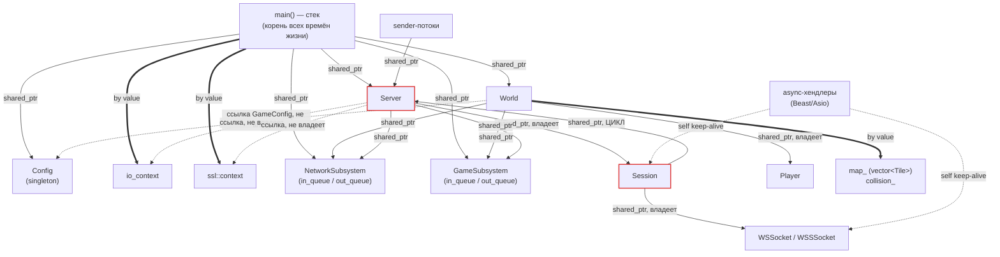
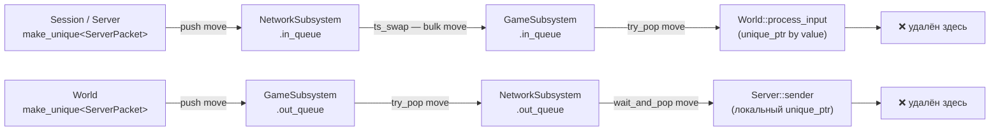

# Ownership Map — кто чем владеет и кто что удаляет

Документ описывает владение объектами в runtime: какие связи «сильные»
(владеющие) и определяют время жизни, а какие — нет. Цель — убрать путаницу
между `shared_ptr` / `unique_ptr` / ссылками.

## Легенда

| Обозначение | Смысл | Кто удаляет объект |
|-------------|-------|--------------------|
| `shared_ptr<T>` | Разделяемое владение | Последний живой `shared_ptr` (счётчик → 0) |
| `unique_ptr<T>` | Единоличное владение | Владелец при выходе из области видимости / перемещении дальше |
| by value (член/локал) | Объект встроен в владельца | Уничтожается вместе с владельцем |
| `T&` / raw `T*` | **Не владеет** (наблюдатель) | Никогда не удаляет; обязан пережить владелец объекта |
| `self` в async-хендлере | Временное удержание на время I/O | Освобождается по завершении операции |

Условные обозначения на графе:
- сплошная стрелка — `shared_ptr` (разделяемое владение);
- жирная стрелка — `unique_ptr` / by value (единоличное владение);
- пунктир — ссылка/наблюдатель (владения нет).

---

## Граф владения



---

## Таблица владения по объектам

| Объект | Кто владеет (сильные ссылки) | Чем владеет сам | Когда удаляется |
|--------|------------------------------|-----------------|-----------------|
| **Config** | статический `shared_ptr` внутри `get_instance` + `main::config` | `net/game/accounts` конфиги by value | При выходе из программы (живёт всё время) |
| **NetworkSubsystem** | `main` + `World` + `Server` (3 × `shared_ptr`) | 2 очереди `TSQueue<unique_ptr<ServerPacket>>` | Когда исчезнут все 3 владельца (конец программы) |
| **GameSubsystem** | `main` + `World` (2 × `shared_ptr`) | 2 очереди пакетов | Конец программы |
| **World** | `main::world`; лямбда `game_thread` держит по ссылке `[&world]` | `players_`, `map_`, `collision_`; ссылки на подсистемы | Уничтожение `main::world` (конец программы) |
| **Server** | `main::server` + каждый sender-поток `[server]`; ⚠️ ещё и каждая `Session::server_` | `sessions_`, ссылки на подсистемы; **ссылки** (не владеет) на `ioc`/`ctx` | Когда исчезнут все `shared_ptr` — мешает **цикл** с `Session` |
| **Session** | `Server::sessions_[id]`; + `self` в каждой in-flight async-операции | `socket_`, `packet_handler_`, `out_queue_`; ⚠️ сильную ссылку `server_` | Когда удалён из `sessions_` **и** нет незавершённых async-операций |
| **WSSocket / WSSSocket** | `Session::socket_`; + `self` в in-flight I/O | `websocket::stream<...>` by value (реальный TCP/SSL сокет) | Когда `Session` отпустил `socket_` **и** нет активного I/O |
| **Player** | **только** `World::players_[id]` | свои поля by value | При `remove_player` → `erase` из map (единственный владелец → сразу) |
| **ServerPacket** | тот, кто держит `unique_ptr` в данный момент (очередь / локальная переменная) | `NetPacket` by value | Когда `unique_ptr` выходит из области видимости (см. поток ниже) |
| **NetPacket.body_** | сам `NetPacket` (`unique_ptr<vector<uint8_t>>`) | буфер полезной нагрузки | Вместе с `NetPacket` |
| **SendBuffer** (`shared_ptr<vector<uint8_t>>`) | `Session::out_queue_` (у одной или нескольких сессий при broadcast) + `self`-capture в `async_write` | байты кадра | Когда исчезнет последний держатель |

---

## Поток владения пакетами (главная «магия» с move)

`ServerPacket` — единоличное владение (`unique_ptr`), которое **перемещается**
по цепочке. В каждый момент времени владелец ровно один; кто последним держит
`unique_ptr`, тот и удаляет.



- **Входящие**: создаются в `Session`/`Server`, живут в `in_queue`, тик
  `ts_swap` перекидывает всю очередь в игровую подсистему, `process_input`
  забирает по значению и **удаляет** в конце обработки.
- **Исходящие**: создаются во `World`, копятся в `game out_queue`, переносятся
  в `net out_queue`, а `Server::sender` забирает через `wait_and_pop`,
  строит из них байтовый буфер и **удаляет** в конце итерации.
- **SendBuffer** — наоборот, `shared_ptr`: при broadcast один буфер намеренно
  разделяется между сессиями и живущими `async_write`, поэтому удаляется только
  когда всё это завершится.

---

## ⚠️ Проблемные места

### 1. Цикл сильных ссылок `Server ↔ Session`

```
Server::sessions_[id]  ── shared_ptr ──▶  Session
Session::server_       ── shared_ptr ──▶  Server
```

Это классический reference cycle. Пока сессия остаётся в `sessions_`, ни
`Server`, ни `Session` не могут быть освобождены только за счёт обнуления
внешних ссылок. На практике цикл «разрывается» вручную в `Server::close_session`
(`sessions_.erase(id)` убирает ребро `Server → Session`). Но если сессия не
закрыта явно (например, при остановке сервера), объекты утекут.

**Рекомендация:** `Server` уже владеет сессиями, поэтому обратная ссылка
`Session::server_` не обязана быть владеющей — сделайте её `std::weak_ptr<Server>`
(с `lock()` перед использованием) или невладеющим `Server*`. Это разрывает цикл
по построению.

### 2. `World::config_` — висячая ссылка по построению

`World` хранит `const GameConfig& config_`, ссылающийся внутрь синглтона
`Config` (`config->game_config`). Владения нет: `World` **обязан** не пережить
`Config`. Сейчас это выполняется случайно (оба живут всю программу). Если время
жизни `Config` когда-нибудь сократится — получите dangling reference. Безопаснее
хранить копию `GameConfig` by value или `shared_ptr<const Config>`.

### 3. `Server::ioc_` / `Server::ctx_` — ссылки на объекты из `main`

`io_context` и `ssl::context` живут на стеке `main`, а `Server` держит на них
`&`. Корректно только потому, что `main` переживает `Server`. Это нормальный
паттерн Asio, но стоит помнить: **`main` — корень всех времён жизни**, и порядок
разрушения на стеке (`server` до `ioc`/`ctx`) здесь важен.

### 4. Keep-alive через `self` — это не утечка, а идиома

Каждая async-операция захватывает `self = shared_from_this()` (`Session`,
`WSSocket`). Это намеренно продлевает жизнь объекта до конца I/O, даже если его
уже убрали из `sessions_`. Объект удалится, когда завершится последний
захвативший `self` хендлер — так и задумано.

---

## Отдельно: модуль БД (пока не в основном цикле)

| Объект | Владение |
|--------|----------|
| `LoginDataBase::connection_` | владеет `SQLConnection` **by value** (передан через `&&` move) |
| `LoginDataBase::stmts_` | владеет массивом `MYSQL_STMT*` — **ручное** удаление в деструкторе (`mysql_stmt_close`) |
| `LoginDataBase::get()` → `unique_ptr<LoginData>` | единоличное владение отдаётся вызывающему |

`SQLConnection` оборачивает C-хендл MariaDB — это единственное место с ручным
управлением ресурсом (RAII поверх сишного API), а не через умные указатели.
