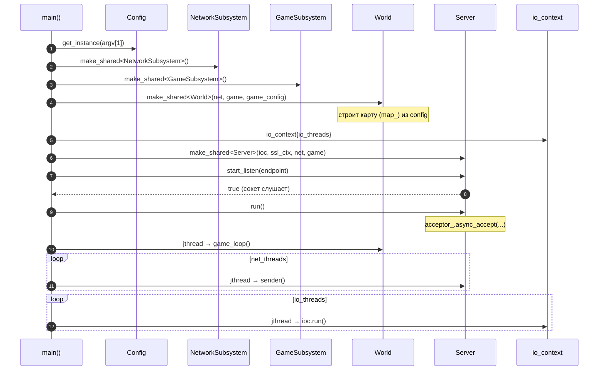
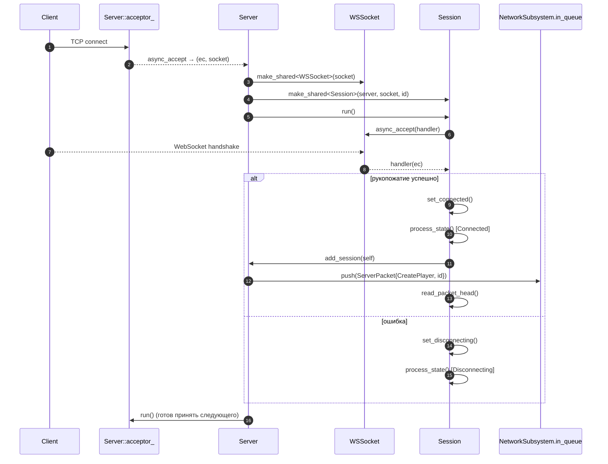
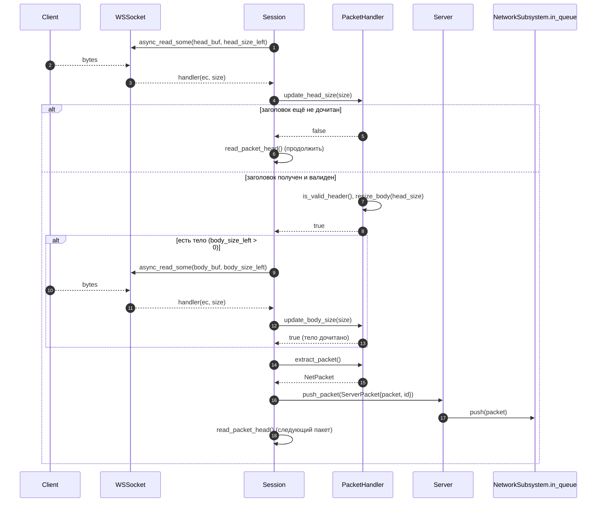
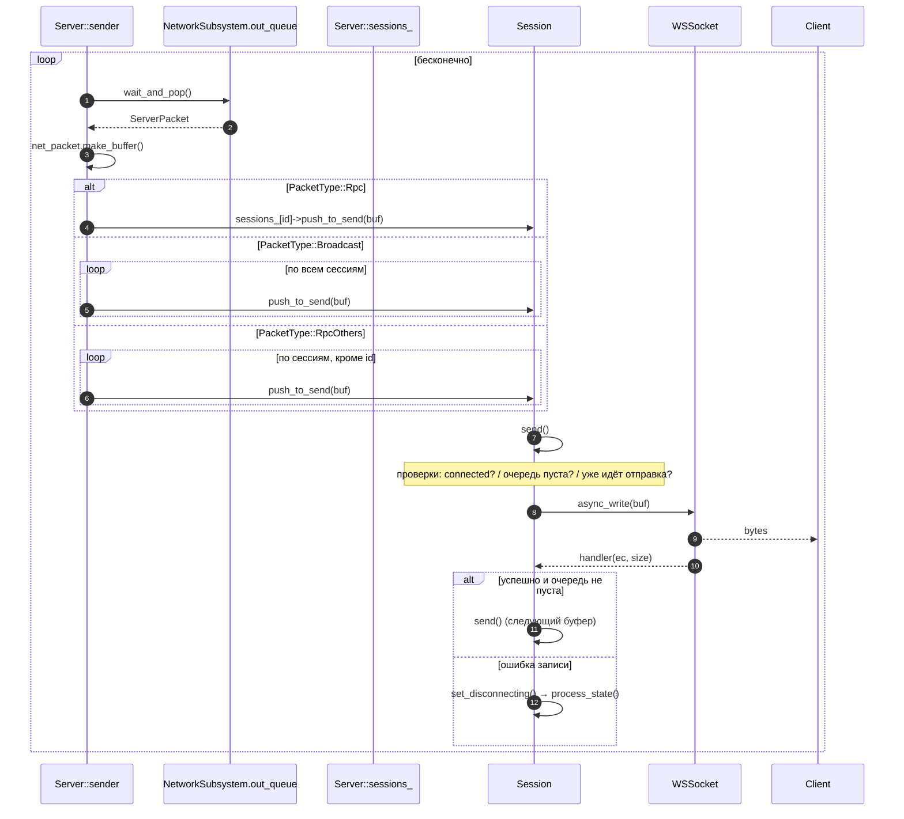
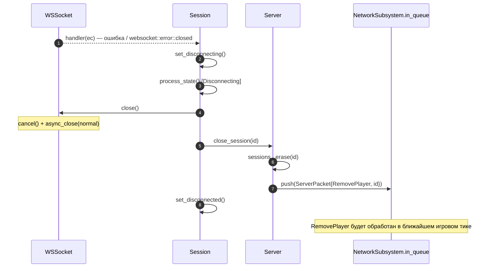

# Диаграммы последовательности — WebSocket Game Server

Документ описывает основные сценарии взаимодействия компонентов сервера в
runtime. Диаграммы выполнены в нотации UML Sequence Diagram с помощью
[Mermaid](https://mermaid.js.org/) (GitHub рендерит их автоматически).

## Архитектура и потоки исполнения

Сервер разделён на две подсистемы, связанные потокобезопасными очередями
(`TSQueue<std::unique_ptr<ServerPacket>>`). Обмен идёт по схеме
producer–consumer между тремя группами потоков:

| Поток | Точка входа | Роль |
|-------|-------------|------|
| **IO-потоки** | `ioc.run()` | Приём соединений, WebSocket-рукопожатие, чтение пакетов от клиентов |
| **Игровой поток** | `World::game_loop()` | Игровой тик: обработка ввода, физика, генерация исходящих пакетов |
| **Sender-потоки** | `Server::sender()` | Диспетчеризация исходящих пакетов по сессиям и запись клиентам |

Поток данных между подсистемами:

```
Клиент ──read──▶ Session ──push──▶ NetworkSubsystem.in_queue
                                           │  ts_swap (в начале тика)
                                           ▼
                                 GameSubsystem.in_queue ──▶ World::process_input
                                                                     │
                                 GameSubsystem.out_queue ◀──── World::update
                                           │  перенос в конце тика
                                           ▼
                          NetworkSubsystem.out_queue ──▶ Server::sender ──write──▶ Клиент
```

> **Примечание.** Модуль авторизации (`db/LoginDataBase`, `SQLConnection`,
> `cryptography/sha256`) присутствует в кодовой базе и покрыт тестами, но пока
> не подключён к основному сетевому/игровому циклу, поэтому в диаграммы ниже
> не включён.

---

## 1. Запуск сервера (bootstrap)



---

## 2. Подключение клиента и WebSocket-рукопожатие



---

## 3. Приём входящего пакета от клиента

Пакет читается в два этапа: сначала заголовок фиксированного размера
(`PacketHead`), затем — тело переменной длины, если оно есть. Оба чтения
дочитывают буфер до конца (частичные `async_read_some` продолжаются).



---

## 4. Игровой тик (обработка ввода + физика)

`game_loop()` вызывает `tick(dt)` с частотой `config.tick_rate`. В начале тика
входящая очередь сети «двойной буферизацией» перебрасывается в игровую
подсистему (`ts_swap`), в конце — исходящие пакеты переносятся в сетевую
очередь.

```mermaid
sequenceDiagram
    autonumber
    participant loop as World::game_loop
    participant tick as World::tick
    participant netin as NetworkSubsystem.in_queue
    participant gin as GameSubsystem.in_queue
    participant player as Player
    participant col as Collision
    participant gout as GameSubsystem.out_queue
    participant netout as NetworkSubsystem.out_queue

    loop каждый tick (1/tick_rate сек)
        loop->>tick: tick(dt)
        tick->>netin: ts_swap(gin, netin)
        note over gin,netin: входящие пакеты попадают в игровую очередь

        loop по каждому пакету в gin
            tick->>tick: process_input(packet, dt)
            alt CreatePlayer
                tick->>player: make_shared<Player>(...)
                tick->>tick: add_player(player)
                tick->>gout: push(CreatePlayer)  [Rpc]
                tick->>gout: push(SpawnPlayers)  [Rpc]
                tick->>gout: push(AddPlayer)     [RpcOthers]
            else RemovePlayer
                tick->>tick: remove_player(id)
                tick->>gout: push(RemovePlayer)
            else MoveLeft / MoveRight / Jump
                tick->>player: set_vel(...)
            end
        end

        loop по каждому игроку
            tick->>tick: update(player, dt)
            note over tick: применяет гравитацию
            tick->>col: swept_axis(player, map_, vel)  (X, затем Y)
            col-->>tick: SweptData{entry_time, hit}
            tick->>player: move(...) / set_on_ground(...)
            tick->>gout: push(MovePlayer)  [Broadcast]
        end

        loop по каждому пакету в gout
            tick->>netout: push(packet)
        end
    end
```

---

## 5. Отправка пакетов клиентам (sender-поток)



---

## 6. Отключение клиента

Отключение инициируется любой ошибкой ввода-вывода (закрытие сокета клиентом,
ошибка чтения/записи).



---

## Ключевые компоненты

| Компонент | Файл | Ответственность |
|-----------|------|-----------------|
| `main` | `src/main.cpp` | Инициализация подсистем, запуск потоков |
| `Server` | `src/net/server/server.cpp` | Приём соединений, реестр сессий, `sender()` |
| `Session` | `src/net/session/session.cpp` | Жизненный цикл клиента, чтение/запись пакетов |
| `WSSocket` | `src/net/socket/ws_socket.cpp` | Обёртка над Boost.Beast WebSocket (`WSSSocket` — TLS-вариант) |
| `PacketHandler` | `src/net/session/packet_handler.cpp` | Сборка `NetPacket` из потока байт |
| `NetworkSubsystem` / `GameSubsystem` | `src/shared/subsystems/*.hpp` | Пары очередей `in/out` между сетью и игрой |
| `World` | `src/game/world/world.cpp` | Игровой цикл, физика, управление игроками |
| `Player` / `Tile` / `Collision` | `src/game/**` | Игровые сущности и swept-AABB коллизии |
