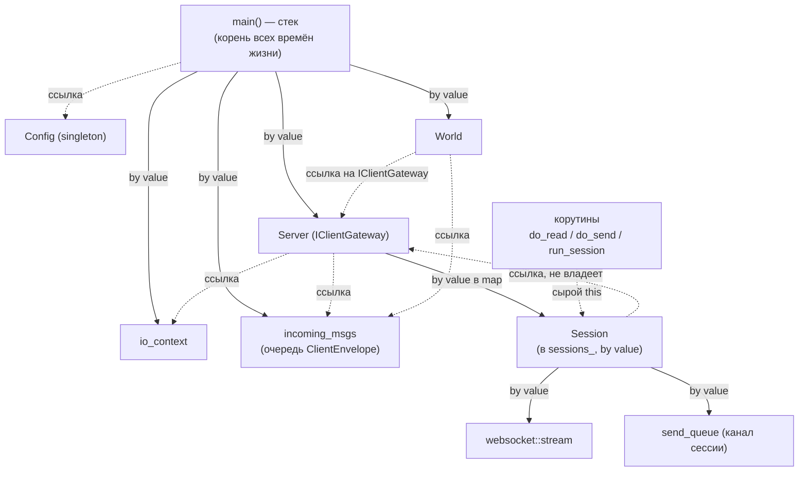

# Карта владения — Game Server

Кто владеет объектами в runtime (и потому определяет их время жизни), а кто лишь
ссылается. После перехода на корутины сессии хранятся **по значению**, а
`shared_ptr` в сетевом слое больше нет (прежний цикл `Server ↔ Session` устранён).

## Легенда

| Обозначение | Смысл |
|-------------|-------|
| сплошная стрелка `-->` | **владеет** (by value / внутри контейнера-владельца) |
| пунктир `-.->` | **ссылка** (не владеет; обязан пережить объект) |

## Граф владения



## Таблица владения

| Объект | Владелец | Чем владеет сам | Когда удаляется |
|--------|----------|-----------------|-----------------|
| **Config** | статический в `get_instance` (singleton) | `net_config` / `game_config` by value | конец программы |
| **incoming_msgs** | `main` (by value) | очередь `ClientEnvelope` | конец программы |
| **Server** | `main` (by value) | `sessions_`, `acceptor_`, `config_` (копия NetConfig); ссылки на `io_` / `incoming_msgs_` — не владеет | конец программы |
| **Session** | `Server::sessions_[id]` (**by value**) | `socket_`, `send_queue_`; ссылка `server_` — не владеет | `sessions_.erase(id)` в `run_session`, после завершения обеих корутин |
| **World** | `main` (by value) | `game_incoming_msgs_`, `config_` (копия GameConfig), `players_`; ссылки на `incoming_msgs_` / `gateway_` — не владеет | конец программы |
| **ClientEnvelope** | тот, кто держит сейчас (очередь / локальная) | `ClientMessage` by value | перемещается по очереди; удаляется после обработки в тике |
| **исходящие байты** (`vector<byte>`) | `send_queue`, затем локально в `do_send` | сам буфер | после `async_write` |
| **game_thread** (`jthread`) | `main` | — (ссылается на `world` через `[&world]`) | выход `main` → stop-token → join |

## Ключевые моменты

1. **Сессии — по значению в `Server::sessions_`.** Никаких `shared_ptr` и прежнего
   цикла `Server ↔ Session`: `Session::server_` — обычная ссылка (Server владеет
   сессией и по построению её переживает). Узлы `unordered_map` не перемещаются,
   поэтому ссылки/указатели на `Session` переживают вставки, удаления других и
   rehash — инвалидирует только удаление именно этого элемента.

2. **Корутины не владеют сессией.** `do_read` / `do_send` / `run_session` держат
   сырой `this`/`Session*`. Безопасность даёт супервизор: `run_session` делает
   `erase` **только** после того, как `co_await (do_read() || do_send())` вернул
   управление (обе корутины завершились). Единственный, кто удаляет сессию, —
   `run_session`.

3. **World и сеть связаны только ссылками.** Очередь `incoming_msgs` принадлежит
   `main`; «шлюз» к клиентам (`IClientGateway`) — это `Server`, а `World` держит
   его по ссылке и сетевыми объектами не владеет. Это и есть шов, за которым сеть
   можно подменить (напр., мок в тестах).

4. **Конфиг копируется, а не заимствуется.** `Server` и `World` хранят *копии*
   своих срезов (`NetConfig` / `GameConfig`) by value, поэтому не зависят от
   времени жизни `Config` (прежней висячей ссылки на `GameConfig` больше нет).

5. **`main` — корень всех времён жизни.** Порядок разрушения важен: сначала
   join'ятся потоки (`io_thread_pool`, затем `game_thread`), потом уничтожаются
   `world`, `server`, `incoming_msgs`, и последним — `io_context`.
```
