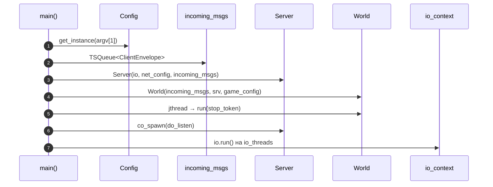
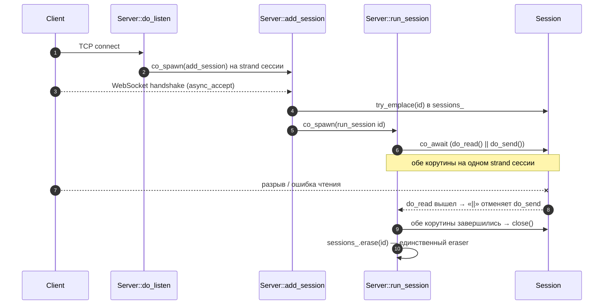
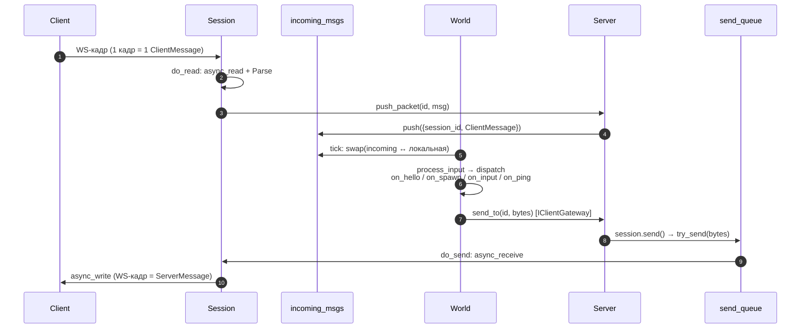

# Диаграммы последовательности — Game Server

Актуальная схема после перехода на **WebSocket + Protobuf + корутины Asio**.
Транспорт: один бинарный WS-кадр = одно Protobuf-сообщение (своего фрейминга нет).

## Потоки

| Поток | Точка входа | Роль |
|-------|-------------|------|
| **io-потоки** | `io.run()` | Приём соединений; на strand каждой сессии — корутины `do_read` / `do_send` и супервизор `run_session` |
| **Игровой поток** | `World::run()` (jthread) | Тик: разбор входящих, диспатч по типу, отправка результатов |

Поток данных:

```
Client ─ws─▶ Session.do_read ─push_packet─▶ TSQueue<ClientEnvelope> ─swap─▶ World.tick
                                                                              │ dispatch
Client ◀─ws─ Session.do_send ◀─ send_queue ◀─ Server.send_to ◀─ IClientGateway ◀┘
```

---

## 1. Запуск (bootstrap)



---

## 2. Жизненный цикл сессии (подключение → teardown)



> Ключ: `erase` выполняется **только** после завершения обеих корутин — `Session`
> никогда не удаляется из-под работающей корутины.

---

## 3. Круг сообщения (клиент → World → клиент)



> Вход буферизуется очередью (много io-потоков → один игровой поток). Выход
> адресный: per-session канал `send_queue` **уже является** выходной очередью,
> поэтому общей очереди на выход нет.

---

## Ключевые компоненты

| Компонент | Файл | Ответственность |
|-----------|------|-----------------|
| `main` | `src/main.cpp` | Bootstrap, запуск потоков и корутин |
| `Server` (`IClientGateway`) | `src/net/server/server.cpp` | Acceptor, реестр сессий, супервизоры, `send_to` / `broadcast` |
| `Session` | `src/net/session/session.cpp` | Транспорт: чтение/парсинг кадра, запись из канала |
| `World` | `src/game/world/world.cpp` | Игровой цикл, диспатч по типу сообщения (пока заглушки) |
| `IClientGateway` / `ClientEnvelope` | `src/shared/net/*` | Шов game↔net: отправка байт и конверт `{session_id, msg}` |
| `TSQueue` | `src/shared/utils/ts_queue.hpp` | Потокобезопасная очередь входящих |
| протокол | `../protocol/game/v1/protocol.proto` | `ClientMessage` / `ServerMessage` |
