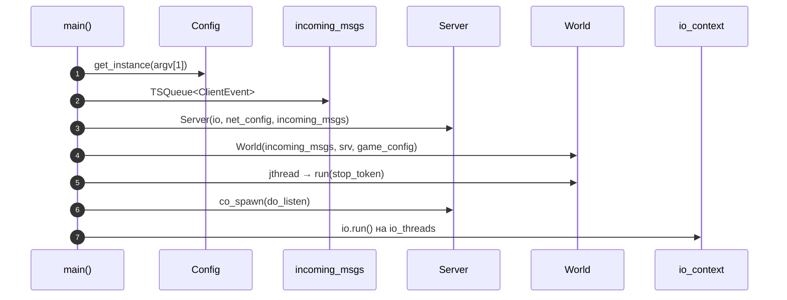
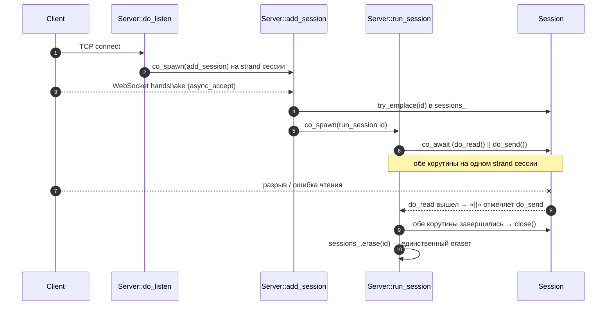
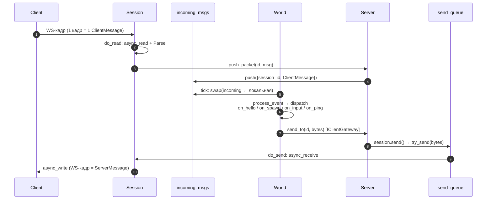
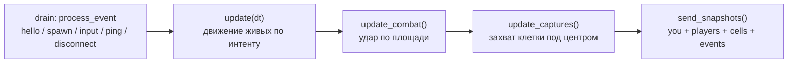
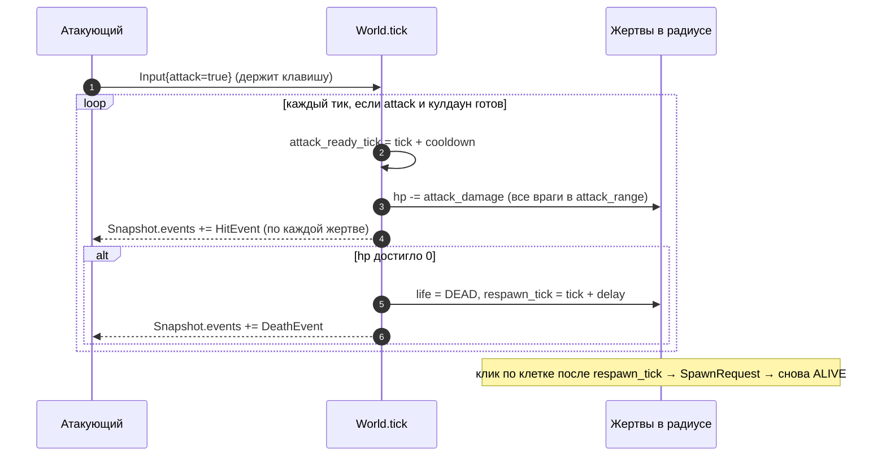

# Диаграммы последовательности — Game Server

Актуальная схема после перехода на **WebSocket + Protobuf + корутины Asio**.
Транспорт: один бинарный WS-кадр = одно Protobuf-сообщение (своего фрейминга нет).

## Потоки

| Поток | Точка входа | Роль |
|-------|-------------|------|
| **io-потоки** | `io.run()` | Приём соединений; на strand каждой сессии — корутины `do_read` / `do_send` и супервизор `run_session` |
| **Игровой поток** | `World::run()` (jthread) | Тик: разбор входящих, диспатч по типу, отправка результатов |

Поток данных:

```
Client ─ws─▶ Session.do_read ─push_packet─▶ TSQueue<ClientEvent> ─swap─▶ World.tick
                                                                              │ dispatch
Client ◀─ws─ Session.do_send ◀─ send_queue ◀─ Server.send_to ◀─ IClientGateway ◀┘
```

---

## 1. Запуск (bootstrap)


```mermaid
sequenceDiagram
    autonumber
    participant main as main()
    participant cfg as Config
    participant q as incoming_msgs
    participant srv as Server
    participant world as World
    participant io as io_context

    main->>cfg: get_instance(argv[1])
    main->>q: TSQueue#lt;ClientEvent#gt;
    main->>srv: Server(io, net_config, incoming_msgs)
    main->>world: World(incoming_msgs, srv, game_config)
    main->>world: jthread → run(stop_token)
    main->>srv: co_spawn(do_listen)
    main->>io: io.run() на io_threads
```

---

## 2. Жизненный цикл сессии (подключение → teardown)


```mermaid
sequenceDiagram
    autonumber
    participant Client
    participant lis as Server::do_listen
    participant add as Server::add_session
    participant sup as Server::run_session
    participant sess as Session

    Client->>lis: TCP connect
    lis->>add: co_spawn(add_session) на strand сессии
    Client-->>add: WebSocket handshake (async_accept)
    add->>sess: try_emplace(id) в sessions_
    add->>sup: co_spawn(run_session id)
    sup->>sess: co_await (do_read() || do_send())
    Note over sup,sess: обе корутины на одном strand сессии

    Client--x sess: разрыв / ошибка чтения
    sess-->>sup: do_read вышел → «||» отменяет do_send
    sup->>sess: обе корутины завершились → close()
    sup->>sup: sessions_.erase(id) — единственный eraser
```

> Ключ: `erase` выполняется **только** после завершения обеих корутин — `Session`
> никогда не удаляется из-под работающей корутины.

---

## 3. Круг сообщения (клиент → World → клиент)


```mermaid
sequenceDiagram
    autonumber
    participant Client
    participant sess as Session
    participant q as incoming_msgs
    participant world as World
    participant srv as Server
    participant ch as send_queue

    Client->>sess: WS-кадр (1 кадр = 1 ClientMessage)
    sess->>sess: do_read: async_read + Parse
    sess->>srv: push_packet(id, msg)
    srv->>q: push({session_id, ClientMessage})

    world->>q: tick: swap(incoming ↔ локальная)
    world->>world: process_event → dispatch<br/>on_hello / on_spawn / on_input / on_ping
    world->>srv: send_to(id, bytes)  [IClientGateway]
    srv->>ch: session.send() → try_send(bytes)
    ch->>sess: do_send: async_receive
    sess->>Client: async_write (WS-кадр = ServerMessage)
```

> Вход буферизуется очередью (много io-потоков → один игровой поток). Выход
> адресный: per-session канал `send_queue` **уже является** выходной очередью,
> поэтому общей очереди на выход нет.

---

## 4. Тик симуляции (после разбора входящих)

После диспатча событий `World::tick(dt)` прогоняет симуляцию в фиксированном
порядке и рассылает снапшоты по кадансу (`tick_rate / snapshot_rate`).


```mermaid
flowchart LR
    drain["drain: process_event<br/>hello / spawn / input / ping / disconnect"]
    move["update(dt)<br/>движение живых по интенту"]
    combat["update_combat()<br/>удар по площади"]
    cap["update_captures()<br/>захват клетки под центром"]
    snap["send_snapshots()<br/>you + players + cells + events"]
    drain --> move --> combat --> cap --> snap
```

**Бой (area attack).** Пока игрок держит клавишу атаки (`InputFrame.attack`), раз
в `attack_cooldown_ticks` он бьёт по площади: урон `attack_damage` получают все
живые враги (иной фракции) в радиусе `attack_range`. hp → 0 → `DEAD`, тело
остаётся на месте, `respawn_tick = tick + respawn_delay_ticks`; `SpawnRequest`
из `DEAD` принимается после `respawn_tick`. Удары и смерти уходят в
`Snapshot.events` (`HitEvent` / `DeathEvent`) — для анимаций и ленты боя.


```mermaid
sequenceDiagram
    autonumber
    participant A as Атакующий
    participant world as World.tick
    participant V as Жертвы в радиусе

    A->>world: Input{attack=true} (держит клавишу)
    loop каждый тик, если attack и кулдаун готов
        world->>world: attack_ready_tick = tick + cooldown
        world->>V: hp -= attack_damage (все враги в attack_range)
        world-->>A: Snapshot.events += HitEvent (по каждой жертве)
        alt hp достигло 0
            world->>V: life = DEAD, respawn_tick = tick + delay
            world-->>A: Snapshot.events += DeathEvent
        end
    end
    Note over V: клик по клетке после respawn_tick → SpawnRequest → снова ALIVE
```

---

## Ключевые компоненты

| Компонент | Файл | Ответственность |
|-----------|------|-----------------|
| `main` | `src/main.cpp` | Bootstrap, запуск потоков и корутин |
| `Server` (`IClientGateway`) | `src/net/server/server.cpp` | Acceptor, реестр сессий, супервизоры, `send_to` / `broadcast` |
| `Session` | `src/net/session/session.cpp` | Транспорт: чтение/парсинг кадра, запись из канала |
| `World` | `src/game/world/world.cpp` | Игровой цикл: диспатч, движение, бой, захват, снапшоты |
| `IClientGateway` / `ClientEvent` | `src/shared/net/*` | Шов game↔net: отправка байт и событие `{session_id, kind, msg}` |
| `TSQueue` | `src/shared/utils/ts_queue.hpp` | Потокобезопасная очередь входящих |
| протокол | `../protocol/game/v1/protocol.proto` | `ClientMessage` / `ServerMessage` |
