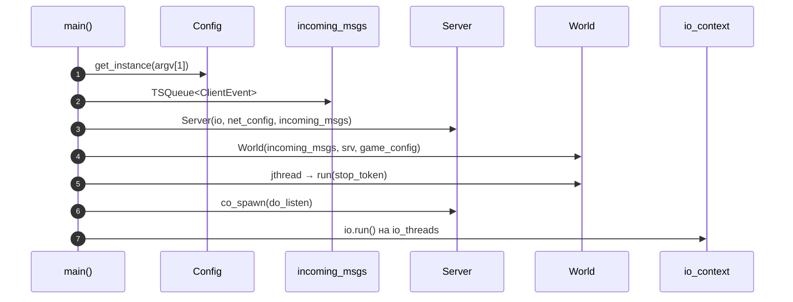
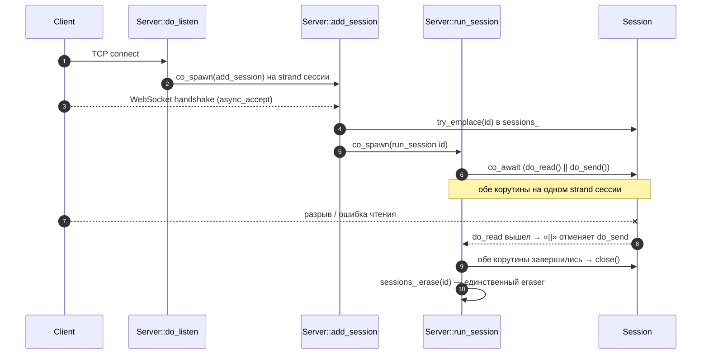
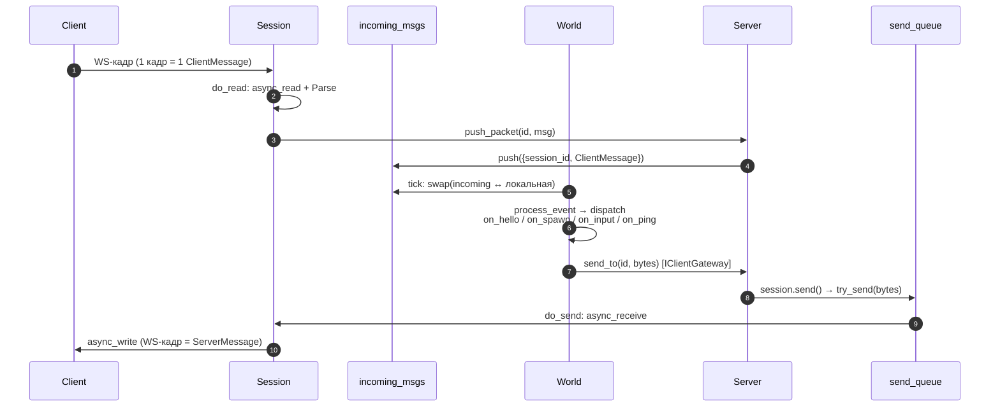
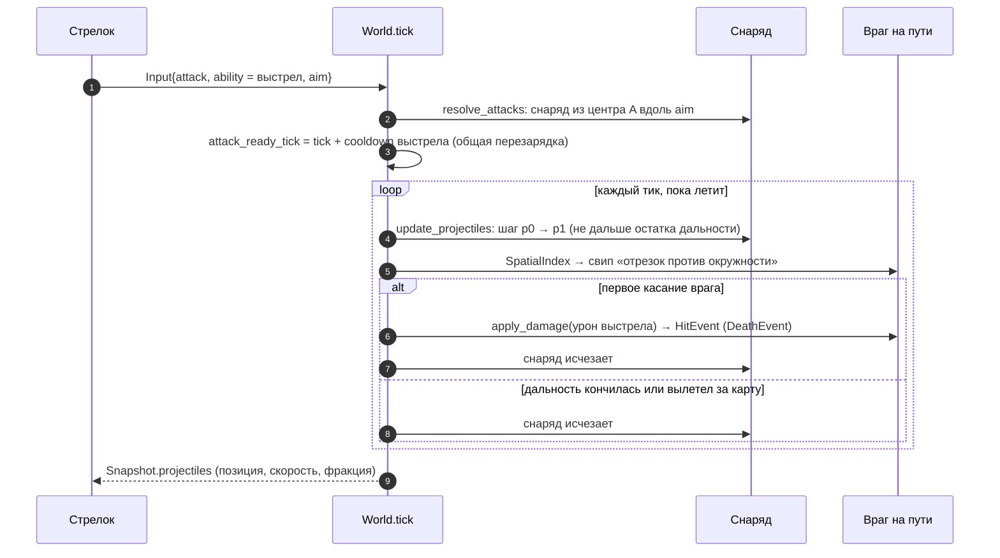
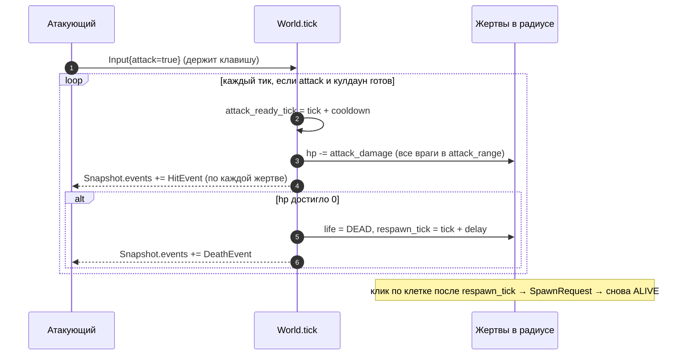
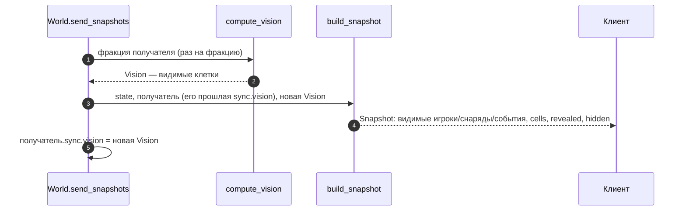
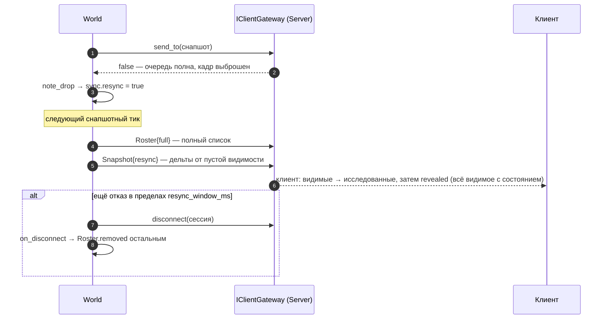

# Диаграммы последовательности — Game Server

Актуальная схема после перехода на **WebSocket + Protobuf + корутины Asio**.
Транспорт: один бинарный WS-кадр = одно Protobuf-сообщение (своего фрейминга нет).

## Потоки

| Поток | Точка входа | Роль |
|-------|-------------|------|
| **io-потоки** | `io.run()` | Приём соединений; на strand каждой сессии — корутины `do_read` / `do_send` и супервизор `run_session` |
| **Игровой поток** | `World::run()` (jthread) | Тик: разбор входящих, диспатч по типу, отправка результатов |

Поток данных:

```
Client ─ws─▶ Session.do_read ─push_packet─▶ TSQueue<ClientEvent> ─swap─▶ World.tick
                                                                              │ dispatch
Client ◀─ws─ Session.do_send ◀─ send_queue ◀─ Server.send_to ◀─ IClientGateway ◀┘
```

---

## 1. Запуск (bootstrap)


```mermaid
sequenceDiagram
    autonumber
    participant main as main()
    participant cfg as Config
    participant q as incoming_msgs
    participant srv as Server
    participant world as World
    participant io as io_context

    main->>cfg: get_instance(argv[1])
    main->>q: TSQueue#lt;ClientEvent#gt;
    main->>srv: Server(io, net_config, incoming_msgs)
    main->>world: World(incoming_msgs, srv, game_config)
    main->>world: jthread → run(stop_token)
    main->>srv: co_spawn(do_listen)
    main->>io: io.run() на io_threads
```

---

## 2. Жизненный цикл сессии (подключение → teardown)


```mermaid
sequenceDiagram
    autonumber
    participant Client
    participant lis as Server::do_listen
    participant add as Server::add_session
    participant sup as Server::run_session
    participant sess as Session

    Client->>lis: TCP connect
    lis->>add: co_spawn(add_session) на strand сессии
    Client-->>add: WebSocket handshake (async_accept)
    add->>sess: try_emplace(id) в sessions_
    add->>sup: co_spawn(run_session id)
    sup->>sess: co_await (do_read() || do_send())
    Note over sup,sess: обе корутины на одном strand сессии

    Client--x sess: разрыв / ошибка чтения
    sess-->>sup: do_read вышел → «||» отменяет do_send
    sup->>sess: обе корутины завершились → close()
    sup->>sup: sessions_.erase(id) — единственный eraser
```

> Ключ: `erase` выполняется **только** после завершения обеих корутин — `Session`
> никогда не удаляется из-под работающей корутины.

---

## 3. Круг сообщения (клиент → World → клиент)


```mermaid
sequenceDiagram
    autonumber
    participant Client
    participant sess as Session
    participant q as incoming_msgs
    participant world as World
    participant srv as Server
    participant ch as send_queue

    Client->>sess: WS-кадр (1 кадр = 1 ClientMessage)
    sess->>sess: do_read: async_read + Parse
    sess->>srv: push_packet(id, msg)
    srv->>q: push({session_id, ClientMessage})

    world->>q: tick: swap(incoming ↔ локальная)
    world->>world: process_event → dispatch<br/>on_hello / on_spawn / on_input / on_ping
    world->>srv: send_to(id, bytes)  [IClientGateway]
    srv->>ch: session.send() → try_send(bytes)
    ch->>sess: do_send: async_receive
    sess->>Client: async_write (WS-кадр = ServerMessage)
```

> Вход буферизуется очередью (много io-потоков → один игровой поток). Выход
> адресный: per-session канал `send_queue` **уже является** выходной очередью,
> поэтому общей очереди на выход нет.

---

## 4. Тик симуляции (фиксированный шаг)

`World::run` крутит **фиксированный шаг** (аккумулятор): `tick(fixedDt)` вызывается
0+ раз за итерацию, `fixedDt = 1/tick_rate`. Детерминизм — основа клиентского
предсказания. Ввод копится в пер-игроковую очередь; `consume_inputs` снимает
**одну команду за тик** и выставляет `last_input_seq` (ack для реконсиляции на
клиенте). Снапшоты — по кадансу (`tick_rate / snapshot_rate`).

`World` только оркестрирует: всё состояние симуляции — простая структура
`WorldState` (`src/game/state`), а правила — свободные функции-системы над ней
(`src/game/systems`). После движения `World` перестраивает `SpatialIndex` живых
игроков — удар и снаряды спрашивают у него «кто рядом», а не перебирают все пары.


```mermaid
flowchart LR
    drain["drain: process_event<br/>hello / spawn(try_spawn) / input(enqueue_frames) / ping / disconnect"]
    consume["consume_inputs(state)<br/>одна команда/тик на игрока"]
    move["integrate_movement(state, dt)<br/>движение живых по интенту"]
    index["index_alive_players()<br/>SpatialIndex живых"]
    blocks["activate_blocks(state)<br/>блок: своя перезарядка, до атак"]
    combat["resolve_attacks(state, index)<br/>способность: удар по площади / запуск снаряда"]
    proj["update_projectiles(state, index, dt)<br/>полёт + свип-попадания → apply_damage"]
    cap["update_captures(state)<br/>захват клетки под центром"]
    snap["send_snapshots()<br/>compute_vision(фракция) → build_snapshot(state, получатель, vision)"]
    drain --> consume --> move --> index --> blocks --> combat --> proj --> cap --> snap
```

**Бой: способности.** Набор способностей задаёт конфиг сервера (`abilities`: вид
`melee` / `projectile`, перезарядка, урон, дальность, скорость и радиус снаряда);
клиент получает его в `Welcome.abilities`. Пока игрок держит клавишу атаки
(`InputFrame.attack`), выбранная способность (`InputFrame.ability`, 0 = первая)
срабатывает, как только готова **общая** перезарядка; применение любой способности
ставит `attack_ready_tick = tick + её cooldown_ticks`, а длину сообщает
`SelfState.attack_cooldown_ticks`. **Удар** (`melee`): урон получают все живые
враги (иной фракции) в радиусе `range` — кандидатов даёт запрос к `SpatialIndex`. Любая потеря hp идёт через единую точку `apply_damage()`: только
по живым, урон не больше остатка hp, `HitEvent`; hp → 0 → `DEAD`, тело остаётся на
месте, `respawn_tick = tick + respawn_delay_ticks`, `DeathEvent`. `SpawnRequest`
из `DEAD` принимается после `respawn_tick`. Удары и смерти уходят в
`Snapshot.events` — для анимаций и ленты боя.

**Выстрел** (`projectile`): снаряд вылетает из центра стрелка вдоль прицела
(`InputFrame.aim_x/aim_y`; нет прицела — нет выстрела и перезарядка не тратится),
летит `range` единиц со скоростью `projectile_speed` и исчезает. Каждый тик шаг
снаряда проверяется «отрезок против окружности» (радиус тела `player_radius` +
радиус снаряда) по живым врагам — не стрелку и не союзникам; первое касание по
пути получает урон через `apply_damage` (зачёт стрелку), снаряд исчезает. Так
быстрый снаряд не «проскакивает» цель, а цель, ушедшая с линии, уворачивается —
компенсации лага нет намеренно.

**Блок** (`block`): своя перезарядка, не общая с атаками — можно поставить блок,
переключиться и сразу ударить. Блок начинается в `activate_blocks` раньше атак
того же тика (нажатый одновременно с ударом уже защищает) и длится
`duration_ticks`: всё это время `apply_damage` не снимает hp, а пишет `HitEvent`
с `blocked = true` и `damage = 0`; снаряд, попавший в блок, гаснет. Каждое
применение способности — удар (даже мимо), блок, выстрел — уходит всем, кто
видит игрока, как `AbilityEvent`: по нему клиенты рисуют удар и блок других.


```mermaid
sequenceDiagram
    autonumber
    participant A as Стрелок
    participant world as World.tick
    participant P as Снаряд
    participant V as Враг на пути

    A->>world: Input{attack, ability = выстрел, aim}
    world->>P: resolve_attacks: снаряд из центра A вдоль aim
    world->>world: attack_ready_tick = tick + cooldown выстрела (общая перезарядка)
    loop каждый тик, пока летит
        world->>P: update_projectiles: шаг p0 → p1 (не дальше остатка дальности)
        world->>V: SpatialIndex → свип «отрезок против окружности»
        alt первое касание врага
            world->>V: apply_damage(урон выстрела) → HitEvent (DeathEvent)
            world->>P: снаряд исчезает
        else дальность кончилась или вылетел за карту
            world->>P: снаряд исчезает
        end
    end
    world-->>A: Snapshot.projectiles (позиция, скорость, фракция)
```


```mermaid
sequenceDiagram
    autonumber
    participant A as Атакующий
    participant world as World.tick
    participant V as Жертвы в радиусе

    A->>world: Input{attack=true} (держит клавишу)
    loop каждый тик, если attack и кулдаун готов
        world->>world: attack_ready_tick = tick + cooldown
        world->>V: hp -= attack_damage (все враги в attack_range)
        world-->>A: Snapshot.events += HitEvent (по каждой жертве)
        alt hp достигло 0
            world->>V: life = DEAD, respawn_tick = tick + delay
            world-->>A: Snapshot.events += DeathEvent
        end
    end
    Note over V: клик по клетке после respawn_tick → SpawnRequest → снова ALIVE
```

**Туман войны.** Симуляция видимость не учитывает: удар и снаряд из тумана
наносят урон как обычно. Туман — это фильтр доставки в `send_snapshots`:
`compute_vision` раз на фракцию отмечает клетки, чей центр в радиусе
`vision_radius` (конфиг; 300 = 3 клетки) от источника зрения — живого игрока фракции или её
клетки (тело даёт зрение ещё в снапшоте, сообщающем о смерти, дальше — нет).
`build_snapshot` отдаёт получателю только видимое: игроков и снаряды на видимых
клетках (себя — всегда), события, все названные в которых игроки видны (попадание
из тумана жертве ничего не сообщает), и клетки — изменившиеся видимые плюс все,
вошедшие в зону видимости, с актуальным состоянием. Разность с тем, что клиенту
сообщили в прошлый раз (`Player::vision`), уходит в `Snapshot.revealed` /
`Snapshot.hidden`; «исследованные» клетки помнит клиент. `MapState` новичку
ничего не раскрывает.


```mermaid
sequenceDiagram
    autonumber
    participant world as World.send_snapshots
    participant vis as compute_vision
    participant snap as build_snapshot
    participant C as Клиент

    world->>vis: фракция получателя (раз на фракцию)
    vis-->>world: Vision — видимые клетки
    world->>snap: state, получатель (его прошлая sync.vision), новая Vision
    snap-->>C: Snapshot: видимые игроки/снаряды/события, cells, revealed, hidden
    world->>world: получатель.sync.vision = новая Vision
```

**Доставка и resync.** Протокол разностный (клетки, видимость, roster), поэтому
потерянный кадр оставил бы клиента рассинхронизированным навсегда. Канал сессии —
64 кадра; когда он полон, `IClientGateway::send_to` отказывает, и `World::send`
отмечает отказ через `note_drop()`: первый — пересинхронизация в следующем
снапшоте, ещё один на более позднем тике в пределах `resync_window_ms` (5 с) —
сессия закрывается в конце тика и игрок уходит из мира.


```mermaid
sequenceDiagram
    autonumber
    participant world as World
    participant gw as IClientGateway (Server)
    participant C as Клиент

    world->>gw: send_to(снапшот)
    gw-->>world: false — очередь полна, кадр выброшен
    world->>world: note_drop → sync.resync = true
    Note over world: следующий снапшотный тик
    world->>gw: Roster{full} — полный список
    world->>gw: Snapshot{resync} — дельты от пустой видимости
    gw-->>C: клиент: видимые → исследованные, затем revealed (всё видимое с состоянием)
    alt ещё отказ в пределах resync_window_ms
        world->>gw: disconnect(сессия)
        world->>world: on_disconnect → Roster.removed остальным
    end
```

---

## Ключевые компоненты

| Компонент | Файл | Ответственность |
|-----------|------|-----------------|
| `main` | `src/main.cpp` | Bootstrap, запуск потоков и корутин |
| `Server` (`IClientGateway`) | `src/net/server/server.cpp` | Acceptor, реестр сессий, супервизоры, `send_to` / `broadcast` |
| `Session` | `src/net/session/session.cpp` | Транспорт: чтение/парсинг кадра, запись из канала |
| `World` | `src/game/world/world.cpp` | Игровой цикл: диспатч событий, порядок систем в тике, доставка сообщений |
| `WorldState` | `src/game/state/*` | Всё состояние симуляции как данные: игроки, сетка территорий, события |
| системы | `src/game/systems/*` | Правила тика: ввод, движение, блоки, атаки (способности: удар, запуск снаряда), полёт снарядов, урон (`apply_damage`, в т.ч. блок), захват, спавн |
| `SpatialIndex`, geometry | `src/game/spatial/*` | Равномерная сетка корзин: запросы «кто в радиусе r»; свип-тест «отрезок против окружности» |
| туман войны | `src/game/systems/vision_system.*`, `src/game/state/vision.hpp` | `compute_vision`: какие клетки видит фракция (живые игроки и её клетки, радиус `vision_radius`) |
| sync | `src/game/sync/*` | Сборка `ServerMessage`; снапшот — на каждого получателя, отфильтрован туманом войны |
| `IClientGateway` / `ClientEvent` | `src/shared/net/*` | Шов game↔net: отправка байт и событие `{session_id, kind, msg}` |
| `TSQueue` | `src/shared/utils/ts_queue.hpp` | Потокобезопасная очередь входящих |
| протокол | `../protocol/game/v1/protocol.proto` | `ClientMessage` / `ServerMessage` |
